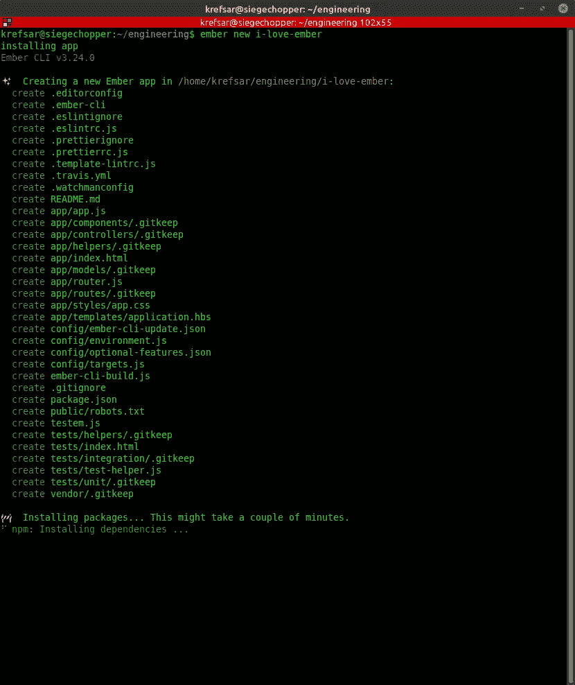
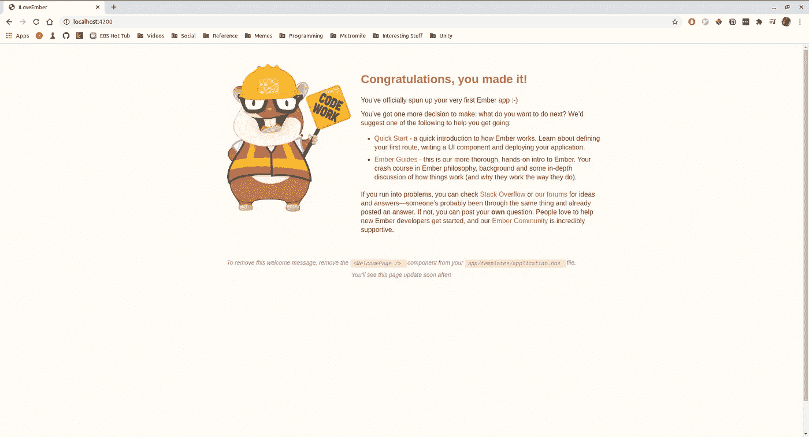

# 一.❤·恩伯网站——启动并运行

> 原文：<https://medium.com/codex/i-ember-js-up-and-running-3705700d5789?source=collection_archive---------9----------------------->

## [抄本](https://medium.com/codex)

## 启动一个新项目，了解 Ember 中的 3 种主要文件类型！


托马斯·凯利在 [Unsplash](https://unsplash.com/s/photos/power?utm_source=unsplash&utm_medium=referral&utm_content=creditCopyText) 上拍摄的照片

*我❤ Ember.js 是一个系列，我在其中谈论如何使用 Ember 以及为什么你应该在你的项目中使用它。我使用 Ember 已经有几年了，它已经成为我最喜欢的创建强大的 web 应用程序的工具，而且非常简单！*

> 注意:要理解本文中的代码，您需要使用操作系统的终端。如果您不熟悉如何使用终端，有些内容可能会令人困惑。

欢迎回到 I ❤烬。js，我希望你很高兴开始玩烬！如果你已经读过前面的介绍文章，你会记得我喜欢 ember 的部分原因是你可以马上开始工作。在本文中，我将向您展示开始一个新项目是多么容易。然后我们将探索如何使用三种核心文件类型在 Ember 中构建特性:路径、模板和控制器。

# 设置

要开始，我们当然需要安装一些东西。如果您是一名 Javascript 开发人员，您可能已经安装了 npm。如果没有，前往[https://www.npmjs.com/](https://www.npmjs.com/)并安装它。

接下来，让我们使用终端安装 ember-cli:

`npm install -g ember-cli`

# 一个新项目

好的，准备好。你准备好了吗？我们刚刚安装的东西是 ember-cli，这是 ember 开发者给我们的又一个好东西。使用 ember-cli 命令，我们可以创建新项目，运行测试，甚至安装 ember 插件，这些插件就像是专门为 Ember 项目制作的**增压** npm 模块。

所以我们来做一个新项目。Ember-cli 命令都以`ember`开头。导航到要创建新项目文件夹的位置，然后运行

`ember new i-love-ember`

其中`i-love-ember`可以是新项目的任何名称。如果您查看终端输出，您可以看到 ember-cli 正在为您的项目创建一个文件夹，安装开发所需的 npm 包，甚至正在设置一个测试框架！

> 旁注:测试在 Ember 是一等公民。这听起来可能不那么令人印象深刻，但我喜欢编写测试的部分原因是因为在 Ember 中做起来非常容易。当你写代码的时候感觉很好，你可以对它充满信心。



ember-cli 正在运行！

# 你好世界！

在我们查看新项目的文件之前，导航到您的项目文件夹，并运行以下命令:

`ember serve`

然后打开浏览器，转到 localhost:4200



那是你的应用！只要`ember serve`命令正在运行，你就可以修改你的代码，应用程序会自动刷新你的修改。就是管用！

# 烬心智模型

在思考如何用 Ember 开发一个网站的时候，你只需要记住:**这都是关于网址的！网址和你在网站上看到的东西之间的联系非常直观。例如，当你导航到一个网站的“联系人”部分时，通常 URL 会以`/contact`结尾。当你在谷歌上搜索狗狗照片时，你会注意到网址以`/search?q=dog+photos`结尾。在现代 web 开发中，URL 是网站状态和用户行为的反映。**

因此，对于我们自己的 Ember 项目，我们需要考虑应用程序的不同特性，并将它们映射到 URL 段，或 **routes** 。如果我们将有一个“用户目录”页面，那么我们将有一个`/users`路线。我们甚至可以在路线中有路线！例如，如果我们可以从用户目录转到关于单个用户的信息，那么我们可能有一个`/users/user-1`路由。

这种关于如何构建你的应用的直觉会随着实践而来。随着应用程序的发展，你的路线很可能会改变。目前，关键的要点是 Ember 使用 URL 来计算如何运行应用程序。

# 三种主要文件类型

Ember 应用程序的大部分由三种文件驱动:路线、模板和控制器。每种文件类型都有自己的职责，这非常重要，因为:

*   跨越清晰的边界分离关注点使得追踪 bug 变得容易。
*   文件往往更短，更容易消化。
*   当你需要完成某件事时，你可以直接找到你需要编辑的文件。

## 路线

路由文件主要负责**数据获取**，并且是用 Javascript 编写的。当用户在您的应用程序中导航到某个路线时，首先会运行相关的路线文件。例如，如果用户访问您的`/users` 页面，`users` Route 文件可能负责获取您需要的所有用户信息。

我们将在未来深入研究路由，但这里有一些很酷的东西:如果一个路由文件返回一个获取数据的[承诺](https://developer.mozilla.org/en-US/docs/Web/JavaScript/Reference/Global_Objects/Promise)，Ember 将实际上**等待**数据，然后立即呈现页面(或显示“加载”状态)!

## 模板

模板文件是您为应用程序编写可视内容的地方。你可以直接输入 HTML，但是模板是用**手柄**编写的。hbs)，这意味着您可以使用弯弯曲曲的括号`{}`从 Javascript 文件中插入属性。

```
<div>
  <p>My name is {{user.name}}.</p>
</div>
```

手柄允许您执行一些逻辑操作，比如循环遍历数组和使用 if-else 块，但是它们的功能受到设计的限制。模板有自己的文件，所以你可以专注于你的应用程序的视觉内容，而不必过于纠结于功能代码。

## 控制器

拼图的最后一块是控制器文件。控制器是用 Javascript 编写的，本质上是模板文件的“大脑”。控制器中定义的任何属性或功能都可以在相应的模板中使用。由路由提取的数据被注入到其对应的控制器中，以便该数据也可用于其模板。

您可能会在控制器中完成大部分功能工作。特别令人兴奋的是**计算的**属性的概念，但是我们将在以后的文章中讨论这些内容！

# 请随意探索

这是一个很大的挑战，但是希望现在你已经对 Ember 开发人员如何构建应用程序有了更好的理解。用户访问应用程序中的一个**路由**，在这里**路由文件**获取任何需要的数据。这些数据被注入到一个**控制器文件**中，在这里你可以编写大部分的特性逻辑。最后，**模板文件**被渲染，可以访问控制器属性和功能，因此用户可以与站点交互。

但是，我们只是触及了 Ember 令人敬畏的表面。我强烈推荐 https://guides.emberjs.com/的资源。Ember Learning 团队在解释这些概念方面很有天赋，所以一定要看看所有这些主题的更多信息。感谢您的阅读，如果您喜欢这篇文章，请务必留下评论！

*此页面/产品/etc 与 Ember 项目无关。Ember 是蒂尔德公司的商标*