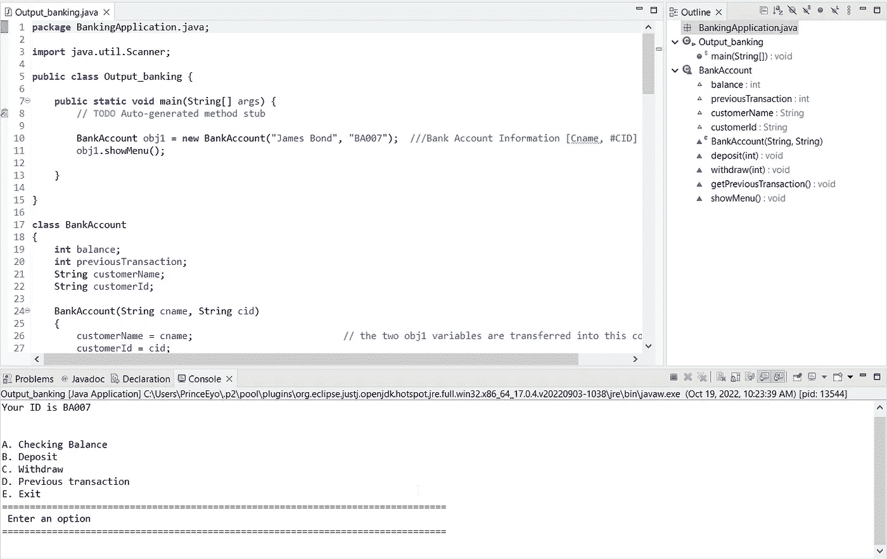
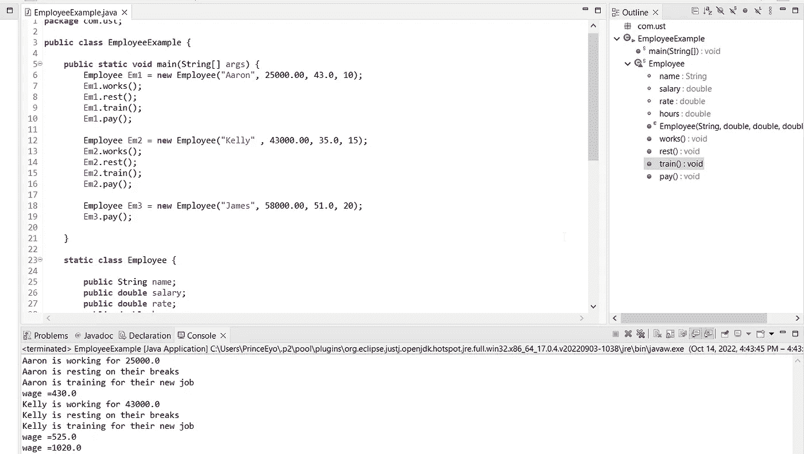

# 我最终冒险学习了编码

> 原文：<https://medium.com/codex/i-finally-took-the-plunge-and-learned-to-code-e71b555bb688?source=collection_archive---------16----------------------->

## 充分披露:我不是一个伪君子。我最近工作忙得不可开交。

克里斯蒂娜@ wocintechchat.com 在 [Unsplash](https://unsplash.com?utm_source=medium&utm_medium=referral) 上的照片

七月，我发表了一篇文章，题目是，

> [克服写作瓶颈:今夏保持高效的小贴士](/@princeeeyo/overcoming-writers-block-tips-for-staying-productive-this-summer-5790661d3c8b?source=your_stories_page-------------------------------------)

然后从这个世界上消失。选择往后三个月不写。我选择进一步学习代码，因为至少我有一个好的借口(很少)。出于法律和/或隐私的考虑，我不能分享为什么我决定学习如何编码，但我可以谈谈我到目前为止学到的东西。

** Eclipse 上使用 Java 的银行应用示例**

# 我发现编写代码是一项可以高效完成的任务。

另一方面，学习编码运动在打破障碍和向人们展示编码实际上是无害的方面做得很好。像 Codecademy、w3schools 和 LeetCodes 这样的工具会以最温和的方式向你伸出援手，向你保证(不，所有人！)您也可以学习编码并成为一名成熟的开发人员。

代码挑战帮助您建立解决问题的技能，更好地理解您使用的编程语言，并了解您可能不熟悉的算法。如果你想提高你的编程技能，没有比写代码更好的方法了。此外，编码挑战很方便，因为它们允许您在一个小问题上练习技能，并且您很少需要构建一个完整的应用程序，所以您通常可以相当快地完成它们。

当我们迭代解决方案时，我们对代码的理解需要改变。为了反映我们对代码理解的提高，我们可以删除旧代码，编写新代码，或者我们可以编辑现有代码！如果我们编写的代码易于更改，这通常是最有效的方法。

**带有 Java*的 Eclipse IDE 中的员工工时和工资示例*

# 我已经练习写代码有一段时间了，下面是我学到的东西。

我学到了很多，现在我写了很多代码，这对我作为一名记者和书籍作者的工作很有帮助。我写了一些小脚本和程序，让我的工作和个人生活更轻松。我也发现我喜欢它——在智力上和创造性上，它可以是绝对的爆炸。

当然，在线教程和书籍可以很好地教你基础知识。但是真正教会你代码如何工作的是当你试图构建一个能做一些事情的软件的时候。那是你最终接受你所做的和不知道的事情的时候。这是从书上或课堂上学习法语短语，然后去餐馆点菜的区别。

记住，编码与其说是一种记忆练习，不如说是一种用积木搭建东西的方式。就像学习一门真正的外语一样，理解是第一位的，这是一个很好的迹象，表明你在正确的道路上。

史蒂文·勒勒姆在 [Unsplash](https://unsplash.com?utm_source=medium&utm_medium=referral) 上拍摄的照片