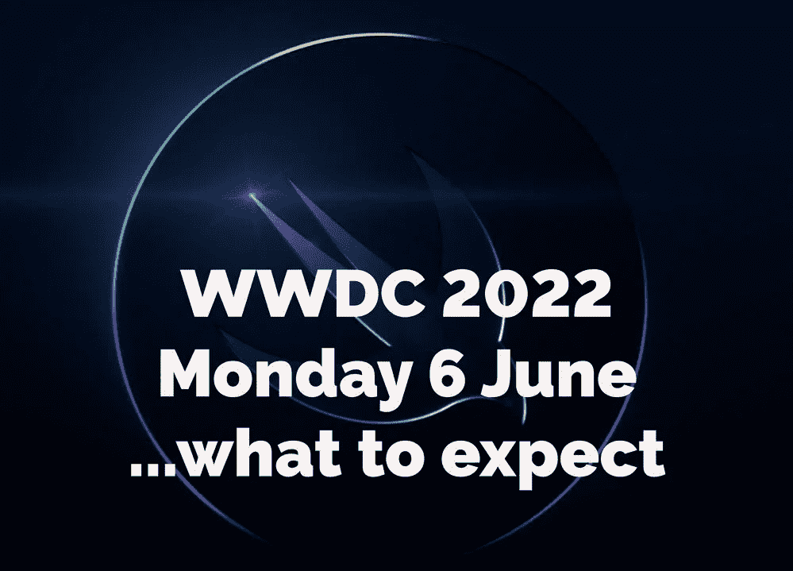

# 我讨厌正确！

> 原文：<https://medium.com/codex/i-hate-being-right-49073d66cb?source=collection_archive---------14----------------------->

## 让我们把六月的 WWDC 看得更远一点

呼叫代码 WWDC 2022

这个博客的标题有点半开玩笑的味道，但同样也有一丝真实。我今天醒来，想在 YouTube 上了解我最喜欢的创作者，却发现他们正在播放我在这里或者在我的[频道](https://www.youtube.com/c/DavidLewistalkingtechandaudio)带给你的故事。从苹果试图通过使用更多的零部件来进一步控制供应链，到 iPhone 摄像头泄露，当然还有 WWDC。几周前，我们被告知会议将于 6 月 6 日举行，昨天，这一消息得到了证实。我当时推测，这个活动将会更多地基于软件的*，但是今天，让我们更详细地看看六月的会议。*

**

*Swift 编码程序*

## *代码调用*

*正如一些人今天所说的，邀请有点无聊，戴着我的设计师帽子，我不同意。轻描淡写，可能是，但平淡或误导，绝对不是。*实际上*，事实恰恰相反，精致的 swift 标志让人回想起他们各种操作系统的强大编程语言。正如我在最近的一篇博客中预测的那样，该活动将在网上举行，但有一点需要注意的是，当天将会有一些人、开发者和学生亲自参加。如何参加的细节将很快在他们的网站上发布，苹果也打算展示天才学生的创造力。这个会议通常是为了聚集最优秀的开发者，一起为未来的软件和应用集思广益。*

* [## 为什么我要去麦克斯？

### 不是 M1，不是 M1 专业版，但对我来说是马克斯。为什么？

medium.com](/codex/why-did-i-go-max-e5e27a6ff1b1)* **

*苹果软件包*

## *那什么软件*

*几乎可以肯定的是，苹果将会看到所有新操作系统的第一眼——iOS 16、iPadOS 16、tvOS 16、watchOS 9 和 macOS 13。Mac 刚刚更新到 12.3。*

* [## 戴森区——真的吗？

### 这可能是有史以来最精心制作的笑话之一，或者是一个杰出的创新。你决定吧。

medium.com](/codex/the-dyson-zone-for-real-cc26172f523b)* **

*macOS 13*

## *马科斯*

*虽然相当小，但最近更新的最大明星是*通用控制*。看到它的实际应用是非常棒的，但是更重要的是，我们花了整整一年的时间才看到它。虽然，从技术上来说，它仍处于测试阶段，但运行良好。它可能会在 macOS 13 中成为完整版本，但我提到这一点只是作为一个警告。如果你在这次 WWDC 上看到任何令人瞠目结舌的新升级，你可能需要耐心等待。 ***你希望在未来的 macOS 版本中包含哪些内容？****

**

*iOS 16*

## *ios*

*小部件再次成为谣言。一些更受欢迎的应用程序，如*音乐*的更大的插件将变得更具互动性。除了一个简单的图标，想象一些有用的用户功能，比如暂停、播放和跳过，可以成为图标的一部分。而且，看起来 iPhone 6S 也已经走到了尽头。要升级到 iOS 16，您需要运行 iPhone 7 或更高版本。尽管如此，苹果支持其硬件的时间之长在技术领域是无与伦比的。*

**

*iPadOS*

## *iPadOS*

*不过，操作系统中最弱的还是 iPad。谣言已经开始浮出水面，多任务处理可能是 iPad 未来的一个焦点。有报道称，苹果正在研究一个更加 T2 化的窗口环境，类似于 iPad 上已经有的 T4 快捷笔记功能，从而使其更像一个桌面工作站。为了实现这个工作流程，你可能需要把你的 iPad 连接到一个神奇的键盘上。专业应用程序的缺席仍然是不祥之兆，这需要解决。随着 iPad 现在运行 M1 芯片，权力就在那里，所以它需要苹果花一些时间和精力来使他们的 Pro 应用程序，如 *Final Cut Pro* 和 *Logic Pro* iPad 兼容。*

* [## 战斗开始了！

### iPad Air v iPad Pro——哪个适合你？

medium.com](/codex/y-ipad-the-fight-is-on-b6a2ba27b898)* **

*苹果 tvOS*

## *tvOS*

*我文字不差，但连我都想不出什么有意义的东西来写 tvOS。我最近开始在 Apple TV+上看更多的 *Apple Originals* ，并在我的智能电视上使用该应用程序。UI 是 *OK* ，我唯一注意到的是它需要多长时间加载。除此之外，苹果电视正在做我想要的一切。再快一点——这就够了。*

**

*watchOS*

## *watchOS*

*在这一点上，Apple Watch 在社会中已经足够成熟和根深蒂固，足以证明它是一个独立的产品。我可以想象，Apple Watch 很快就会依赖于拥有一部 iPhone。在某种程度上，这阻碍了它的发展，因为我确信有 Android 用户喜欢 Apple Watch 上健康功能的*想法*，但不想将*完全切换到*苹果。*

* [## 太阳出来了！

### 随着今年 WWDC 的预计日期泄露，我们可以期待什么？

medium.com](/codex/here-comes-the-sun-9fe01350de9c)* **

*我们最终会看到 AR/VR 耳机吗？*

## *五金器具*

*虽然主要是一个软件会议，但它不是前所未有的，硬件可以向我们展示。正如我最近写的，新的硬件很可能需要新的软件和应用程序。所以，当全世界的开发者都在关注你的时候，你还有什么更好的平台来发布新产品呢？我不希望在 WWDC 发布任何硬件，而是*宣布*，在今年年底或明年年初发布。我认为 *Mac Pro* 和我们第一次看到的 *AR/VR 耳机*可能是主要目标。关于耳机，我们知道它将有自己的专用应用程序商店，所以开发者领先游戏的时间越长越好。随着 Mac Studio 现已上市，Mac Pro 是完成向苹果芯片两年过渡所需的最后一台基于英特尔的 Mac。中高端用户已经有了 Mac Studio，所以 Mac Pro 可以直接瞄准那 5%的人想要的、需要的需求——苹果提供的最好、最快的产品。模块化仍然是这里的关键。可能会包括 PCIE 插槽，供消费者添加更多内存，或者可能会回到授权的苹果经销商那里升级/更换芯片。尽管如此，Pro 还是需要可扩展。*

## *有效性*

*如果你是苹果开发者计划的一部分，那么在 WWDC 宣布的大部分内容你都可以马上看到。对于我们其他人来说，第一次更新可能会在 7 月底推出。主要的主题演讲将一如既往地在太平洋标准时间下午 1 点举行，希望到那时，我将通过我的新 MacBook Pro 16 英寸在工作室显示器上观看它！ ***看，我不需要太多就能让我开心！****

## *在你走之前*

*我只是高端博客网站 Medium 的众多作者之一。它是如此物有所值，你可以在这里加入[https://medium.com/membership](https://medium.com/membership)*

*加入我的幕后邮件列表[https://www.talkingtechandaudio.com](https://www.talkingtechandaudio.com)*

*最初发表于 2022 年 4 月 6 日 https://www.talkingtechandaudio.com/blog。*