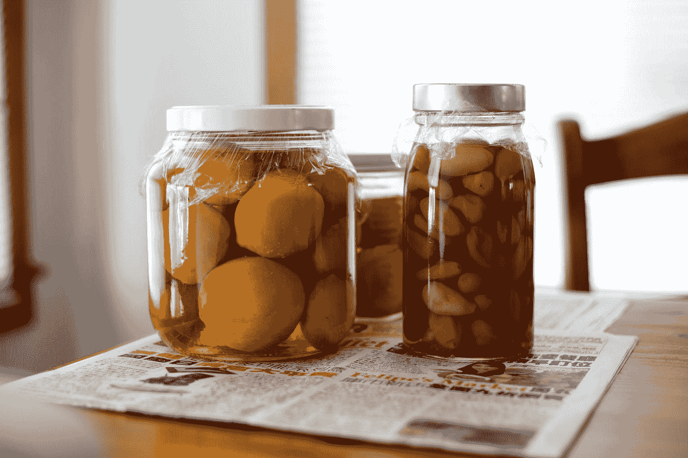

# 我讨厌隔离飞镖

> 原文：<https://medium.com/codex/i-hate-dart-isolates-dd7ca044d374?source=collection_archive---------0----------------------->

[梁杰森](https://unsplash.com/@ninjason?utm_source=medium&utm_medium=referral)在 [Unsplash](https://unsplash.com?utm_source=medium&utm_medium=referral) 上的照片

于是 Flutter 2.8/Dart 2.15 刚刚公布。在这篇文章中，我将谈论 Dart 2.15。

在我开始之前，有没有人希望 Dart 的第 3 版没有安全性？这些数字太高了。

## Dart 2.15

首先，我对更新有什么看法？没关系。我的意思是它使用更少的内存，这总是好的。我真的很喜欢能够得到…