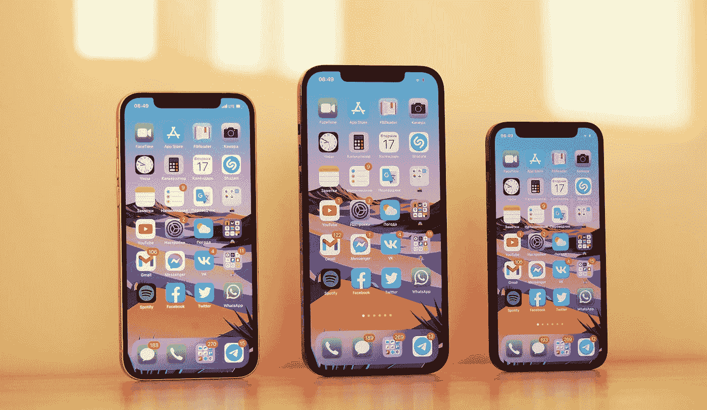

# 我已经用一个简单的移动应用程序赚了 10，000 美元。

> 原文：<https://medium.com/codex/i-have-earned-10-000-with-one-simple-mobile-app-b0673d5af25b?source=collection_archive---------2----------------------->

丹尼斯·切尔卡申在 [Unsplash](https://unsplash.com?utm_source=medium&utm_medium=referral) 上拍摄的照片

如果我不得不从头开始我的编程生涯，我会 100%投入到移动应用程序开发中，因为开发移动应用程序就像建造出租公寓一样。

**这里有一个例子:**

在法国，一套小公寓的价格是 10 万美元。如果你想租它，你一个月挣 500 美元，大约一年 12000 美元。