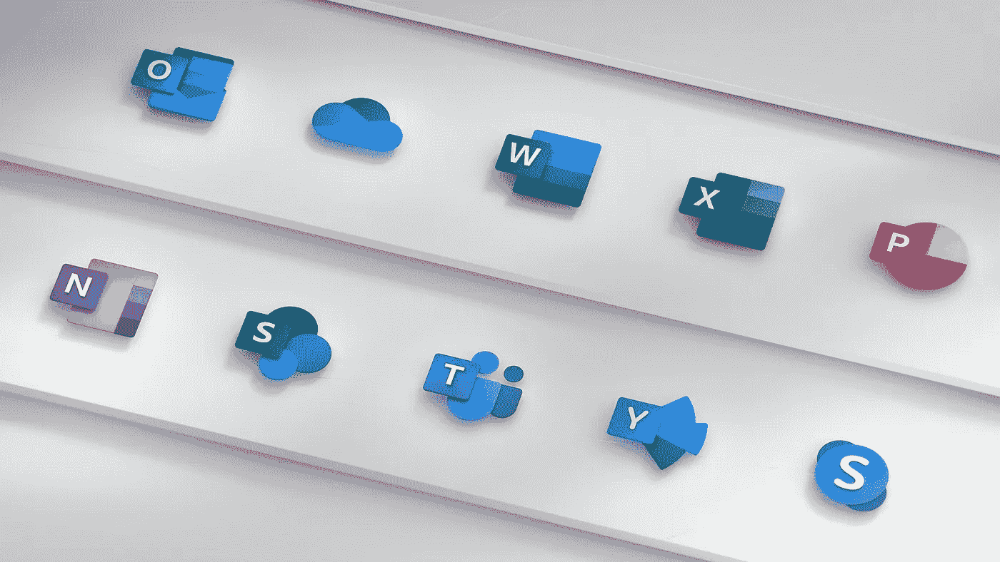
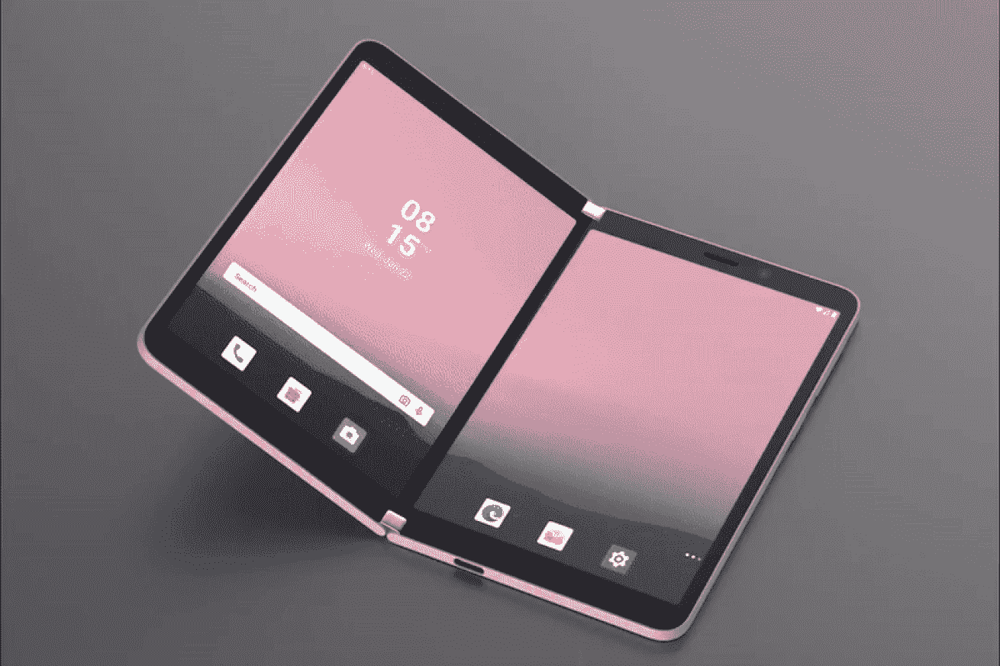

# 我刚刚进入微软的生态系统

> 原文：<https://medium.com/codex/i-just-got-into-the-microsoft-ecosystem-c9a9d3db089d?source=collection_archive---------4----------------------->

## 我甚至不知道这是一件事

微软生态系统。

你听过有人谈论微软生态系统吗？在技术领域，我们通常会听说苹果生态系统。他们只是很擅长这个(声明:我已经 5 年多没有苹果了！).你的 iPhone 可以轻松地连接到 MacBook，你的 iPad 笔记在你写的时候就在 iCloud 里了。如今，即使你的鼠标也能在不同设备间无缝工作。这只是另一个层面。据我们所知，苹果在这方面做得最好。很少有人谈论微软生态系统，但我相信每天都有比我们想象的更多的人在其中。这就是为什么我们必须谈论它。

## 关于微软近年来的一些情况

十年前，微软只是一家令人畏缩的公司。他们开发了 Zune HD、Windows 8 和 Windows Phone。当时没人喜欢微软。苹果就像是一个很酷的潮人(就像乔布斯一样)，而微软是一个戴着眼镜的书呆子(就像比尔·盖茨，但今天他更酷)。史蒂夫·鲍尔默自比尔·盖茨 1998 年离开后一直担任首席执行官，他和公司董事会意识到他们需要一场文化变革。事情并不顺利。2014 年，他们选择塞特亚·纳德拉担任新的首席执行官。

萨提亚认为，微软必须让人们和组织获得更多成就。公司必须做出东西来帮你做出东西，让东西发生。

萨提亚尽快宣布 Office 套件即将登陆 iOS(是的，2014 年之前还没有 iPhone 版的 Office 应用)。他们发布了 Windows 10，收购了 GitHub，宣布了 Surface 设备，发展了云业务，甚至开始销售微软制造的 Android 手机。微软的每一款新设备看起来都像来自未来。文化上的变化如此巨大，以至于 Windows 11 的发布让人们兴奋不已，这是微软从未见过的。这就是微软的 ***新*** 。

不同的是，现在微软不仅试图复制竞争对手的产品，而且试图成为一家创新公司。创新是一场小尝试、小失败、快速学习的游戏。

微软 Duo——双屏安卓手机。

# 微软生态系统解释道。

“生态系统”一词源于生物学，但也适用于科技。生态系统是一个整合为一个整体的环境。这是微软为我整合的一个整体:

*   **Windows + Office 套件:**这是经典的组合。世界上超过 75%的人使用 Windows。说真的，PowerPoint 比谷歌幻灯片好太多了。
*   **VSCode + GitHub 进行编码:**这些碎片刚刚成为开发者的“新常态”。我认识的人都在用 VSCode 编码，用 GitHub 发布。这是默认值。有很多扩展使得 VSCode 非常适合在 GitHub 上发布。
*   团队和对沟通的展望:团队在疫情期间成倍增长，这非常适合在办公套件中使用。当我们通过团队共享一个文档并一起编辑时，我们可以说“它只是工作而已”(恭喜你，微软，你成功了！).Teams 还是一个基于电子的软件，这让它感觉很慢，但这即将改变。对于与工作相关的电子邮件和日历，我使用 Outlook。和工作相关的看板，我用的是 Planner。这两个程序总是与团队同步，所以我的日历和任务总是很容易在团队中找到。
*   **OneDrive for file storage:** 同样，这款工具非常适合生产力套件。您可以轻松地在团队中共享或将其发送给其他同事，他们可以与您一起编辑该文档。OneDrive 的主要超能力是 Office 文档的轻松保存和共享，查看其编辑历史和一起编辑。
*   **浏览边缘:**好吧，我实际上在日常生活中使用 Firefox(有很多插件),因为*失败了*尝试变得更加隐私。但是，有时，我需要更换浏览器，所以，当我需要时，Edge 是我的第二选择。而且对我来说，感觉比 Chrome 好太多了(而且已经安装了！).但是必应仍然是一个禁忌。使用真正的搜索引擎。
*   **Xbox Game Pass for gaming:** 我是一个 PC Master Race 的家伙(这意味着我拥有一台游戏 PC)。然后，我的显卡就坏了。所以，游戏是不可能的。但是，几天前，我加入了 Xbox 游戏 Pass Ultimate。这是网飞式的，但不是为了游戏。每月只需 14.99 美元，我就可以玩 350 多种游戏，有些还可以在云上玩，不需要高端电脑。突然，在 Steam 购买游戏成了第二选择。我这辈子可能再也不会有游戏电脑了。

PS:微软，如果你在看这个，请改名为“微软游戏通”。每次我和我的朋友谈论“ *Xbox* 游戏通行证”时，他们都认为这是一项专为 Xbox 游戏机打造的服务。

因此，当我查看我的日常活动时，我正在通过微软工作、交谈、编码、浏览和玩耍。我不得不承认，我喜欢这样。很简单。

# 从现在到未来🚀

我确实相信微软内部的新文化会改变游戏规则。我们将在未来谈论 IBM 如何失去其地位，以及微软如何*几乎*失去它但有能力再次获得它(已经有聪明人在谈论它)。我相信微软会拓展业务，去拥抱更多的东西。未来是协作的。

我对微软有好感。真的希望他们保持这个轨迹，建立一个更好的生态系统。

想了解更多关于创新的内容吗？这个怎么样:

 [## 为什么电动滑板车是下一个重大创新

### 它们是缓慢的、低范围的和许多其他的衰退。这就是未来。

medium.com](/@allanmviana/why-electric-scooters-are-the-next-big-innovation-7ca682e00d79)