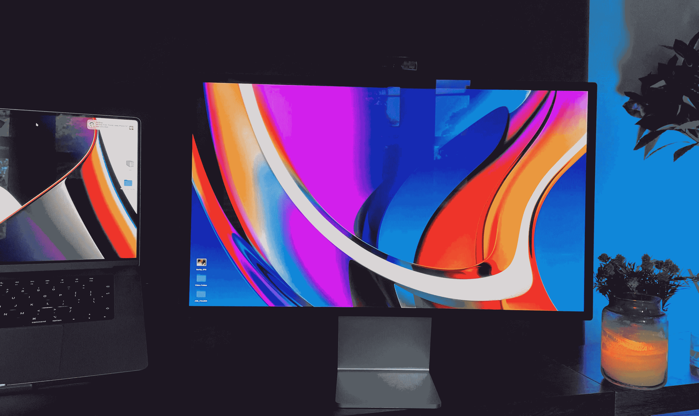
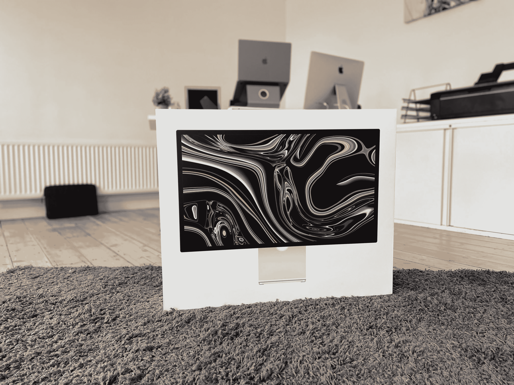
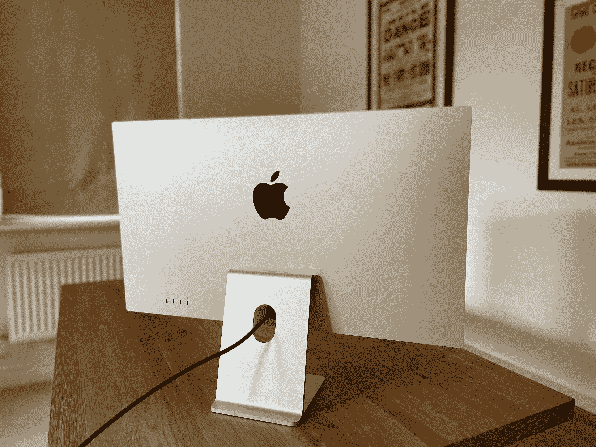
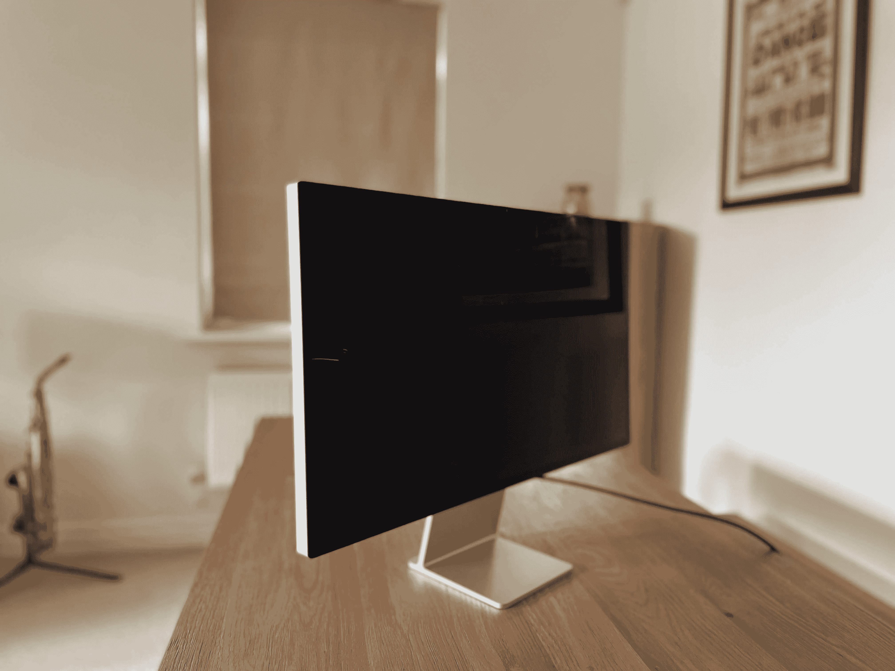
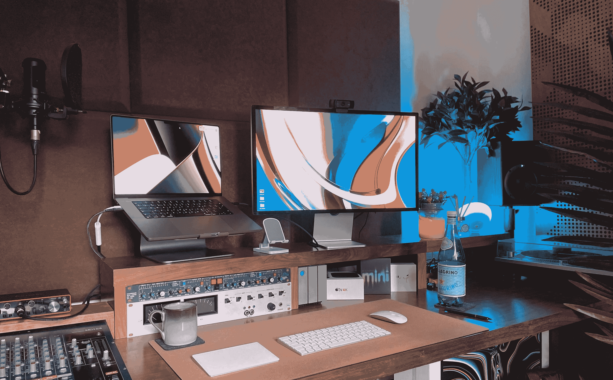

# 我刚刚经历了一场周末恋情

> 原文：<https://medium.com/codex/i-just-had-a-weekend-affair-c35c2e4caba1?source=collection_archive---------5----------------------->

## 我想我可能正式爱上了工作室的展示

图片由作者提供

好吧，我可能不是第一个参加派对的人，但在过去的几周里，我一直在更新我的苹果游戏。AirPod Pro(爱非国大)，16 寸 M1 Max MacBook Pro(你听过的都是真的)，现在，工作室显示器。是的，很贵，但是它够用吗？

## 一种奇怪的方式得到它

在我进入博客，告诉你我的展示经历之前，首先，关于*我是如何得到我的展示的难题。我在三月底下了订单。预计的日期是 7 月中旬。上周，我在 YouTube [频道](https://www.youtube.com/c/DavidLewistalkingtechandaudio)上的精彩观众建议我去看看一些英国第三方零售商。我查过亚马逊和易趣，毫无收获，但没有想到供应商。果然，他们是对的。我找到了一个工作室展示，为第二天交付，与一家名为*非常*的公司。这几乎太容易了，但毫无疑问，在浪费了一个月的等待后，第二天就到了。奇怪的是，发货文件告诉我它是直接从苹果公司发出的！现在，给我解释一下！*

 [## 大小——并不完全像人们所说的那样！

### 大屏幕还像以前那么重要吗？

medium.com](/codex/size-not-all-its-cracked-up-to-be-a7cd7689a8ca) 

## 非常苹果

图片由作者提供

到货，就是典型的苹果。他们现在使用的蛤壳盒子在工程上非常壮观。它为你设置了完美的场景，即将发生的事情。在里面，你得不到什么。我说的不多，是指显示器和迅雷线！如果你有一台 27 英寸的 iMac，那么它的重量和那台差不多，但是放在桌子上要稍微低一点。正如您所料，构建质量感觉非常好。它全身都是“苹果”拉丝铝表面，背面有一个简单的大黑色标志。奇怪又莫名其妙的是，电源线是不可拆卸的。只要确保不要让你的狗咬穿它，否则在苹果修理它的时候，你会失去显示屏！

## 设置

图片由作者提供

再简单不过了。开箱后，撕下几层保护层，接上随附的 USB-C thunderbolt 线缆。我要说的一点是，对于 1500 来说，1 米的长度有点太吝啬了。可笑的是，如果你愿意，你现在可以购买 1.8 米或 3 米的电缆，但为此，你将被要求交出 129 或 159 英镑！来吧，苹果…我爱你，但一根 1 米长的电缆是可悲的。一边，你做好了准备。你没有更多的设置要做。别忘了，*(短)* thunderbolt 线缆也可以给你的 MacBook 充电，所以可以减少线缆的数量。不，我没有强迫症…我只是喜欢干净的桌子，好吗！最后提一下电缆，无论是雷电&电力电缆，他们现在是一个布，编织的事情。再次强调，对细节的关注是惊人的。再次，所有增加了溢价的感觉。

 [## 闭环系统

### 以及苹果断裂的供应链

medium.com](/codex/the-closed-loop-system-f1b2ee23a151) 

## 我们来这里的目的

图片由作者提供

该面板为 27 英寸 5K 显示屏，分辨率为 5120x2880，每英寸 218 像素。它也很亮，600 尼特，采用 True Tone 技术，支持 10 亿种颜色。当我第一次把它放在桌子上时，它正对着一台 27 英寸的 iMac，我不骗你，它让它看起来很差。这可能是我用过的最好、色彩最准确的显示器。直到上周，这还会是那个声明的结尾，但是 MacBook *上的显示只是*击败了它…*罢了！黑色更浓了一点，颜色更鲜艳了一点，但我也变得既娇惯又挑剔了！工作室的展示从各个角度看都很美。我看不到平点或死细胞。从边缘到边缘，它提供铲负载。*

## 我们来这里不是为了什么

摄像机。太可怕了！老实说，不要用。我用我的罗技 C920P 1080P，30fps，高清相机拍摄了它，总共花了 65 英镑，它轻而易举地击败了它。好吧，我没有为网络摄像头购买显示器，但这是我的观点。如果你要有一个，那就做好，否则就别麻烦了。它破坏了用户体验，并削弱了包装的优质空气。这是我第一次看到舞台中央的表演，不可否认，这非常巧妙。但是，我永远不会用！在我的测试中，相机似乎处于一个尴尬的高度，使我看起来像塑料和橙色。它是如此糟糕，我真的不能公正地对待它。我的建议是买你自己的相机。

## 音频和内容消费

图片由作者提供

然而，音频完全是另一回事。这里有一个六扬声器系统，听起来也是如此。声场是相当全面的，如果你正在寻找舒适的，一整天的听力，这些将提供。不要过于重低音，清脆而真实，这将是描述这种体验的最简单、非发烧友的方式。对于你们，我听了一些肯德里克·拉马尔检查空间音频。老实说，几乎察觉不到。有一些头部跟踪，但你不会注意到。或许正如你所料，AirPod Pro 的表现要好得多。在这个面板上看苹果电视，或者 YouTube，可能和我曾经有过的视觉体验一样好。比我的苹果电视好…那就是*好！*同样，根据您的桌面设置，您可能会发现显示器位置有点低，比如比 iMac 低。虽然这么说真的让我很受伤，但如果你是在标准办公桌上工作，400 英镑的倾斜和高度可调支架升级可能是值得的。不好意思！

 [## 我在 M1 麦克领地的第一个 48 小时…

### …从英特尔到苹果芯片的过渡

medium.com](/codex/my-first-48-hours-in-m1-mac-territory-9e88b093a961) 

## 连通性

你的四个端口中的一个被 thunderbolt 占用，它将链接到你的 Mac。其他三个端口是普通的 USB-C 端口，最高可达 10Gb/s，用于连接外围设备、存储和网络。这些端口的配合紧密而精确。当它们卡入到位时，有一种高度可靠的“*咔嗒声*”。

## 结论

欣喜若狂。从我所听到的一切来看，我知道这部相机不会给人留下深刻印象。但由于我没有为网络摄像头购买显示器，我将忽略这一点。在我*购买这款显示器的地区,*无法提供 10 分中的更多。充满活力、明亮、多彩且精确。到目前为止，设置简单，使用方便。我肯定还有更便宜的选择，但就像我的苹果工具包的其他部分一样，这是对未来的投资。我怀疑，在显示器过时之前，MacBook 就已经过时了。因此，尽管这是一笔昂贵的支出，但也是一次性的。我将很快将其与 LG Ultrafine 5K 显示器进行比较，并将我的想法告诉您。我知道我让苹果轻松了。对我来说，它永远是这个显示器。它看起来很棒，非常合身。我会推荐吗？太好了。我刚刚看了苹果网站，他们仍然在报价 8-10 周交货。我的建议是货比三家。你也可能会走运。

毫无疑问，这是苹果的最佳状态——除了相机。

**原载于 2022 年 5 月 16 日 https://www.talkingtechandaudio.com/blog******。****