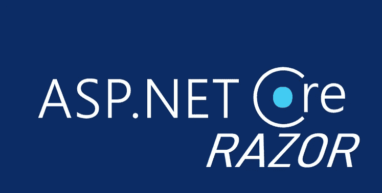
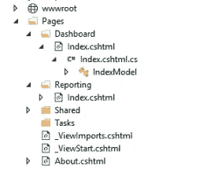

# 我离开了网络表单，转而使用剃刀页面。

> 原文：<https://medium.com/codex/i-left-the-web-form-and-switched-to-razor-pages-c520a96c1cd2?source=collection_archive---------3----------------------->



嗨，在这篇文章中，我将谈谈我的想法。NET 核心剃刀页，它的优点，缺点和它给我增加了什么，我祝你阅读愉快。

如果你和我一样处在改变的过程中，或者想知道我的改变，那将是一篇很长的文章。

如果非要说我自己，我从 2015 年就开始用 web Forms 技术开发 Web 应用。一次又一次，我看着 MVC，发现它对我开发的项目来说太复杂了，所以我在一两个项目中被使用，然后走开了。如果你没有一个旧的但难以置信的大项目作为 ORM，我会用 LINQ 2 数据上下文建立我的数据库关系，这不会引起问题，甚至节省了很多时间，我会开发基于过程的数据库架构，并尽可能将 SQL 与 C#分开。

我将使用 Linq2DC 作为 ORM。如果你没有一个旧的但是不可思议的大项目，它是一个不会引起问题的 ORM，甚至可以节省很多时间。我曾经用这个 ORM 建立我的数据库关系，开发基于过程的数据库架构。

我之所以讲这一切，是因为我习惯了安逸，我能在自己的安全地带快速发展。

如果你用过 **Linq2DC** ，就能明白我的意思。拖动表格、程序等。就足以让它变成一个类。你说是什么问题，我直接解释。你不能在 Net Core 中使用 **Linq2DataContext** ，即使你努力尝试使用一个与 web form 相比的实体。
正是因为这些原因，我继续用 Web Form 进行开发。

## 那么我是怎么逃出安全区的呢？

我现在工作的公司有很多老项目，有些工作需要处理老项目中的 mdb(access)数据库。在这些情况下，最讨厌的历史工件 oledb 代码开始发挥作用，如你所知，这使我发疯，所以我花了 2-3 天为自己编写了一个微 ORM。

然后我喜欢这个微型 ORM 的想法，我准备了一个版本的微型 ORM，它可以与 Sql 客户端一起工作，并可以在可以读取和 Lamda 表达式的地方使用。
我以采购员的身份进入微 ORM 世界，说如果我写这些，别人做的更好。我发现了一个运转良好的微型生物的世界。我决定使用 OrmLite，并开始使用它。就在这时，我想到了一个主意，我可以在 Core 中使用这个微表单吗？

在开发 Core 时，我在旧版本中尝试了 2-3 次，所以我在兼容版本的 **Nuget 包**尚未开发时测试了它们，并说它需要更多的开发，然后离开了它。请记住，我已经开发了一个世界 Nuget 包没有任何问题的项目。现在 OrmLite 已经解决了我的 ORM 问题，即使它不像拖放那样简单，我也不打算让 SQL 查询既硬编码又能迁移，我觉得自己一石二鸟。现在我可以真正地将 Core 引入我的开发过程了。

我离 Core 的后端部分不远，由于我之前一直从事 Web API 开发，可以说 Core 给我的感觉就像是写纯 C#一样。

## 核心剃刀页的利弊？

当我在一个小项目中测试它时，我看到了当与核心结合时 Razor Pages 变得多么强大，我可以说我很惊讶。*现在网络表单项目真的感觉像是浪费时间。*

所有的公共变量都被传递到前端。如果您将一个作为属性从后端绑定到表单元素的变量作为 name 属性，那么在表单请求过程中，您的变量将自动从表单元素中解析和填充。

这个事件极大地缩短了开发时间。而不是说 t_name。值并达到文本框的值，进行全局检查，然后填充您的类，想象您的类直接达到满。Web 表单脚本引擎已经快把我们逼疯了。由于 Razor 在这方面的灵活性，处理前端和后端都变得非常简单。您可以根据模型的字段为 html 输入提供控件。您也可以忘记使用 ASP.NET 验证组件或 Jquery 验证。

**范例属性绑定；**

*。cshtml*

```
<**form** class="form-horizontal" method="post"><**div** class="form-group"><**label** for="Name" class="col-sm-2 control-label">Name</**label**><**div** class="col-sm-10"><**input** type="text" class="form-control" name="Name"></**div**></**div**><**div** class="form-group"><**label** for="Email" class="col-sm-2 control-label">Email</**label**><**div** class="col-sm-10"><**input** type="text" class="form-control" name="Email"></**div**></**div**><**div** class="form-group"><**div** class="col-sm-offset-2 col-sm-10"><**button** type="submit" class="btn btn-default">Register</**button**></**div**></**div**></**form**>
```

*cshtml . cs；*

```
[BindProperty]**public** **string** Name { **get**; **set**; }[BindProperty]**public** **string** Email { **get**; **set**; }**public** **void** OnPost(){ViewData["confirmation"] = $"{Name}, information will be sent to {Email}";}
```

最大的好处之一是，当你添加一个 WebMethod 来请求 Web 表单中的页面时，你必须使之成为静态的，当然，由于静态和动态会话中的会话是不同的，你必须以某种方式将额外的用户发送到后端。Core 完全走在了前面。它将 RequestVerificationToken 输入添加到页面中，当您使用此输入发出请求时，会显示客户端的所有会话值等。像他们一样工作。

由于 Razor 页面的页面结构类似于 Web 表单，所以你不会感到惊讶。

**基本上，如果需要讲它的结构。**



在 wwwroot 文件夹中有静态文件(CSS、img 等)。

页面的内部是路由，每个文件夹实际上可以被认为是一个页面。

在上面的示例中，如果您向/Dashboard 发送请求，Index.cshtml 将会打开。cshtml 前端，cshtml.cs 是我们后端代码所在的区域。显然，它更适合于固体结构。例如，您创建了 Workers 文件夹，您将执行 worker 进程。你在里面打开必要的页面。

Workers > Index.cshtml、AddUpdate.cshtml、Detail.cshtml 等。

如果您有交通工具，那么可以使用诸如/Workers/Detail？id=54，您的查询也可以直接访问，就像 propertybinding 一样。

**在性能上有着令人难以置信的差异，有着明显的提高。**

由于其一般结构，它作为非管理代码工作。您应该为每个项目创建一个单独的资源库。如果你看看输出，它得到的输出是 exe 和 dll。【ProjectViews.dll】像 project.dll 一样把前端和后端分开。唯一恼人的部分是，你已经发布了你的项目，你会上传到 ftp。在这种情况下，你要从 iis 停止项目，不需要连接服务器就可以做到这一点，当然如果你从 ftp 传输一个名为 app_offline.htm 的文件到项目的目录下，项目会自动停止。这样，您可以执行更新过程。看来我们别无选择，只能马上停止这个项目，我真的希望如此。

基本上，我过渡到核心，我想告诉你，有一个主题，我可以进入一个完整的世界的细节，但我不想延长这篇文章。

**优点**
*性能
*它极大地缩短了开发时间。
*他极其倾向于甚至推动以坚实的原则发展。
*多平台
*剃刀引擎

**缺点**
*你可能会在发布项目时遇到麻烦，每次你创建一个新项目，你都要做一些发布设置。
*更新项目时，不能覆盖文件。由于它以动态链接库的形式给出视图，即使是最轻微的 html 修改，你也应该重新发布。

[详细回顾，建议你看一下微软准备的页面。](https://docs.microsoft.com/en-us/aspnet/core/razor-pages/?view=aspnetcore-3.1)

非常感谢你读到这里。