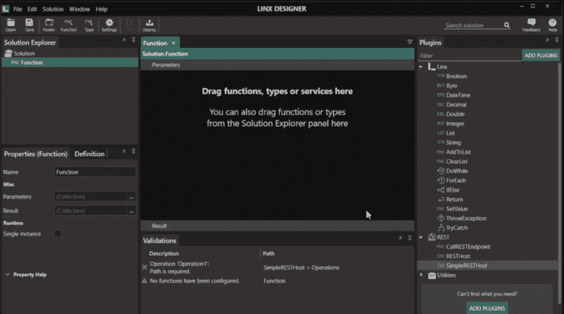
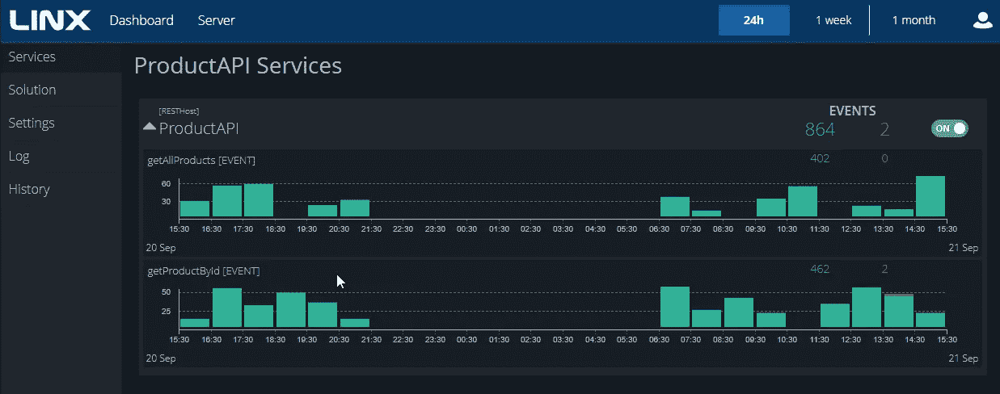
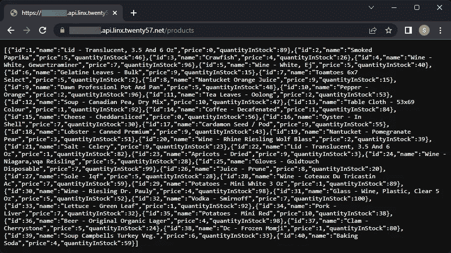

# 我需要快速构建一个 REST API 帮助

> 原文：<https://medium.com/codex/i-need-to-build-a-rest-api-fast-help-9039b9651fa?source=collection_archive---------8----------------------->

众所周知，API 开发具有挑战性，尤其是如果它不是您的专长。您可能会发现自己处于这样一种情况，即您需要用有限的相关知识构建一个 REST API，并且您需要尽快完成。如果是这样，这是给你的帖子。

我确信你可以在互联网的任何地方找到 API 的定义，但是为了方便起见，这里是我的基本解释:

API(应用编程接口)是一组允许软件程序相互通信的功能和过程。API 充当两个软件应用程序之间的桥梁，两个应用程序都可以使用 API 来执行原本很难或不可能完成的任务。

API 可以采用多种形式，但通常接收一种格式的输入数据，将其转换为另一种格式，并将转换后的数据返回给调用者。例如，一个 API 可能从 web 客户端接收 JSON 数据，并返回要由 web 浏览器呈现的 HTML 内容。这是一个 REST API 的例子。

在这篇文章的上下文中，当我说 REST API 时，我们指的是一个 API。让我们快速看一下 API 开发过程。

# API 开发

要成功开发一个允许用户检索数据的 API，您需要设计、开发和托管该 API。

这些活动中的每一项都有一系列细微的步骤，并且需要使用一套技能和工具:

**设计** —为了设计 API，您可以选择使用类似 OpenAPI 3.0 规范的东西。该规范将允许您记录 REST API 的外观，定义其交互，并作为文档使用。诸如 Postman 或 SwaggerUI 之类的工具对这一步很有用。您也可以选择通过 Linx 等工具中的向导来设计 API。Linx 有一个 SimpleRESTHost 组件，允许您通过 GUI 轻松地设计和更改 API。

**开发**——现在你有了设计，是时候编码了。您需要选择您将使用的工具、技术和标准。这一步还将涉及不同技术和系统的整合。通常，用于向用户提供数据的 API 会连接到您的数据库、数据湖或数据仓库。您还需要考虑安全性和身份验证。

**托管**——现在你有了可用的代码，你需要托管它。托管变得棘手，因为可供选择的数量。您是要在本地自行托管，还是选择云解决方案？你将如何处理安全和监控？你的预算是多少？当选择在哪里托管 API 时，您必须考虑这些问题。

传统上，这些活动中的每一个都有各种各样的工具。例如，设计 OpenAPI 规范可以在 YAML 或 JSON 中完成。编码可以用 python、JavaScript、C#或低代码工具来完成。托管可以在本地服务器上进行，也可以通过云解决方案进行。这些都是工具，如果你不熟悉它们，你将需要学习。这就解释了为什么许多组织有多个团队来关注 API 开发生命周期的不同部分。

使用 API 时，理解 REST API 中通常使用的方法也很重要:

*   **GET:** 用来从服务器获取东西，或者换一种说法，用来从服务器读取。
*   **POST:** 将此视为发送一封信，其中包含要添加到服务器/服务的信息。POST 用于添加或创建某物。处理数据时，您将向数据集中添加一条新记录。
*   **删除:**顾名思义，该方法用于删除某个特定的资源或数据片。当处理数据集时，这可用于删除特定记录，或者当处理媒体时，您将使用这来删除图像。
*   这个方法用于更新一个资源。您还可以使用 PUT 来创建一个新的资源，其中客户端可以控制一个 ID
*   **PATCH:** 该方法用于更新资源的特定部分。也就是说，如果不想更新数据集中的整行，可以使用 PATCH 只更新非常具体的一条信息。

所有这一切听起来可能很难，似乎需要一段时间才能完成，但这就是您的需求和您可以使用的工具将会产生影响的地方。

# 简化 API 开发

我们生活在一个幸运的时代，在这个时代我们有很多工具可以让任务变得更简单。从过程自动化、数据捕获，甚至 API 开发。根据您选择的工具，您甚至可以不用接触代码就可以开发一个 API。假设你选择了一个低代码的工具(需要你编写最少代码的工具，它们主要使用拖放界面)。如果你选择一个低代码的工具，你就有可能在一天之内完成你的 API，这取决于你的需求有多复杂。

我更喜欢在构建 API 时使用 Linx。Linx 遵循一种通用的编程范式，这意味着它感觉很熟悉，并且有许多编程概念，然而，它仍然允许快速开发，因为它有一个拖放界面。

使用 Linx 创建 REST API 时，您需要安装 REST 插件，拖动 SimpleRESTHost，通过向导类型的界面设置端点，最后添加后端功能:

需要注意的是，您可以完全控制安全性以及调用 API 时会发生什么。

您也可以通过调试来测试您的 API。调试将创建 API 的本地托管版本，您可以使用任何测试工具甚至浏览器来调用它。这使您能够确保 API 的行为符合预期，并确保您能够在部署到服务器之前很好地捕捉错误。

一旦准备好了，就可以将 API 部署到 Linx 服务器上，在那里完成托管和监控，然后您的客户机就可以调用 API 了。

如果你想了解更多关于用 Linx 构建和托管 API 的知识，请参阅[完整指南](https://linx.software/build-and-host-your-api/)。

当然，还有许多其他可用的低代码选项，所以如果 Linx 不适合您，您一定会找到另一个可以帮助您开发 API 的工具。

# 最后的想法

构建和托管一个 API 可能是一项具有挑战性且有些令人生畏的任务。有许多事情需要考虑，但是在一些工具的帮助下可以快速有效地完成。低代码工具可以帮助你快速达到目标。通常，为了开发和部署一个 API，您甚至不需要完全理解编码 API 的所有细微差别。综上所述，要谨慎并意识到低代码工具的能力和局限性。

如果你想了解更多关于 Linx 的知识，你可以在[网站](https://linx.software/build-and-deploy-api/)上找到更多。