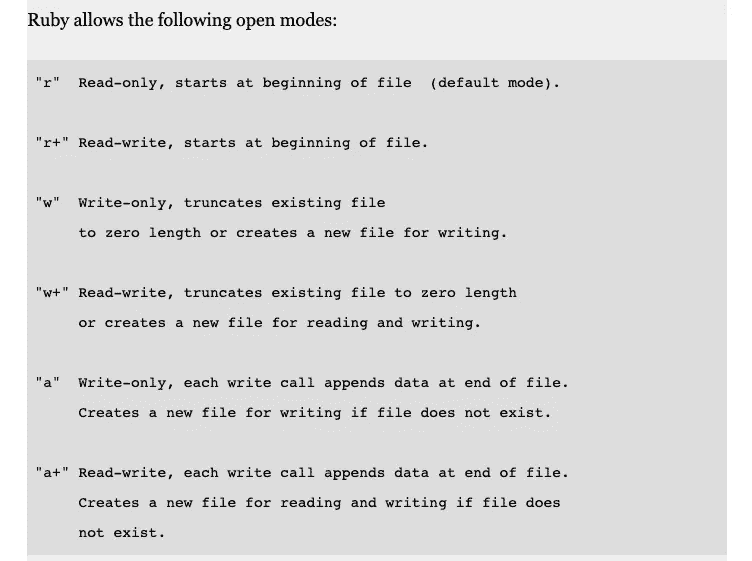

# Ruby 中的 I/O——哪些有效，哪些无效？

> 原文：<https://medium.com/codex/i-o-in-ruby-what-works-and-what-doesnt-a8cee063d833?source=collection_archive---------6----------------------->

## [抄本](http://medium.com/codex)

不同模式的解释—来源: [Ruby 2.6.3 文档](https://ruby-doc.org/core-2.6.3/IO.html)

前阵子偶然看到[这篇文章](https://blog.appsignal.com/2018/07/10/ruby-magic-slurping-and-streaming-files.html)，简单解释一下`File.read` vs `File.foreach`的内存利用问题。这是有意义的——一次读取文件的所有内容，并在内存成本上“付出代价”。

写入文件怎么样？我找不到任何直接引用 file write 的文章。好吧，那我们来测试一下，好吗？😆