# 我开发/发布了一个应用程序。网毛伊岛 Blazor

> 原文：<https://medium.com/codex/i-published-the-application-i-developed-with-net-maui-blazor-aedc2655f410?source=collection_archive---------3----------------------->

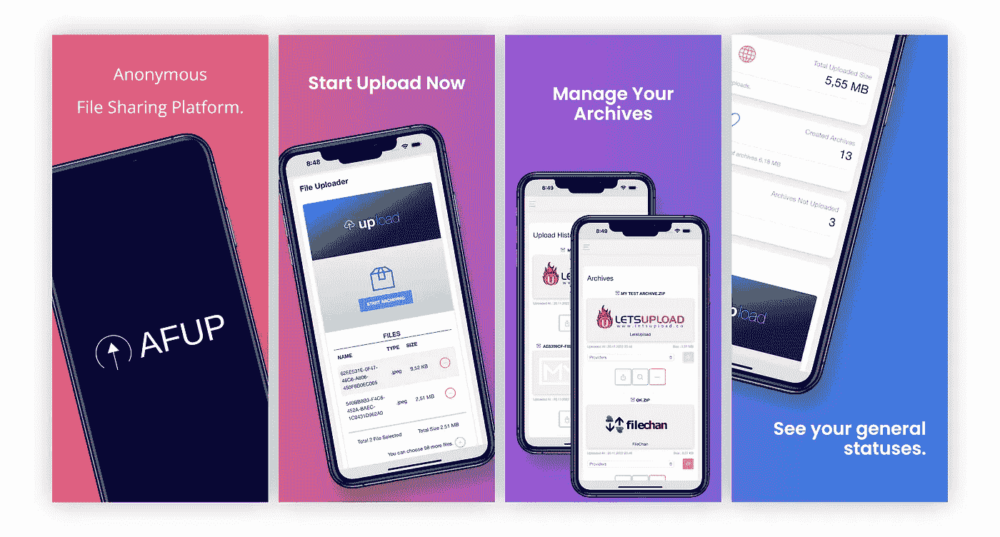

[AFUP Google Play](https://play.google.com/store/apps/details?id=com.runaho.afup.mauiblazor)

你好，首先我想告诉你我为什么进入这个充满挑战的过程。

对于不想看文章的，我会直接给你应用的链接，但我更喜欢你先看完再点。

[AFUP Google Play](https://play.google.com/store/apps/details?id=com.runaho.afup.mauiblazor)

[Blazor](https://dotnet.microsoft.com/en-us/apps/aspnet/web-apps/blazor) 一直让我觉得是一项伟大的技术。用 MAUI 发布原生 [Blazor 应用程序的想法令人难以置信。我马上说要学这个技术，开始研究。我写了一些小程序，待办事项等等。但是后来我问自己为什么不写一个大家会用的应用。计划现在已经准备好了，我要写一个应用程序，提交给所有商店，为自己创建一个参考，并从头到尾接管应用程序开发的每个阶段。](https://learn.microsoft.com/en-us/aspnet/core/blazor/hybrid/tutorials/maui?view=aspnetcore-7.0&pivots=windows)

通常我的工作只是开发应用程序，我过去写过手机应用程序，但我自己从未发布过。

## app 会做什么？

即使开发的想法是好的，如果我要创建一个产品，我必须弄清楚应用程序将做什么。在这一点上，我想从互联网上的数据安全和文件共享开始。我发现了一些可以免费上传和分享文件的服务。

*   [允许上传](https://letsupload.cc/terms)、[在线分享](https://share-online.is/terms)、[我的文件](https://myfile.is/terms)、[海量上传](https://megaupload.nz/terms)、[文件更改](https://filechan.org/terms)

它们在彼此的 api 端都是一样的，所以我有可能让用户选择上传文件的位置。

申请书是在我脑子里准备好的。
文件将被上传和存档，服务提供商将通过互联网上传和存储存档。然后，它将能够查看它过去共享的内容，或者将档案重新上传到另一个提供商。

从这个角度来看，这似乎是一个非常简单和短暂的过程，但我花了近 3 个月的时间，从头开始重写了 4 次应用程序。靠自己从零开始做一个完整的产品，比我们想象的要难得多。

## 会是什么样子？

对我来说，最大的问题是一个应用程序将会是什么样子。作为一名程序员，设计从来都不是我想做的事情。

幸运的是，有一些资源可以让我免费找到设计，但是我花了很长时间才找到它们。当然，当你找到一个模板时，问题并没有结束，你需要将它翻译到你的应用程序中，翻译到你心目中的模板中。你必须调整你的标志，调整设计，让你的应用程序具有互动性。

[点击此处查看仪表盘。](https://www.creative-tim.com/product/paper-dashboard)

这个设计很好，但对我来说，免费版本没有足够的内容，所以我开始寻找一个上传者。

我在 codepen.io 上发现了一个很好的上传器，我不得不认真地修改它。

[上传 CSS 动画 UI (codepen.io)](https://codepen.io/jotavejv/pen/bRdaVJ)

现在基本内容准备好了，开始编码吧。

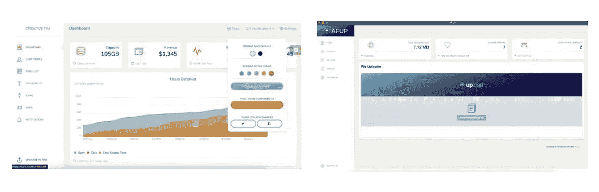

[设计](https://www.creative-tim.com/product/paper-dashboard)与最终应用的对比

## 习惯新技术

是的，每个人都知道新技术意味着新的想法和新的美丽，但它也意味着新的问题，你可以肯定这里有大量的问题。

编译一次后，重新编译时出错，清理项目，重新编译。
在 mac 上运行项目时无法检查。
无法访问日志命令，如控制台写入、调试器有时无法连接、出错时应用程序锁定、某些情况下调试器因崩溃而关闭。
每次重新编译应用程序并上传到仿真器。我们谈论的是严重浪费时间。

我不是说签申请，我的天，这是个坑。尽管如此，这项技术承诺并实现了不可思议的事情。

例如，您可以在一个地方编写项目，同时制作移动应用程序和网站。
在我的应用中，share 按钮直接运行一个原生组件，在每个平台上看起来都不一样。
你可以作为一个接口来开发，根据平台来做基于平台的编码和加载类，这很棒。

最重要的特性是你在里面写的 CSharp 代码直接作为汇编工作。
你会明白，与其他技术相比，这里没有使用 Http 请求。
将 Blazor 和 Xamarin 结合起来真的是微软有史以来最聪明的一件事。

尽管有这些麻烦，这是让你坚持下去的动力。

## 让我们转向发展

我们已经到了最重要的一点。

我们说安全是重要的，我们说让我们匿名，我们甚至为与此相关的应用程序取了名字。那么，我们将把数据保存在哪里，我们将如何确保安全？显然，我在这里追求简单，更喜欢将数据保存在应用程序中，而不是保存在互联网上。可能有点令人失望，但是如果我说我把数据保存在 sqlite 中呢？

在这一点上，你必须说为什么我能够在所有 android 和 iOS/MAC 设备上使用 sqlite？[sqlitepclraw . provider . e _ sqlite3 . net standard 11](https://www.nuget.org/packages/SQLitePCLRaw.provider.e_sqlite3.netstandard11)和[sqlitepclraw . bundle _ green](https://www.nuget.org/packages/SQLitePCLRaw.bundle_green/)他们的库来救我们了。

简单地说，所有用 net 标准开发的库都可以很容易地跨平台工作。

简而言之，我在。应用程序中的数据库文件。
不够，我在各个阶段都用这个 db，如何？

我在选择文件时创建了一个空的存档记录。我将上传的文件转换成一个字节数组，然后将它们转换成一个单独的归档文件，并将归档文件作为一个字节数组保存在一个单独的表中，这样我就可以随时重新上传或读取归档文件。所以单次存档多次上传。

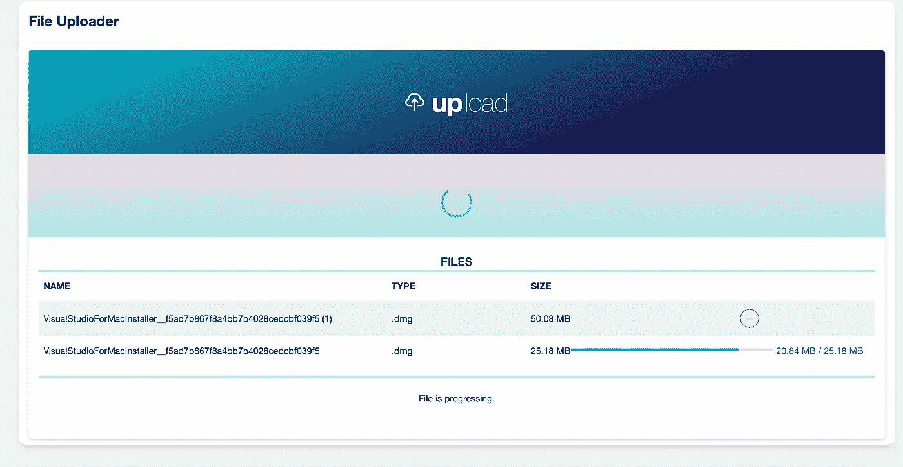

AFUP 提取选定的文件到内存。

因为我要将文件一个一个地提取到 ram 中，并最终创建归档文件，所以我需要将浏览器文件文件转换为字节数组，在这里，在您稍后将读到的临时文件上传过程类中，我也准备了它，以便我可以获得这些文件的转换状态。这样，当文件被选中时，它们被转换成字节，同时我们可以在进度条上看到它们的状态。

**让我们继续上传存档文件。**

我创建了一个临时文件上传处理器。

有了这个类，我可以管理所有的状态，并在这个类上构建应用程序。这个类将管理选定的文件，开始存档，显示存档是否准备好，并开始通过互联网上传它们。它本身将充当一种状态机。

嗯，我们必须异步进行这些操作，另一方面，我们需要能够在应用程序中导航，起初这个类不是瞬态的，因此不可能导航到其他页面，我重新编码了这个类，并将其构建为瞬态的。

我经历了所有这些步骤，我与许多错误进行了斗争，但我成功地将其转变为一个工作和优化的系统。

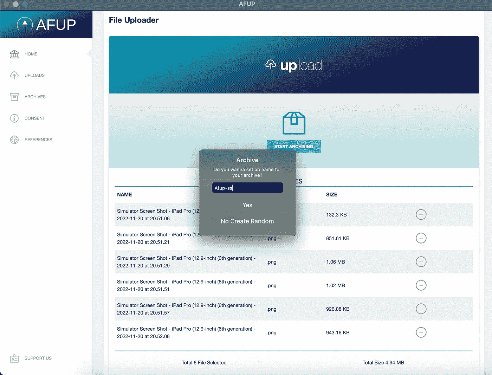

创建档案

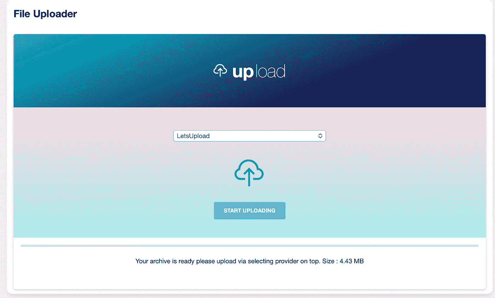

开始上传

到目前为止还不错，但是当我们再次问我在哪里可以看到我上传的档案时，我们正在为此准备一个页面。

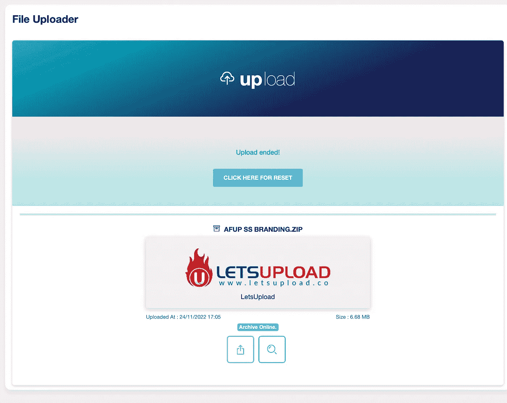

上传结束

我在哪里可以看到我的档案，也许我想把它们上传到另一个来源，然后我该怎么做？你可以说我这是一个过度工程，但我认为这是一个很好的功能，我从一开始就想要它。以防上传过程中断或文件被删除等。这些档案应该能够再次上传到其他来源。

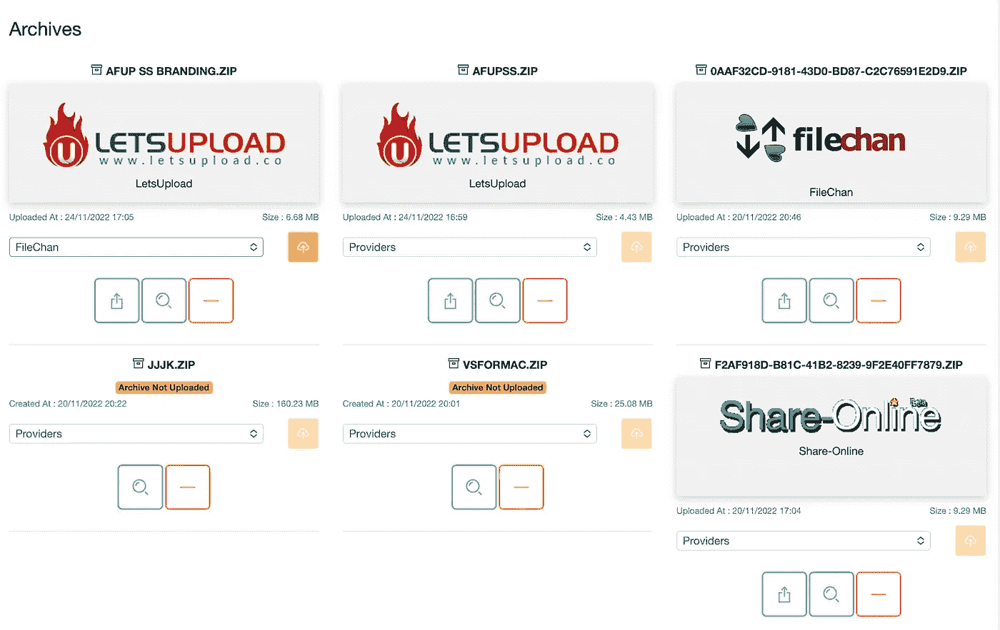

AFUP 档案馆

这个页面给我制造了很多 bug。

如果文件已经存档，它就在这里，如果它已经上传，提供者应该不能更改它，等等，我不得不测试许多情况并相应地开发。

## 我们已经完成了基本的功能，剩下的就是琐碎的事情了。

不幸的是，当您让应用程序的实际功能工作时，您并不是在制作应用程序。不幸的是，为了把一个应用变成一个产品，你还需要做一些不必要但必要的工作，我称之为琐事。😆

你需要包括你所使用的库的参考，尊重版权并提及制作者。

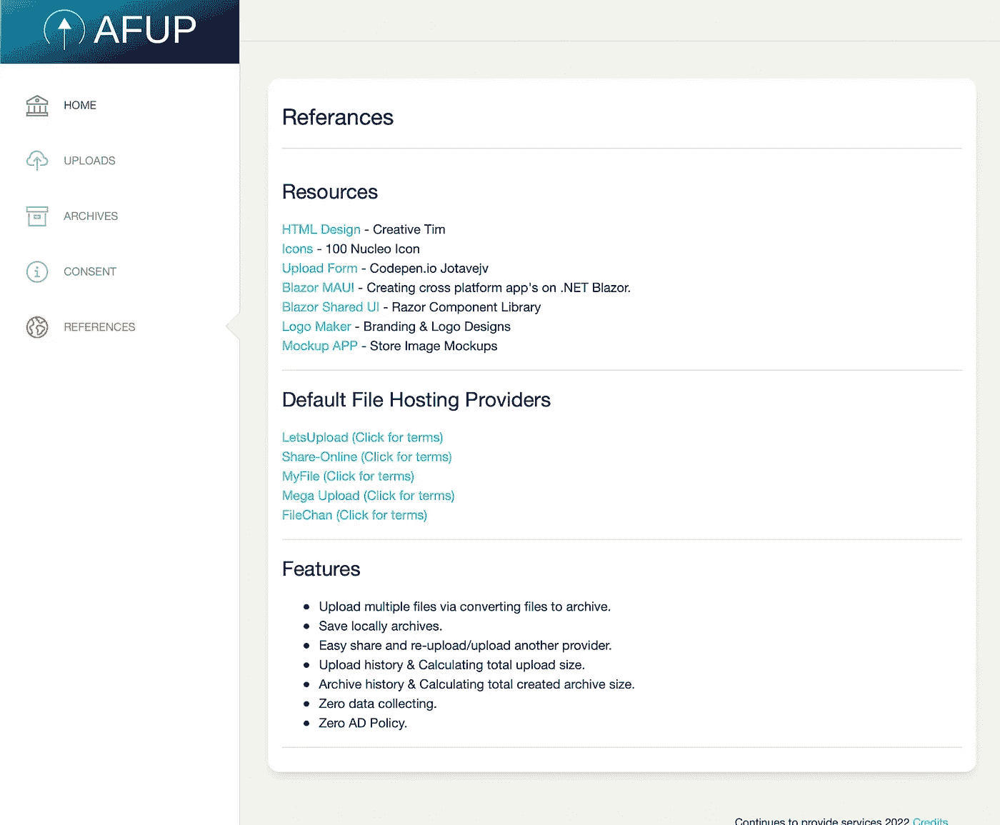

AFUP 参考

这还不够，你需要准备一个隐私政策，好像你的应用程序会被白痴使用，并得到同意，这样你明天就不会头疼了。

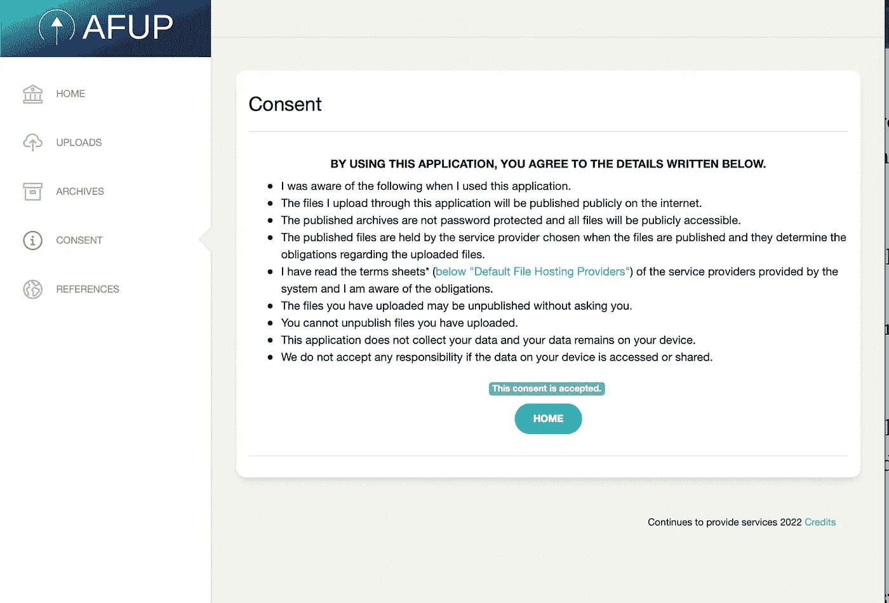

AFUP 同意

我为那些想要支持的人创建了一个支持页面。

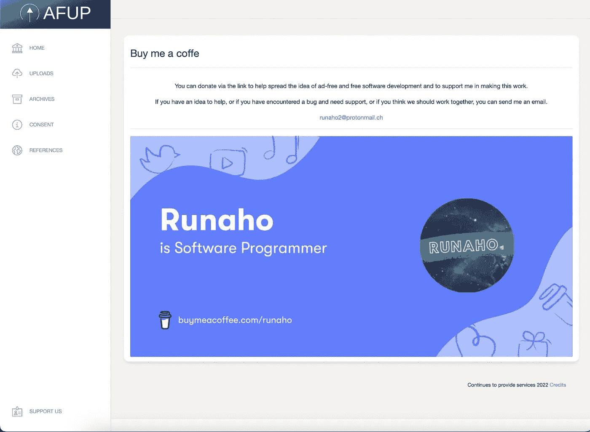

给 Runaho 买杯咖啡？

所以现在应用端完成了，但是我们的产品完成了吗？

## 进入市场的产品

现在我们可以进入更琐碎的部分了。在我看来，在市场上发布你的应用程序是一种独立的折磨。

首先，我为 Play Store 创建了一个开发者帐户，然后我添加了应用程序，然后谷歌问我要我的 ID，我给了他们一张照片。不够，我必须为我的应用程序回答一大堆问题。
显然，对于经常处理这种业务的人来说，这些过程过一段时间后就会自动化，但对我来说，这只是浪费时间。

当然，我们不要跳过这个阶段，因为不是每个人都在申请中添加同意文本，他们希望你准备并添加一个严肃的隐私政策。

然后我找到了这个网站: [App 隐私政策生成器(app-privacy-policy-generator.firebaseapp.com)](https://app-privacy-policy-generator.firebaseapp.com/)

从那里，在我拿到同意书后，我很好地编辑并准备好了。我把它上传到 Google drive，因为它不是一个网站，它是一个可以通过域访问的资源，因为我没有为这个项目想到一个域，我看到其他人已经这样做了，我抓住了这个机会。

## 你的应用在商店里会是什么样子？

欢迎来到演艺圈。

在这里，你真的需要拍摄大量的截图，浏览模型，并创建最能表达你的图像。我也找到了一个很好的工具。

[AppMockUp Studio(测试版)(app-mockup.com)](https://studio.app-mockup.com/)

从现在开始，在写完介绍您的应用程序的文章后，这就是您的页面。

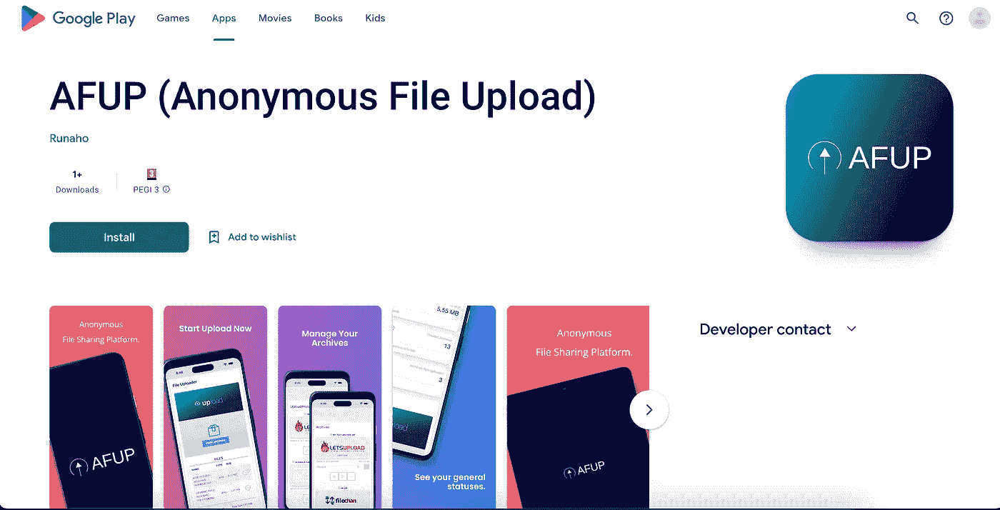

[AFUP(匿名文件上传)](https://play.google.com/store/apps/details?id=com.runaho.afup.mauiblazor)

## 结束了！

显然，如果你已经读到这里，我非常感谢你。
你能和我分享这美好的一天真是太好了。
在接下来的日子里，我会逐步分享我在这个过程中所经历的发展问题。

尽管这对我来说是一个考验，但我现在是一名开发者，可以从头到尾经历所有阶段，并且我已经学会了一项新技术。工作之余做这些也给了我很多信心。

应用程序的苹果端口也准备好了，但它的商店页面更详细一些，所以这一部分似乎需要更长的时间。

如果你想的话，请别忘了留下你的评论。

保重，很快再见。👋