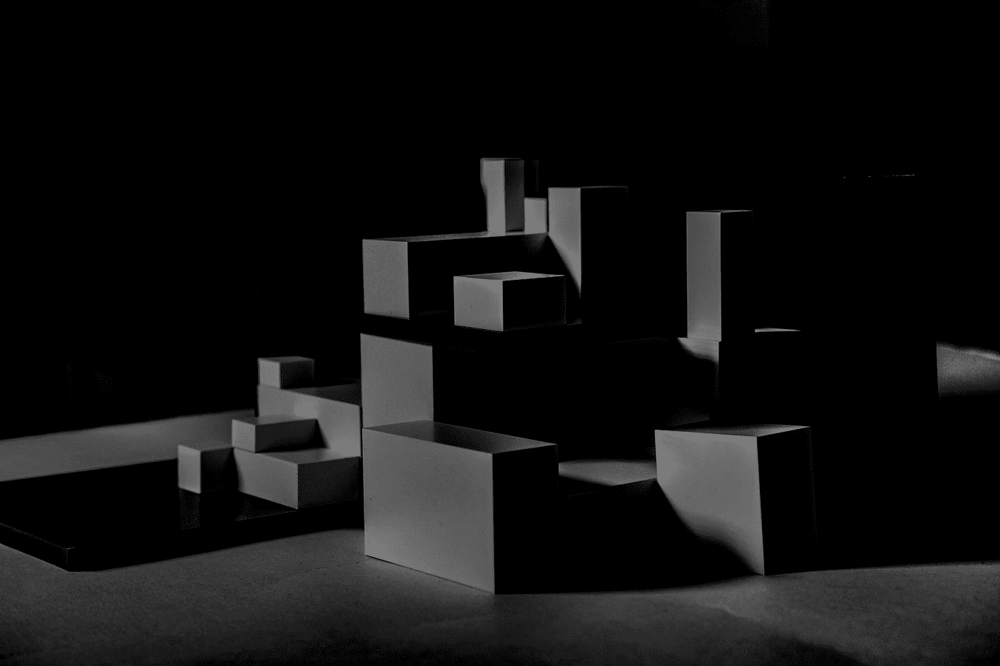

# 我真的很喜欢它:为你的网站尝试这些形状生成器

> 原文：<https://medium.com/codex/i-really-love-it-try-these-shape-generators-for-your-websites-8ec34b3fd46c?source=collection_archive---------9----------------------->

## 神奇的形状生成器帮助你的网页设计！

照片由 [Esther Jiao](https://unsplash.com/@estherrj?utm_source=medium&utm_medium=referral) 在 [Unsplash](https://unsplash.com?utm_source=medium&utm_medium=referral) 上拍摄

网页设计师总是在寻找新的方法来为他们的网站创造令人兴奋和独特的形状。虽然许多软件程序可以在这方面提供帮助，但许多在线工具也可以做同样的事情。这些工具易于使用，可以帮助你创造一些奇妙的形状…