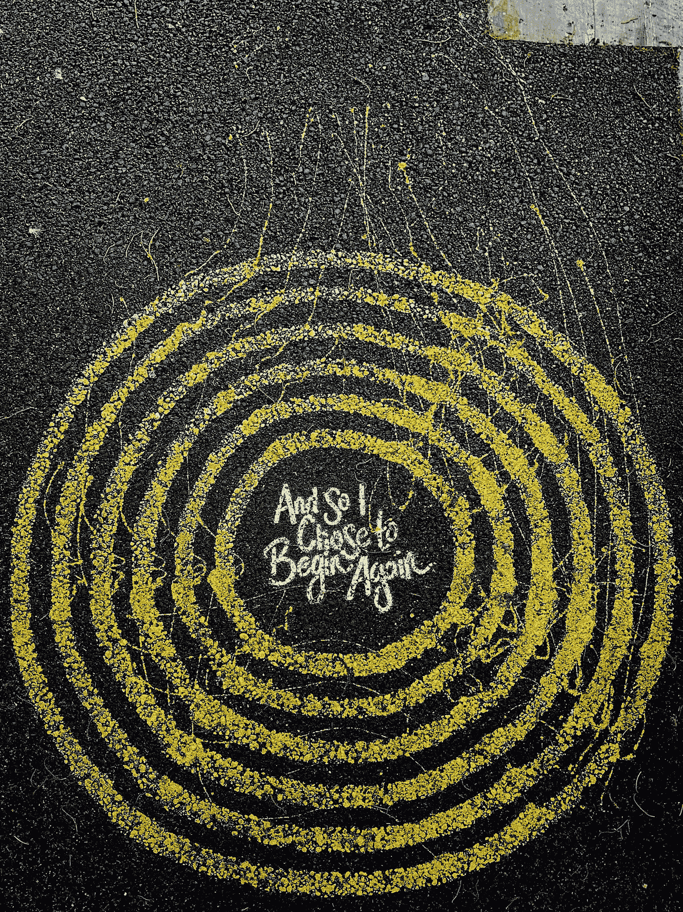

# 我又重新开始编程了…

> 原文：<https://medium.com/codex/i-started-programming-all-over-again-affd5f3a59bf?source=collection_archive---------15----------------------->

以及为什么你也应该这么做

# 怎么开始的

我在 2020 年 16 岁时开始编程，我从 CS50 计算机科学导论开始，整个课程花了我大约 2 个月的时间来完成，在我完成后，我完全投入到 Flutter 应用程序开发中。这是我花了一年时间学习的东西，我对使用这个框架创建具有令人惊叹的 UI 的移动应用程序是如此容易感到非常好奇。到 2020 年底，我已经非常擅长框架，可以在很短的时间内创建出令人惊叹的应用。我是一名移动应用程序开发人员…或者我是这么认为的。

然后第二年，2021 年来了，我对这一年抱有很高的期望，我有一个非常简单的目标，学习 flutter 并得到一份实习，一份初创公司的工作，或者基本上，任何能让我获得框架实践经验的地方，这就是我的计划。但是后来…

我的笔记本电脑崩溃了，它只是停止了工作，这很令人沮丧，因为我喜欢笔记本电脑处理大量高要求任务的效率。所以我有很高的目标，但是没有实现它们的方法。我很幸运地得到了另一台笔记本电脑，但它的规格达不到用 flutter 开发移动应用程序的要求。

所以我有一台可以编程的笔记本电脑，但不是我想编程的东西。这种情况给我留下了两个选择，我要么决定因为我没有一台可以有效编码的计算机，我就不再编程，要么我就接受现实，学习一种不同的编程语言。幸好我选择了第二个选项。

我选择学习的编程语言是 python。它的多功能性和强大功能让我着迷，我认为它适合学习，所以我学习了它，我在接下来的 8 个月里致力于学习编程语言，我几乎学到了所有要学的东西……几乎。然后我开始学习它的框架，一开始我选择了 Django，但是一个月后，我意识到我并不真正喜欢它，它对我来说太臃肿了。于是我转而学习 Flask，爱上了框架，用它搭建了一堆东西。

但还是感觉有些不对劲，我在用一个我讨厌的框架制作反应灵敏、功能强大的 web 应用程序，但我不觉得我想和这个框架在一起很长时间，我不觉得我属于我所在的地方。

到了年底，我很幸运地得到了一台功能强大的笔记本电脑，嗯……强大这个词太强了，但它可以毫不费力地处理我所有的编程任务，而且比我以前的电脑好得多。它让我以前的笔记本电脑相形见绌的一个原因是，我可以在笔记本电脑上用 flutter 框架编程。感觉很好。所以我决定 2 年来第一次尝试用 flutter 编码。

“就是它”，这是我用框架做第一个移动应用时说的话，当然是简单的计算器应用，但这并不完全是我做的，是感觉。我欣喜若狂，很长时间以来，我第一次对自己写的东西感到满意。以及为什么我要离开所有其他编程语言，坚持使用 flutter

我不是唯一一个有这种感觉的人，这种感觉就像你不喜欢用特定的编程语言编码，大多数人可能会认为这是害怕错过(FOMO)，但我们都知道不是这样。如果是这样，那么你应该问自己一个简单的问题。

我使用编程语言或框架的主要原因是什么？

在我开始编写代码之前，我只是对创建移动应用程序的想法感到惊讶。当然，人工智能、Web 开发、软件开发和所有其他的东西都让我着迷，它们从来没有让我像对移动应用程序开发一样感兴趣，这种热情是我最初学习 flutter 框架的原因。当我发现自己无法开发移动应用程序时，我开始学习 python。Python 虽然有很多功能，但并不完全适合移动应用程序开发。尽管学习 Flask web 框架创建了许多应用程序。我意识到这来自于一种根深蒂固的、永不满足的制作移动应用的欲望。

其他的文章和博客文章可能会给你很多其他的理由，但是最终，这就是它的本质。如果你是出于正确的原因而编码

导致我从事编程的主要原因、激情和原因是创建移动应用程序。就这么简单。是什么让你从事编程的？你还在做你喜欢的事情吗？这是你想长期坚持的事情吗？如果你对这些问题的回答甚至是轻微的否定，那么你应该想办法回到你喜欢的事情上去。

## **好的一面**

现在我知道你可能会想，“所以你是在告诉我，我应该简单地离开我花了三年时间学习的编程语言？”。是的，但是这能改变什么吗，因为仔细想想，你不会仅仅因为你选择停止使用它就忘记关于编程语言的一切，你的大脑是一个神奇的工具，它可以保留这些知识，这样你就可以在需要的时候很容易地使用它。我已经有两年没有用 flutter 编程了，但是我已经能够创建一个应用程序了。所以你没有抛弃或离开任何编程语言。你只是决定添加一个新的武器，你最喜欢的武器到你的军火库。

所以如果你觉得格格不入，你真的应该做点什么，生命太短暂了，不应该浪费时间做你不喜欢的事情。