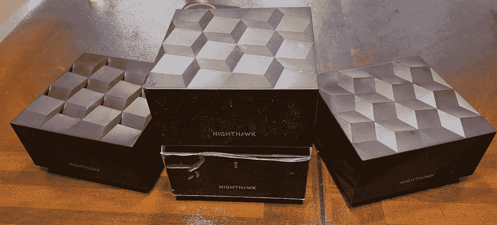

# 我在我的无线网络设置上失败了两次！

> 原文：<https://medium.com/codex/i-struck-out-twice-on-my-wifi-setup-8c779bba427c?source=collection_archive---------7----------------------->

## 第三次是魅力？

[网件夜鹰 WIFI 6 Mesh 系统](https://amzn.to/3ncDXI2)

我写下了我实现 [**【尖叫的 WIFI 速度】**](/codex/my-wifi-evolution-1359a40f3957) 的旅程，我很开心，直到我不开心。我已经选定了 Netgear AX-3600 WIFI 6 mesh 系统，最初一切似乎都正常。它有两个主要特点，使它比我以前的夜鹰型号 AX-1800 更有吸引力。