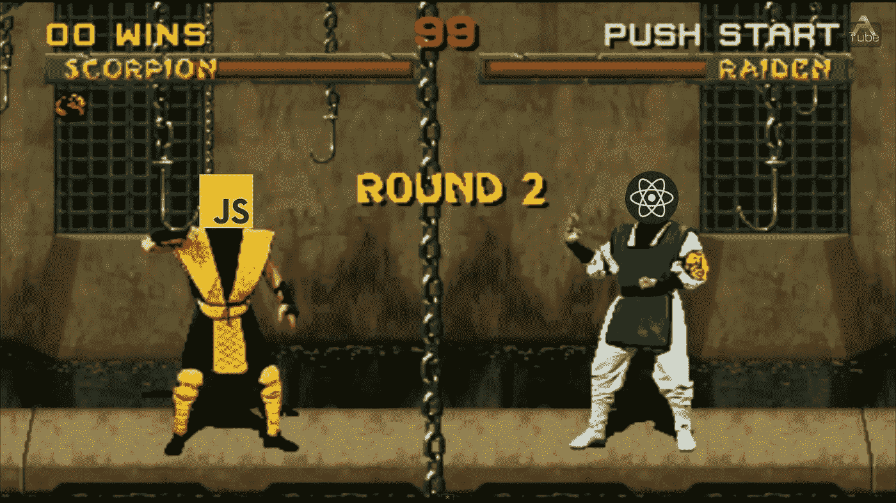

# 我认为 React 是垃圾，第二轮

> 原文：<https://medium.com/codex/i-think-react-is-junk-round-two-5cb80c5d82b3?source=collection_archive---------1----------------------->

战斗！

在我之前的文章“为什么我认为 React 是垃圾的部分原因”中，我做了一些有意的省略和卡片堆积的陈述，只是为了衡量观众的反应和推动参与。那些读过[我关于宣传](/codex/the-7-propaganda-techniques-and-how-they-sucker-web-developers-cd03333b2f0b)的文章的人可能事实上认识到我使用的一些技巧。

*就流量、掌声和回复而言，这也可能是我写过的最受欢迎的文章的原因之一。*