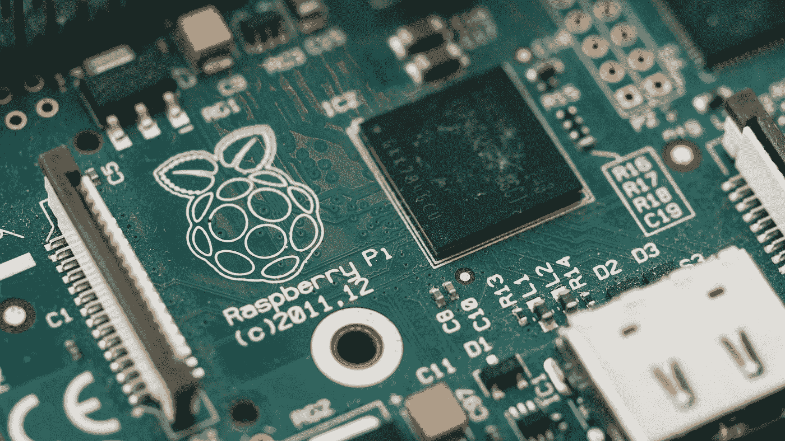
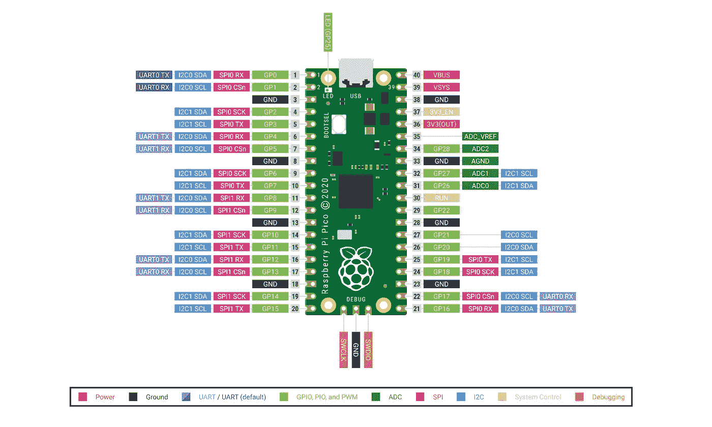
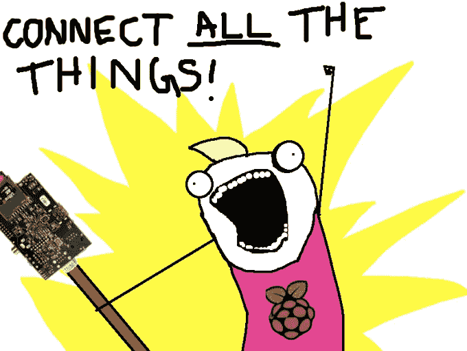
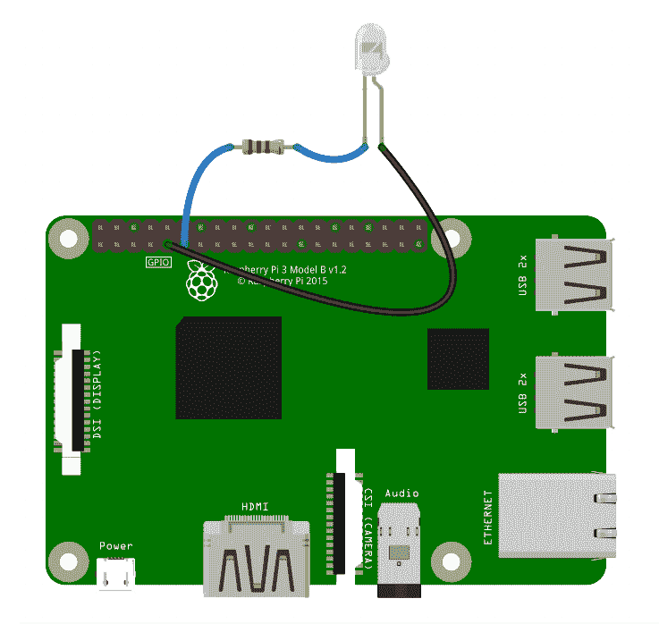
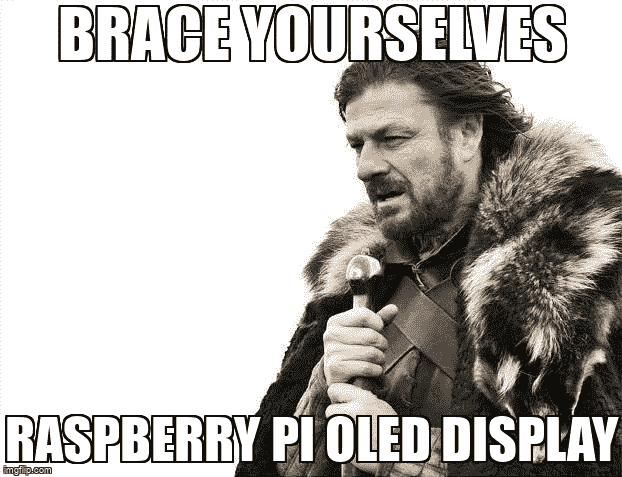
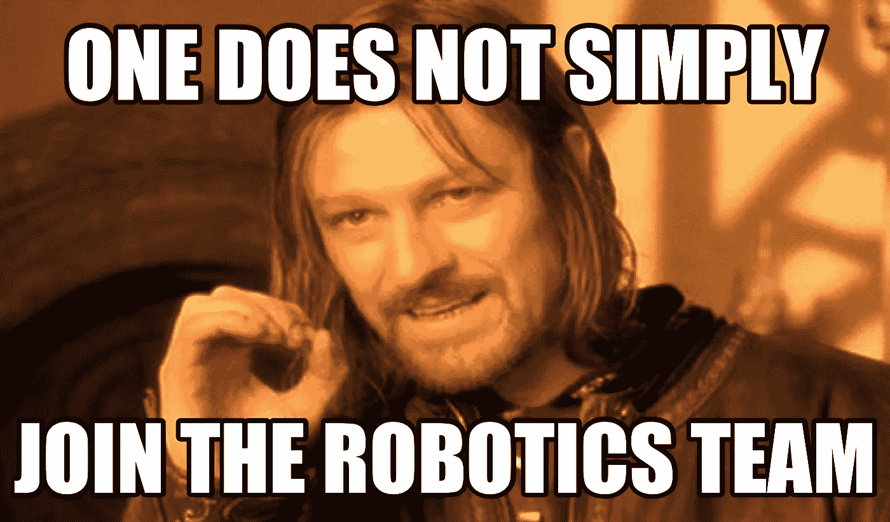
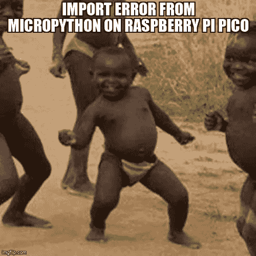

# 我在一无所知的情况下尝试了机器人技术

> 原文：<https://medium.com/codex/i-tried-robotics-knowing-nothing-heres-what-i-learnt-e83bbf950e10?source=collection_archive---------17----------------------->

## 这对我来说是全新的。我的意思是，是的，我可以开发网页，应用程序，等等…但我对机器人项目一无所知，等等。从头开始，开始吧。

# 我知道什么，不知道什么？

在我们开始之前，你需要了解我来自哪里。说到计算机，我知道一些编程语言(虽然我不会使用这些)。就是这样。我所学的机器人技术没有任何帮助。

我甚至不知道机器人和微控制器的基本工作流程。所以当我说“从零开始”时，我的意思是我从组件、编程、硬件、修补和所有其他需要的无穷无尽的东西开始。

说到电子学，我知道一些基础知识，比如电路的连接、串联和并联(一个 10 岁的孩子都知道)。

哈里森·布罗德本特在 [Unsplash](https://unsplash.com?utm_source=medium&utm_medium=referral) 上的照片

# 入门指南

我从任何生物搜索过的最普通的谷歌搜索开始——“机器人入门”。

我实话实说。我得到的大部分结果并没有帮助我开始学习机器人技术。它给出了一个我需要知道的主题列表，尽管没有一个教过我。

经过漫长的徘徊，我发现微控制器可能是我想要的。然后我遇到了 Arduino Nano 和 Raspberry Pico，它们是目前市场上最受欢迎的微控制器。

# 学问

最初，我决定用 Arduino，因为它比 pico 更受欢迎。我能想到的了解这些的最好方法是通过 YouTube。

## Arduino(部分)

上面的视频(当然，不是我做的)，是我用来了解基本的电子学，以及像电机，传感器等设备是如何工作的。它还清楚地解释了模拟和数字是如何工作的，以及这对学习 Arduino 有多么重要。我还了解了试验板的用法以及使用它的原因。

## 它是如何工作的

最后，我知道了机器人是如何工作的。我意识到这是开关设备，真的。例如，要创造一只机器人手，你只需要在铰链上安装马达，然后有条不紊地开关它们，让它像机器人手一样工作。

你在芯片上有引脚，你可以将每个引脚与一个设备相连，并通过电流触发相连的设备。就这么简单(尽管对于 ADI 公司来说会变得复杂)

## 我是如何开始的

最初，我想使用微控制器模拟器，如 Tinkercad，以及其他一些听起来很奇怪的网站，但我改变了主意，而是购买一个更普通的微控制器。

尽管我已经了解了 Arduino 如何比其他任何微控制器更好地工作，但我还是决定使用 raspberry pi Pico，因为它更便宜，并且使用更容易理解的编程语言(好吧…主要原因是它只有 4 美元)。

## 在整个旅程中

我所做的就是查阅大量的文献，甚至每天看大量的 YouTube 视频。这让这一天变得更美好。

# 我的第一个微控制器程序

## 连接和编程

这可能是最简单的部分，但我让它变得复杂了。你所要做的就是:-

*   按下启动按钮(在微控制器中)
*   插入您的电脑
*   松开启动按钮
*   打开 pico 中提到的网页
*   安装引导程序(只需复制并粘贴文件)

我浪费了很多时间将微型计算机连接到我的电脑上。我的意思是…这是我的错误。如果你使用的是 Windows、Mac 或 Linux，毫无疑问它会工作。在我的例子中，我使用的是 Linux，但是我没有安装通知管理器。所以即使它是连接的，我也没有意识到，这浪费了我一整天的时间。

我今天选择的第一个程序，可能是你可以在其中创建的最简单的程序，它是 pico 自带的内置 LED 闪烁的程序(同样的程序也可以用于外部 LED，尽管 PIN 发生了变化)。

在此之后，我创建了一个设备列表，我将使用 pico 构建这些设备。顺便说一句，我不会为所有设备购买新的微控制器。我要重新使用原来的那个。

这是我试过的东西的清单。以下所有内容让我很好地理解了机器人技术是如何工作的，但这仅仅是冰山一角。

*   机械手可移动铰链(基本上是两个伺服电机一起工作)
*   LCD 显示我的 YouTube 频道上的订户数量
*   夜晚/白天开灯/关灯
*   我的笔记本电脑的桌子支架(高度可以用我的笨机器手调节)
*   我不能这样做，但如果我有足够的钱，我可以创建我的自动化工作室(排序)。也许在未来；)
*   自动枪(虽然你可以制造各种致命武器，但我制造的是一种相当无害的枪)
*   多米诺堆垛机…我的意思是这可以帮助我打破世界纪录

我知道…以上所有这些对你们中的一些专业人士来说可能有点太简单了，但是，嘿…我在机器人方面还是个新手。让我喘口气。

在机器人学的 6 个月里，我只能做这些。我甚至不敢想象，和 ROS(机器人操作系统)之类的结合起来能有多牛逼。

## 学习 Micropython

这非常容易。这只是意味着语法字面上像 python，唯一的区别是你没有一些你不会在 pico 中使用的奇特的库和模块。所以我可以说学习编程语言是一次顺利的经历。

这花了我大约一天的时间。我只需要限制自己使用任何一个图书馆。

## 学习模块、库和其他特性

 [## MicroPython 文档

### MicroPython 运行在各种系统和硬件平台上。在这里，您可以阅读通用文档…

docs.micropython.org](http://docs.micropython.org/en/latest/index.html) 

这就是我所说的忘记我将在我的项目中使用的所有模块和库。简而言之，上面的文档充满了你想要学习的一切知识。与其他一些文件相比，它很容易传播。

# 我对此的想法

我在学习任何与编程相关的东西时都会遇到这种情况。我试图形成一个简单的算法(试图找出代码可能是什么样子)，但毫无头绪。但是一旦我读了文档，我意识到这是一个非常简单的算法，我正在为自己把它复杂化。

例如，对于机器人，我认为我们需要将操作系统添加到微控制器中，并将其与硬件或类似的疯狂东西集成在一起。但是后来我意识到…我需要添加的只是一个 bootloader 和一个 Micropython 文件。随着您变得越来越复杂，您会有多个 Micropython 文件。

## 我的问题是

机器人技术是金钱非常重要的领域之一。我的意思是，如果我手上有一个重要的项目，我必须买一些东西。目前，我还没到成为下一个埃隆·马斯克的阶段，所以…你可能明白了。

然而，我不会离开这个领域，继续学习，当然，也有一些修补周围的乐趣。谁知道呢？也许是把 sd 卡插入人脑的算法？

## 总的来说，

我所得到的是数以千计的错误，最终学会了 pico 的基础知识。这不是一次顺利的经历(我还能指望什么？).它充满了有趣的障碍。现在…这是我一直在做的事情，我可以看到自己对这些错误感到厌倦。但是，由于这对我来说是完全陌生的，我觉得很有趣。而且是的…我还是觉得每天看柚子 CPU 芯片了解更多很有意思。

## 哦，对了，顺便说一句，

如果你们对上面的任何代码感兴趣，请告诉我！我有代码，我会清除所有的错误，并张贴到 GitLab:)

也就是说，不断学习新的东西是很棒的。通过像机器人这样的东西，我们可以完成很酷的东西(我的意思是你生活在 21 世纪，所以你可能已经知道这一点)。

总的来说，这很有趣，我可能会开始一些我的想法来构建一些有用的东西。我会让你们在我的 YouTube 频道和 Twitter 上保持联系。我希望你们能从中有所收获，继续努力，下一集再见:)

> 法丁吉克