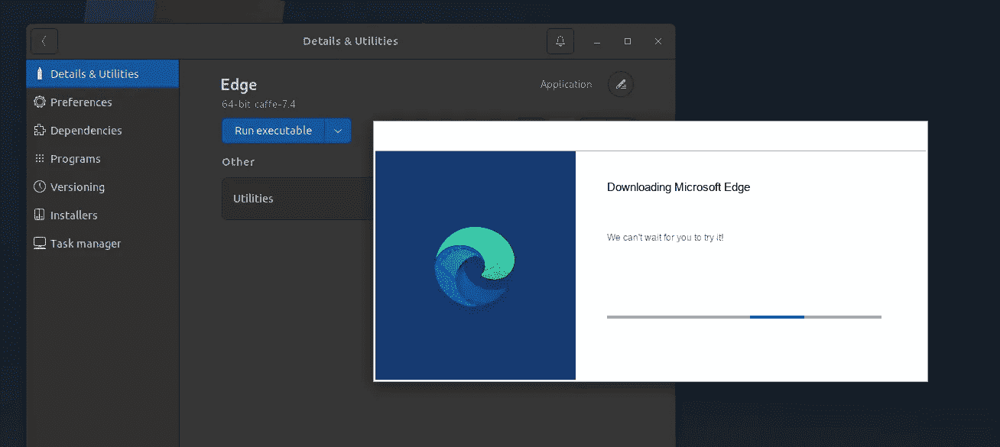
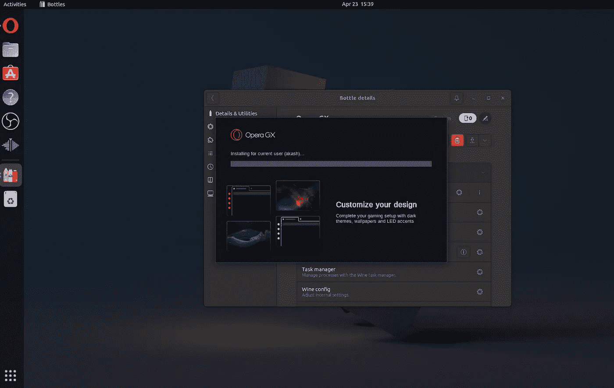
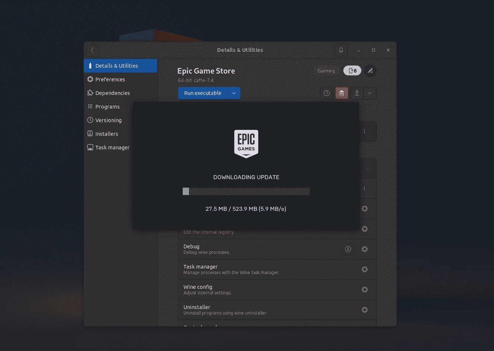
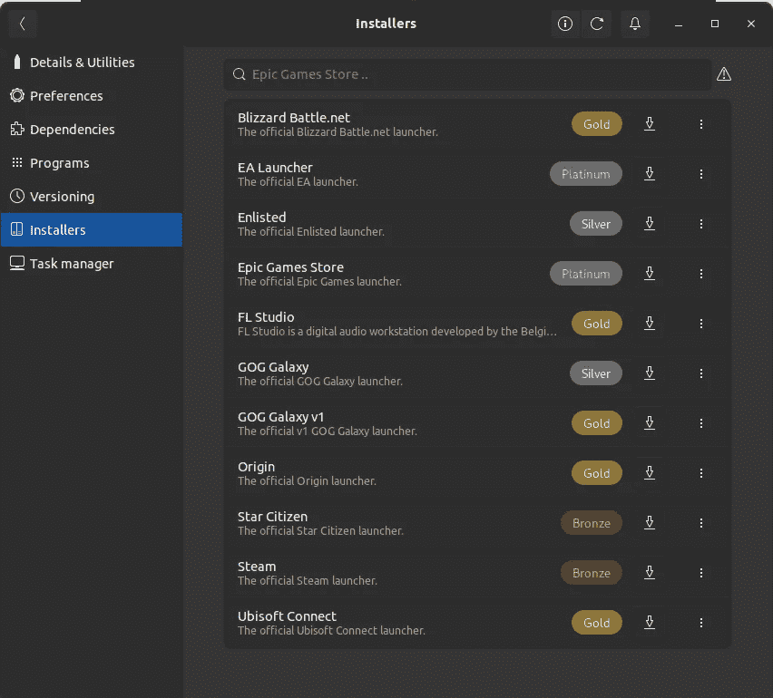
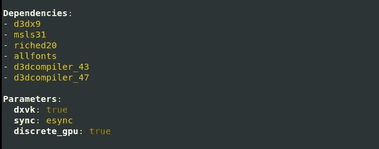
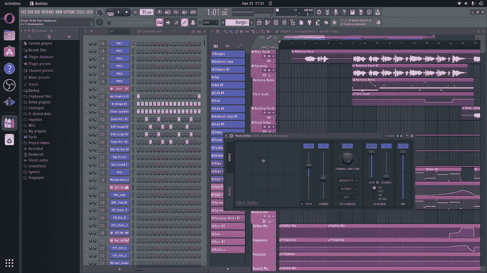
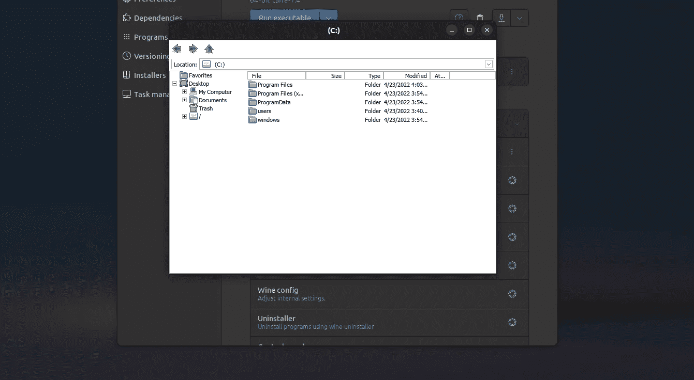
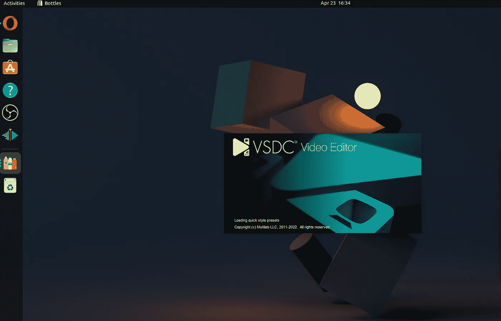
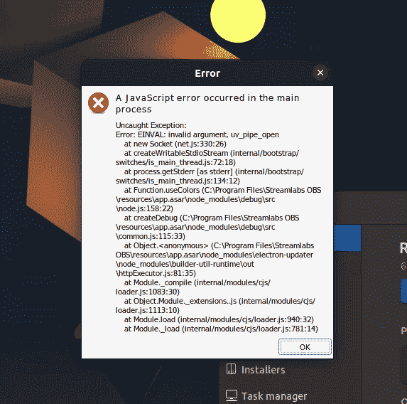

# 我尝试了一个月只用 Linux 的 Windows 专属软件…

> 原文：<https://medium.com/codex/i-tried-using-only-windows-exclusive-softwares-in-linux-for-a-month-674d923c22b9?source=collection_archive---------0----------------------->

## 我从这个实验中学到了很多……你可以流畅地运行 Epic 游戏商店和其他工具……

## 当我寻找另一种方法来烧我自己的时候…

这是我一直想知道的事情。我能用 edge(windows)这样的应用生活吗？exe)、premier pro、epic game store 等，它们都使用。exe 文件，而不是 Linux 文件格式。是啊…我最后浪费了很多时间，证明我的脑细胞还在死亡。事实证明，我得到的结果很有趣，经过一些调整，我可以做到这一点！

# 删除我的所有 Linux 应用程序

从现在开始，我发现自己删除了所有的 Linux 应用程序。从网络浏览器到我的视频编辑器。所有东西都被删除了。正如你可能猜到的，这是我即将面对的旅程中最容易的部分。

## 我用的是哪个 Linux 发行版？

我对 Fedora 36 的新测试版非常好奇，但同时，许多新版本也非常好。最后，我决定用 Fedora 36 来使用非 Linux 应用程序一个月。

## 我用哪个工具在 Linux 中运行 Windows 应用程序？

很多读到这里的人可能会猜测 Wine64 或 PlayOnLinux。但是我什么都没用。

因为我必须用这个工具坚持一个月。于是，我在一些类似的 app 上搜索了一段时间，最后在瓶子周围徘徊。这是一个 gtk 应用程序，通常只作为 flatpak 使用。幸运的是，这是一个 GUI 初学者友好的应用程序，可以帮助你从 Windows 运行应用程序，但有缺陷。

瓶子运行边缘

# 旅程

## 装置

上面的截图是在它崩溃前几秒拍摄的。所以，那时我意识到我可能应该用别的东西。

这时，我决定使用以下代码

*   适用于我的网络浏览器的 GX 歌剧院
*   用于玩游戏的 Epic 游戏商店(我通常根本不玩游戏，但我还是决定买下它并尝试玩一把)
*   Visual Studio 2022 用于编码(它不起作用，所以我用 VSCode)
*   用于编辑视频的 VSDC 视频编辑器
*   用于网页设计的 Adobe XD(我就是不能安装这个)
*   FL 工作室
*   用于录制的数据流 OBS。(工作正常，但有一些图形故障)
*   文件浏览器(是的…我甚至卸载了 Linux 的文件管理器)

嗯…这个工具花费了我 3 天的精力，没有间断(当然是在我工作的时候)。除了 epic Game Store 之外，以上几乎没有一个正常工作。

安装 Opera GX 有点太难了……它充满了迷宫般的 bug，你必须通过各种谜语才能在运行时享受更多的 bug。

事实证明，我必须创建一个新的定制瓶，而不是应用程序瓶。然后我不得不使用系统酒。最后，它成功了。

Epic game store 只是我在瓶子里运行一个预配置选项来运行 Epic Game Store。就是这样！！！现在我有了这个游戏商店里所有的 windows 游戏。

嗯… Epic 游戏店也是虚幻引擎的意思！是的，它在 Linux 中是免费的。

所有这些都可以关闭

VSDC 和 GX 歌剧院一样。我已经手动配置了一些文件，并将源文件改为 caffe7.4(花了一整天才弄明白)。这非常困难，因为我必须找到一些隐藏在暗处的小文件，并启用和取消对一些文件的注释来启用 VSDC 的图形。

FL Studio 的安装也非常容易和简单，就像 epic 游戏商店一样…没什么不同。只需点击安装，它就完成了。

到目前为止，FL 工作室和 Epic 游戏商店的体验最好。登录时，Epic 游戏商店是如此的完整，以至于我点击了登录，它打开了 opera GX 通过谷歌登录。

幸运的是，我不用安装文件浏览器。它预装了瓶子。尽管它完全脱离了“Windows 主题”,看起来像 XP。

另一方面，流实验室工作…是的…这是唯一的应用程序不支持，它只是这样工作，没有我的痛苦。

## 瓶子如何工作

因为 Windows 是专有的，瓶子不能只安装它需要的部分。它安装完整的 windows 操作系统，并模拟整个应用程序，看起来像是在 Linux 上运行。像 epic game store 这样的一些应用程序也有一些集成，比如通过 Linux 中的实际 web 浏览器登录等等。

## 使用软件

我不得不重新安装和重新配置一些软件，比如 Opera GX，它把所有文件下载到瓶子创建的假窗口里(甚至在我配置了一些东西之后)，这让我很恼火。

Epic 游戏店是最好的。它完成了我所有的工作(我指的是玩游戏和在虚幻引擎中开发)。那么 FL 工作室工作顺利吗？这相当简单。

另一方面，VSDC 安装好了，而且运行得很好，尽管我必须把所有东西从 Mkv(OBS 中的默认值)转换成 mp4，而且在某些情况下仍然不工作。

使用文件资源管理器就像使用 Windows XP，没有任何功能和一个丑陋的应用程序…相信我…这并不愉快。

VSCode 还行…我猜…它没有完成你所期望的所有工作，它又…表现得好像它安装在 Windows XP 或类似的系统中。它与窗口选项的反应不太好，但总体来说，它确实可以编辑文件。

初始安装时 StreamLabs 出错

# 最光滑的部分

一旦我安装了所有我想要的，这是非常黄油。我知道什么有用，什么没用，以及如何修理它，你知道…我已经安装了它，并到处试用。因此，大多数应用程序要么工作并完成工作，要么就是不打开…所以旅程很顺利，因为我已经安装了工作的应用程序，使用它们就像使用它一样。

有些不同，比如 GX 歌剧院把所有东西都放在一个令人困惑的目录里。虚幻引擎花了太多的时间，我怀疑它是否会工作，但它最终成功了。而 VSDC 只是第一次卡住开口。但是换了显卡之后，就管用了。

Streamlabs 刚刚中断，出现一些绿色小故障，在录制屏幕时，它在第一次尝试时没有工作。然后，我把显卡换成了集成显卡，看起来效果不错。

所以我被困在这种情况下，有些应用程序，如 GX 歌剧院，不能与集成系统一起工作，只能与独立系统一起工作，但另一方面，Streamlabs 是完美的，反之亦然

# 你能做什么

因此，如果你来自 Windows，这当然值得一试…我的意思是，你可以继续尝试，如果你的 Windows 专用程序将工作，什么不能。这可以帮助你做到所有这些，甚至不需要使用它所需要的操作系统。

## 什么不起作用

以下类型的应用不工作或需要高配置/定制:-

*   自带独立文件的应用程序
*   这需要高显卡或独立显卡

## 什么管用

*   官方支持的游戏，比如 epic game store(它需要大量的图形，但它像 charm 一样工作，因为它是由瓶子高度支持的)
*   简单的应用程序，没有安装很多依赖项，(对我来说，它是 VSCode，虽然它有一些小故障)。

如果你用的是 windows，也许可以看看这个。也许你会喜欢 Linux，最终完全转向 Linux，但仍然使用只在 windows 中可用的你最喜欢的应用程序。使用所有的 Linux 应用程序慢慢地完全转向 Linux。

我会制作更多的 YouTube 视频,告诉你如何做到这一点，创造更多的瓶子，以及更多关于开发、设计和编辑的内容。它让我直接通过一个视频说，不能写在一篇文章里。

此外，看看我的 [Twitter](https://twitter.com/fadingeek) 和 [Tumblr](https://www.tumblr.com/blog/fadingeek-official) ，我会在那里发布一些小的，太小而不能在文章中讨论的。

我希望你喜欢这篇文章，我会在下一个视频/文章中见到你。

**你真棒:)**

> 法丁吉克