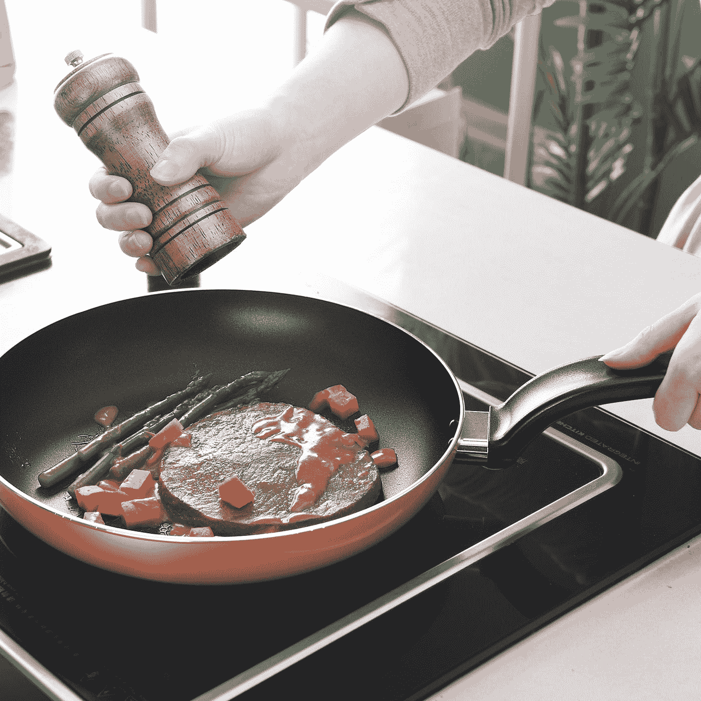

# 我用电磁炉提升了我的烹饪水平！

> 原文：<https://medium.com/codex/i-upped-my-cooking-game-with-an-induction-burner-812f05239677?source=collection_archive---------12----------------------->

## 如果对专业厨师来说足够好，对我来说也足够好。

[灶王](https://unsplash.com/@cookerking?utm_source=medium&utm_medium=referral)在 [Unsplash](https://unsplash.com?utm_source=medium&utm_medium=referral) 上的照片

称之为看太多烹饪节目，称之为冲动购买，或者说我疯了。事实上，我很久以前就想要一个电磁炉了。不要误解我，我喜欢我的炉子，但是我们最近从煤气换成了电，并且有了相当大的进步…