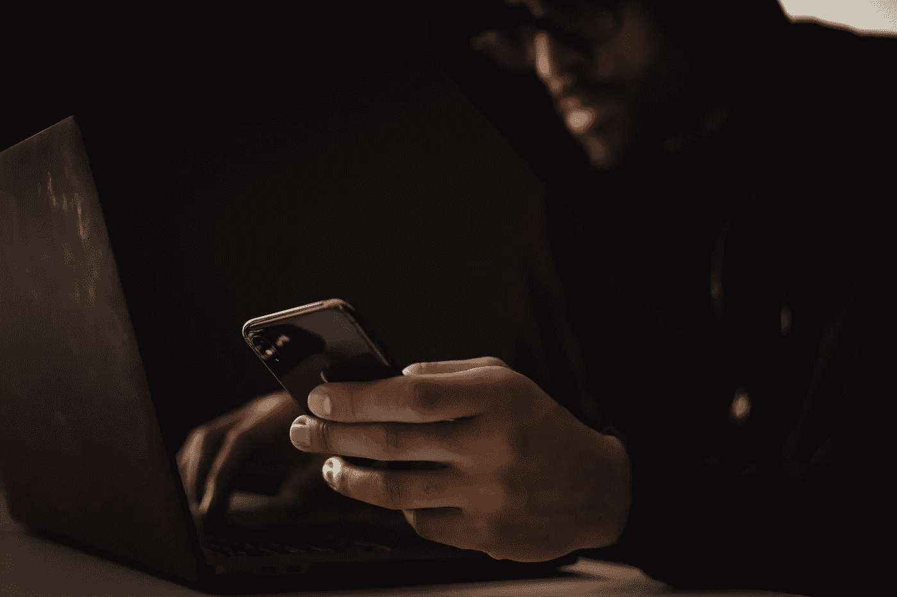

# 我被黑了，你也一样

> 原文：<https://medium.com/codex/i-was-hacked-and-so-will-you-be-585b8938d1a0?source=collection_archive---------1----------------------->

## 在你认真对待它之前，你所学到的关于安全的东西。

照片由[黑脸田鸡岛崎](https://www.pexels.com/@sora-shimazaki?utm_content=attributionCopyText&utm_medium=referral&utm_source=pexels)从[派克斯](https://www.pexels.com/photo/crop-ethnic-hacker-with-smartphone-typing-on-laptop-in-dark-room-5935792/?utm_content=attributionCopyText&utm_medium=referral&utm_source=pexels)拍摄。

这一切都是从一个熟人发来一张他在 Linkedin 上收到的我的直接信息的截图开始的。这是某种垃圾邮件。“不确定你是否想通过 Linkedin 发送这些，”他说。我甚至没认出这条信息。有猫腻？哦是的。