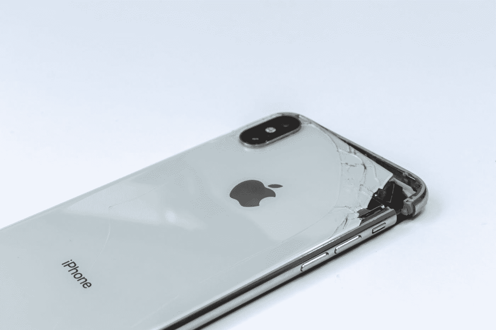

# 我会一直在我的 iPhone 上使用外壳

> 原文：<https://medium.com/codex/i-will-always-use-a-case-on-my-iphone-a80ef2a164b2?source=collection_archive---------6----------------------->

## 不使用一个只是鲁莽。不要@我。

[菲利·桑蒂兰](https://unsplash.com/@filisantillan?utm_source=medium&utm_medium=referral)在 [Unsplash](https://unsplash.com?utm_source=medium&utm_medium=referral) 上的照片

听着，我明白。iPhone 是一款相当上镜的设备。苹果将它设计得和它工作时一样酷。此外，苹果每年都声称其 iPhones 的玻璃比以往任何时候都更坚固。

这些主张已经导致一些人甚至放弃使用任何形式的外壳或屏幕保护…