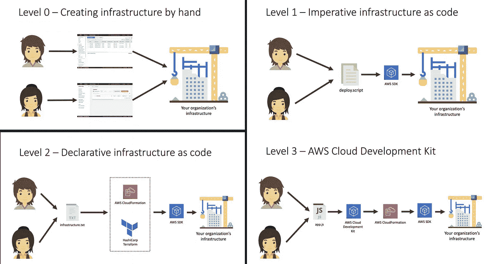

# IaC 使用 AWS CDK

> 原文：<https://medium.com/codex/iac-using-aws-cdk-1163c1cf978b?source=collection_archive---------0----------------------->

## [法典](http://medium.com/codex)

图片来自 [AWS 现代应用工作坊](https://resources.awscloud.com/aws-modern-applications/modern-application-workshop)

# 概观

在我之前的文章中，我描述了如何使用 Lambda 和 EFS 部署无服务器机器学习 API。作为部署的一部分，设置 EFS 所需的手动步骤很少。

在本文中，让我们利用 [AWS 云开发套件(CDK)](https://docs.aws.amazon.com/cdk/) 来自动化基础设施的供应。AWS CDK 是一个软件开发框架，用于定义您的…