# 使用 K-means 算法推荐摩洛哥马拉喀什的餐馆

> 原文：<https://medium.com/codex/ibm-applied-data-science-capstone-project-the-restaurant-battle-of-neighborhoods-in-marrakech-b521fa1ad747?source=collection_archive---------18----------------------->

图片来自 devidia.net

> 这是 IBM 数据科学专业证书的最后一个项目——IBM 数据科学顶点项目。
> 
> [在 Github 上访问项目。](https://github.com/joseph-josh/Coursera_Capstone)

# 1.介绍

一年前，当冠状病毒来袭时，我决定通过提升我在供应链管理和数据科学等领域的技能和理解来利用我的时间。我参加的课程之一是 IBM 数据科学专业证书。它由 9 门单独的课程组成，即数据科学方向、数据科学方法论、用于数据科学和人工智能的 Python、用于数据科学的开源工具、用于 Python 的数据可视化、用于数据科学的数据库和 SQL、用于 Python 的数据分析、用于 Python 的机器学习以及应用数据科学顶点。

平衡 IBM 项目与我的大学培训、目前的实习和其他职责一直是一个巨大的挑战。通过努力工作和决心，我终于走到了最后一步:应用数据科学的顶峰。本课程的期末作业是一个项目，在这个项目中，学习者被引导使用他们在整个项目中获得的许多技能。虽然每个学生都可以选择题目，但是这个项目应该是关于使用位置数据来解决商业问题。我选择在摩洛哥的马拉喀什进行研究。这篇文章是可交付成果的一部分，还有一个 [Jupyter 笔记本](https://github.com/joseph-josh/Coursera_Capstone/blob/main/Capstone%20project/script.ipynb)和一份报告。

我强烈推荐 IBM 数据科学专业证书。来看看:[https://www . coursera . org/professional-certificates/IBM-data-science](https://www.coursera.org/professional-certificates/ibm-data-science)。

# 2.商业问题

马拉喀什也被称为红色城市，是仅次于卡萨布兰卡、非斯和丹吉尔的第四大城市，拥有 100 多万居民，它仍然是这个国家的旅游首都，拥有无数的市场、花园、博物馆、宫殿和清真寺。对于游客来说，考虑到喜欢的菜肴类型和距离，找到最佳位置是一个挑战。这促使人们根据游客的口味，开发一种推荐最佳餐厅的工具。

我的目标是为到访马拉喀什的外国游客提供简单的建议，比如去哪里吃当地菜肴，去哪里吃地中海食品或快餐。

# 3.数据的描述

为了完成这个项目，我需要两套数据。首先，我将使用 Foursquare API 来检索马拉喀什市内餐馆的位置数据。对于每个餐馆，检索的信息包括餐馆名称、ID、位置和食物类别。作为一个例子，这里有一个马拉喀什浪漫晚餐的餐馆列表。

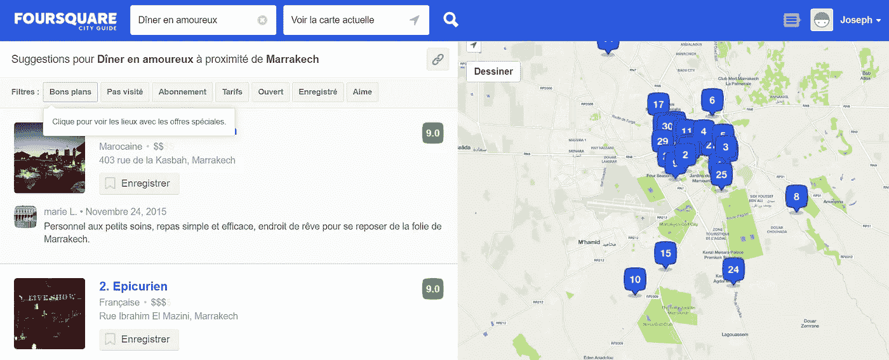

第二，我将在地理编码器工具和维基百科中的[列表的帮助下，使用马拉喀什行政区的地理坐标。](https://fr.wikipedia.org/wiki/Cat%C3%A9gorie:Arrondissement_de_Marrakech)

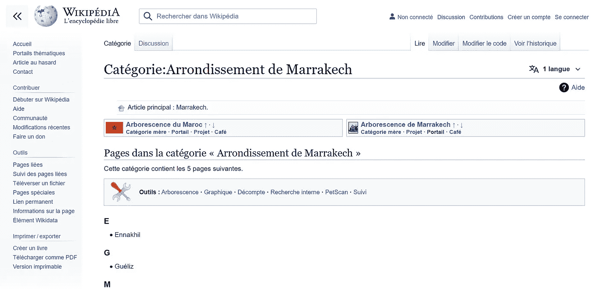

# 4.方法学

在这一部分，我将描述探索性的数据分析和产生最终结果的所有过程。

在安装了项目中需要的所有必要的包之后(下图)，我开始获取马拉喀什的街区列表和它们的地理坐标。为了做到这一点，我使用了 library BeautifulSoup 从描述马拉喀什市的维基百科页面中删除了[列表。下面的数据框显示马拉喀什有 5 个街区。然后，使用 geopy 包获取列表中每个邻域的纬度和经度。](https://fr.wikipedia.org/wiki/Cat%C3%A9gorie:Arrondissement_de_Marrakech)

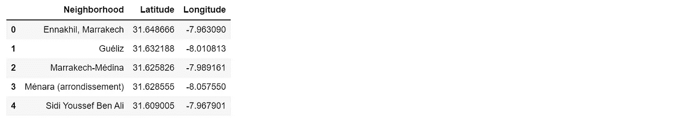

之后，我使用库 leav 创建了一个地图来可视化社区。

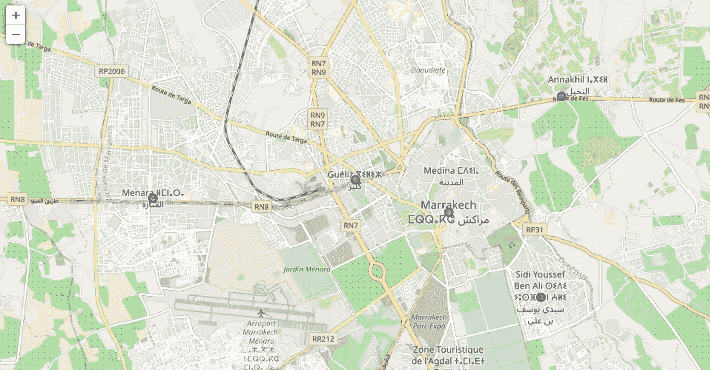

检索完街区及其坐标后，下一步将使用 Foursquare API 检索每个地区的所有场馆。马拉喀什总共有 105 个场馆，包括酒店、餐厅、咖啡馆、市场等。

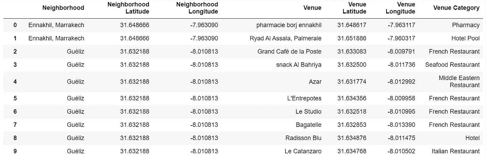

但是由于我们只对餐馆场所感兴趣，所以我根据它们的类别过滤了场所。将被保留用于进一步分析的地点将是那些在其类别中包括单词“餐馆”的地点。有 33 个这样的餐馆和 10 个不同类型的餐馆，它们的频率如下。

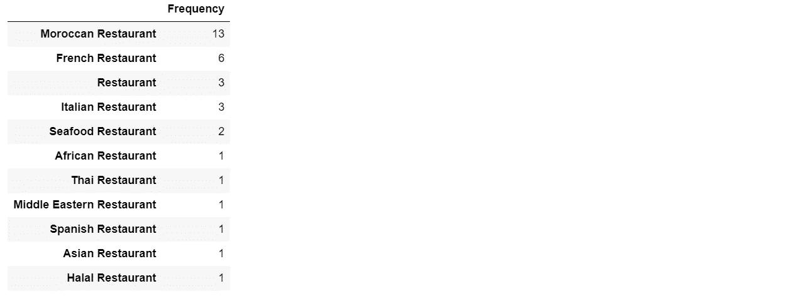

为了更好地了解这 10 类餐馆的排名，我使用 seaborn/matplotlib 包绘制了一个条形图。从图中可以看出，摩洛哥餐厅、法国餐厅和意大利餐厅是马拉喀什最常见的 3 种餐厅。

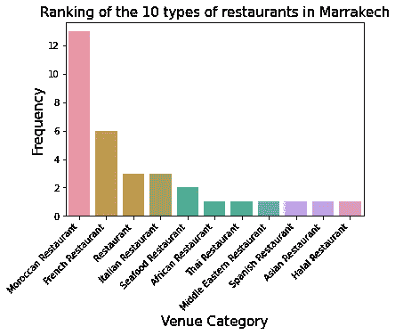

现在工作的最重要的部分来了:根据包含的餐馆类型对区域进行聚类。在使用 K-means 算法创建聚类之前，我首先使用 one-hot 编码转换了包含邻近地区的餐馆场所的数据帧，然后我按邻近地区对频率进行了分组。结果如下。

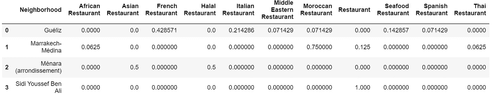

我们可以注意到，在马拉喀什的 Ennkhil 附近没有找到餐厅。

先前的数据框已用于创建新的时间，在该时间中可以看到每个地区最常见的餐馆类型。

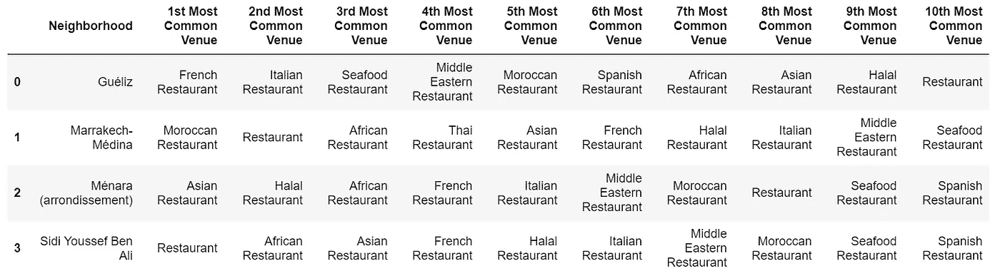

最后，我启用了无监督机器学习算法 K-means 来创建聚类。为了找到代表聚类数的 K 的最佳值，使用了诸如剪影法和肘形法的方法。在我的例子中，创建集群的地区数量很少(4 个地区)，在我看来，k=3 是一个合理的选择。

# 5.结果

每个街区都被贴上了标签。总共有 3 个标签(0、1 和 2)代表创建的 3 个聚类。从下面的数据框中可以明显看出，马拉喀什的 Ennkhil 区未被分类到任何聚类中。原因是，正如我们在上面已经注意到的，在那个街区没有发现餐馆。聚类的结果如下所示。

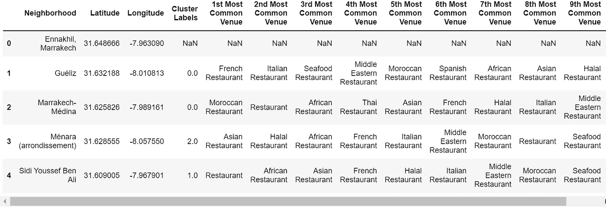

我们还可以通过给每个聚类的邻域赋予特定的颜色，并使用 flour 在地图上绘制区域来可视化结果。

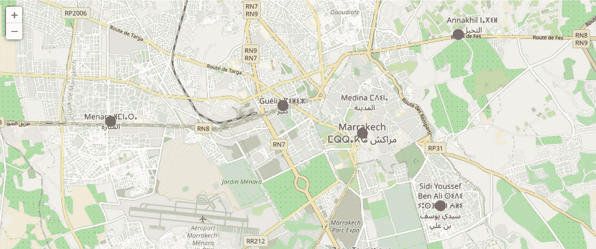

将邻近区域分组后，现在我们可以检查每个聚类，并确定区分每个聚类的不同餐馆场所类别。根据定义的类别，我们可以为每个集群指定一个名称。

**集群 1:法国/摩洛哥美食集群**

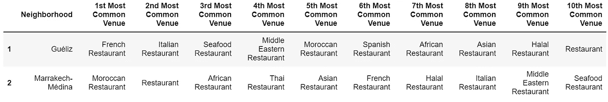

**集群 2:非洲美食集群**

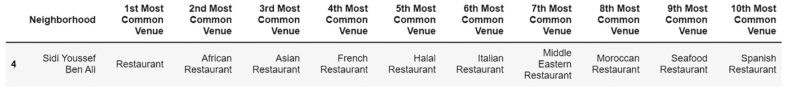

**集群 3:亚洲美食集群**

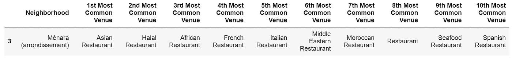

# 6.讨论

该聚类研究可以总结为 3 个部分。首先，我使用 BeautifulSoup 从维基百科中抓取数据并使用 Geopy 库创建了一个包含马拉喀什街区列表的数据框。随后，使用 Foursquare API 和地区坐标检索餐馆的位置。在最后阶段，餐馆场所数据已经被用于执行探索性数据分析和基于餐馆类别的邻居聚类。

# 7.结论

在这个项目中，我使用了 Foursquare API 和不同的数据科学和机器学习方法来获得关于在马拉喀什哪里可以买到什么类型的食物的最终建议。这项研究的结果可能对参观摩洛哥第一旅游城市马拉喀什的游客有用，因为他们可能会发现找到吃他们最喜欢的菜肴的最佳位置是一项挑战。

总之，这个项目是一个利用数据技术找到现实世界问题解决方案的绝佳机会。

# 8.参考文献和致谢

我从其他完成顶点项目的人的出版物中获得了宝贵的灵感和深刻的见解，对此我感激不尽。我还要感谢 IBM 让我在这个专业证书中学习到了与数据科学和数据技术相关的技能，尤其是这个 capstone 项目。如果没有这些资源，这个项目会更加困难。仅举几个例子:

*   [https://www . LinkedIn . com/pulse/applied-data-science-capstone-project-restaurant-Wagner-MBA/](https://www.linkedin.com/pulse/applied-data-science-capstone-project-restaurant-wagner-mba/)
*   [https://www . LinkedIn . com/pulse/housing-sales-prices-venies-data-analysis-ofistanbul-ser can-y % C4 % B1ld % C4 % B1z/](https://www.linkedin.com/pulse/housing-sales-prices-venues-data-analysis-ofistanbul-sercan-y%C4%B1ld%C4%B1z/)
*   [https://towards data science . com/IBM-data-science-capstone-project-battle-of-the-neighborhood-c 90648 a 0 dbab](https://towardsdatascience.com/ibm-data-science-capstone-project-battle-of-the-neighborhoods-c90648a0dbab)。