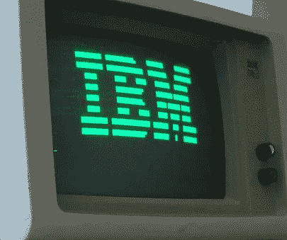

# IBM 在 15 分钟内介绍数据科学

> 原文：<https://medium.com/codex/ibms-introduction-to-data-science-in-10-minutes-2a684f1828d5?source=collection_archive---------2----------------------->

## **最受欢迎的数据科学入门课程之一的概述。**

IBM 终端，那时数据科学还不算什么(图片由[鲁本·德·里基克](https://commons.wikimedia.org/wiki/Special:Contributions/Rderijcke)通过[维基媒体](https://commons.wikimedia.org/wiki/File:Ibm_px_xt_color.jpg)提供)

没有人会错过它:数据科学现在很热门。仅仅十年前被认为不可能解决的问题，现在正通过将大量数据与分布式计算的巨大能力相结合来解决。公司是…