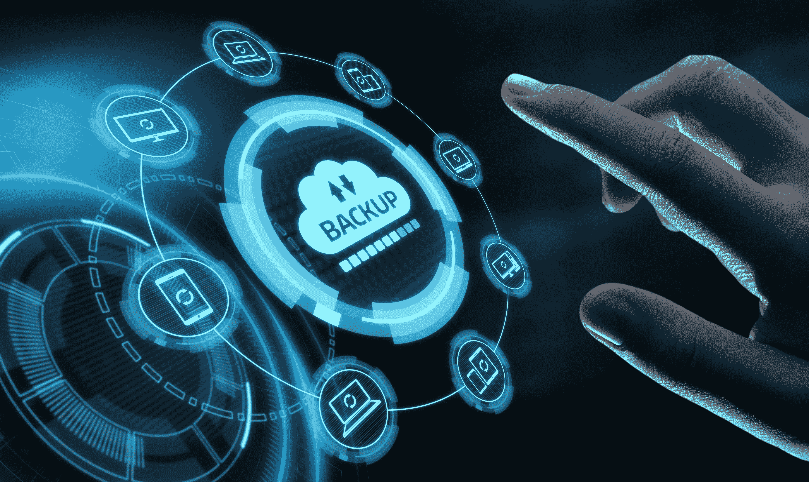
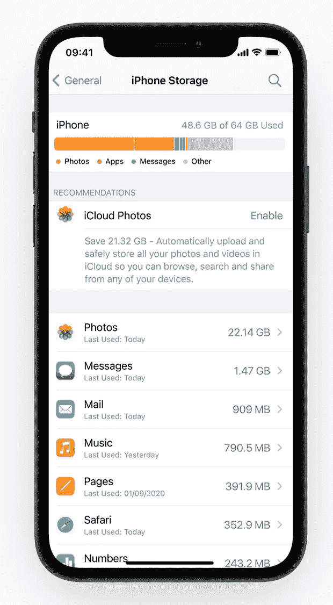
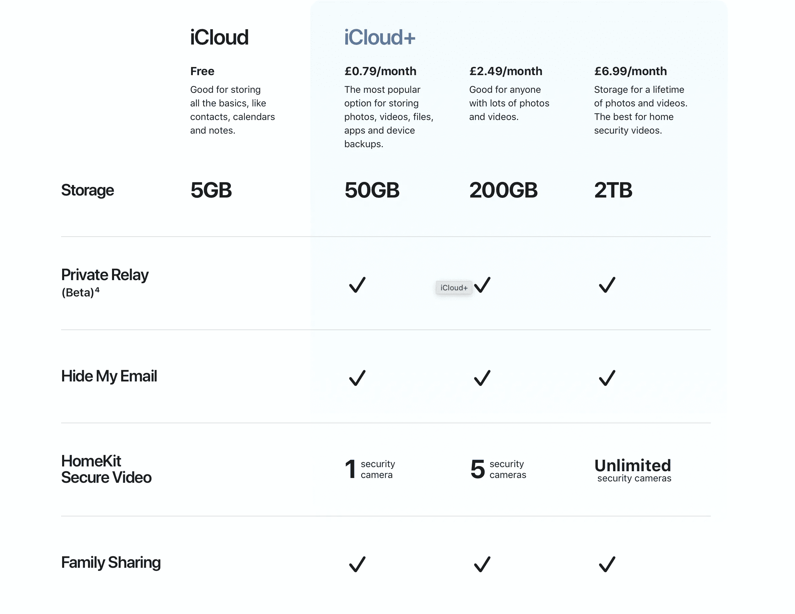
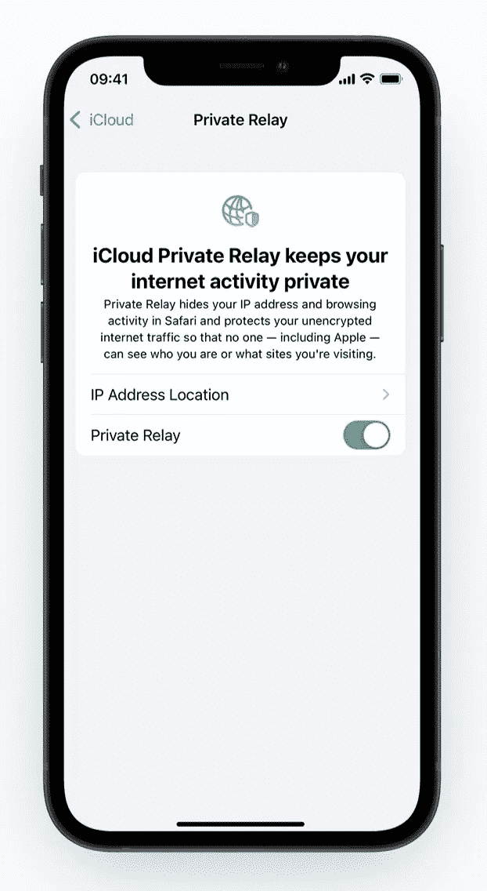
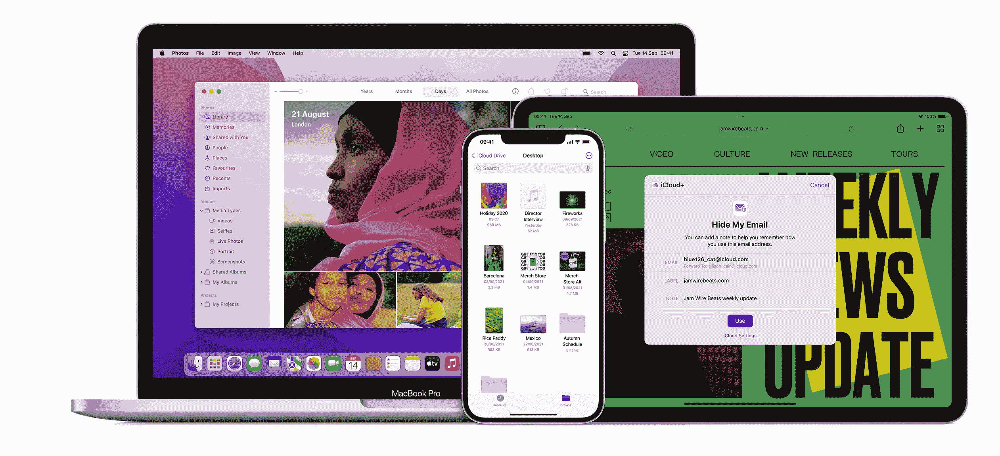

# iCloud+完美的存储解决方案

> 原文：<https://medium.com/codex/icloud-the-perfect-storage-solution-741e0c9e1bd4?source=collection_archive---------2----------------------->

## 如果您在 MAC 和 iOS 设备上工作，您是否利用了这种备份和存储解决方案？

## 这一切是如何开始的

回到几年前，我是说几年前，几乎唯一像样的云、存储和备份解决方案是 Dropbox。从一开始它就改变了游戏规则。然而，这些天来，我的备份服务通常是 iCloud+。

我很有信心，你们大多数花时间阅读这篇博客的人都使用了某种基于云的存储服务。你们中的许多人可能也是 iOS 和 macOS 用户，这使得使用苹果自己的 iCloud 非常有意义。当然，使用备份服务本质上是一种简单备份照片、文档和视频的方式。然而如今，iCloud 已经成长为一个庞然大物，并且提供了更多功能。

 [## 我的 Mac 及其邮件

### 尽管竞争激烈，我仍然热爱原生应用

medium.com](/codex/my-mac-and-its-mail-9ca6b02f762e) 

## 最好的？

是最好的吗？如果你运行的是 Mac，可能会。它让使用 iCloud 变得如此简单和无缝，因为它是你购买的每一台 Mac 和 iOs 设备的一部分。不用下载，不用安装，不用搜索 App Store，它就在你的 Mac、iPhones 和 iPads 上。用你的 Apple ID 登录，你就可以开始了。

## 价值

当然，与其他服务相比，你免费得到的东西并不怎么样。用苹果的 iCloud，你只会得到 5 GB。谷歌，在这一点上，提供 15 GB 免费。有一个有效的论点是，在交换时，5 GB 甚至不足以备份一个设备。为了应对这种情况，苹果将把数据“借给”你，以确保你可以在长达两周的时间内更换设备，让你能够进行备份和恢复。在付费等级上，iCloud+有三个等级可供选择。50gb(79 便士/月)、200 GB ( 2.99 便士/月)或我的计划，2 TB 全脂版每月 6.99 英镑。

 [## AirTags、iPads 和 AirPods Max

### 本周苹果新闻综述

medium.com](/codex/apple-news-582a0fea713a) 

## iCloud+

一旦你决定进入 iCloud 的付费层，你就会成为现在使用 iCloud+的大军之一。这项服务随 iOS 15 一起提供，适用于所有 iCloud 订户，并且计划也可以在您的家庭共享组的最多六名成员之间共享(*尽管这仅适用于 200 GB 和 2 TB 级别*)。要找到这一点，请前往**系统偏好设置>家庭共享**。分享出去的时候，可以分享 Apple Books 和 App Store 购买的内容。如果你最终选择了**苹果 One** (稍后会有更多)，你可以分享更多的应用和服务。

## 存储及其他

苹果如今的主要口号是*隐私*。

除了你期望从备份服务中获得的所有基本功能，通过 iCloud+你还可以获得三个关键的新功能，即**私人中继、隐藏我的电子邮件和 HomeKit Secure** ，我稍后将介绍这些功能。

在提供的商品中还有另外两个无价之宝，那就是**账户恢复&遗产联系人**。前者可以让你指定一个可信的联系人来接收安全码，以防万一你不幸需要找回丢失的账户。另一个是**遗产联系人**，这意味着在你去世后，你爱的人可以访问你的 iCloud 账户。

回到**私人中继**，顾名思义，这完全是关于隐私，尤其是你在使用 Safari 时的浏览历史。苹果不遗余力地营造这种环境。在 Safari 上浏览时，数据将首先被加密，然后通过两个拦截网站发送出去，这两个网站不仅可以隐藏你的位置，还可以隐藏你的 IP 地址和浏览活动。一定会喜欢苹果的这个。

我发现自己越来越多地使用隐藏电子邮件功能。这使您能够创建用于网站和各种在线表单填写的别名。这个功能的美妙之处在于，你会像平常一样收到邮件。您的实际电子邮件数据并不在线，因此您不会受到肆无忌惮的网络钓鱼攻击。您也可以使用自定域名来个性化您的 iCloud 电子邮件地址。腰带和背带，如果你愿意的话。就当是轻 VPN 吧。

**HomeKit** 适用于拥有 HomeKit 认证安全摄像头的用户。使用 iCloud+,您可以将所有相机镜头储存在 iCloud 中，正如您所料，iCloud 是加密的。更好的是，它不会计入您的存储限制。您可以添加到 iCloud+帐户的物理相机数量取决于您的计划。50 GB，只能有一个家庭安防摄像头。有了 200 GB，你最多可以有 5 个，有了 2 TB 的计划，你就中了头彩，可以无限量使用。

## 苹果一号。这是怎么回事？

我之前提到过苹果一号。就当是苹果特价吧！它相当诱人地将服务和应用捆绑在一起，但却打了相当大的折扣。它有三个不同的计划，它们是:

**个人**:包含 Apple Arcade、Apple Music、Apple TV+和一个用户的 50 GB iCloud 存储。

**家族**:包含 Apple Arcade、Apple Music、Apple TV+和 200 GB iCloud 存储。最多可与六名家庭成员(您自己和其他五人)共享。

**Premier** :包含 Apple Arcade、Apple Fitness+、Apple Music、Apple News+、Apple TV+和 2 TB 的 iCloud 存储。最多可与六名家庭成员分享。

## 动心？

老实说，如果你还没有深入了解内置的苹果友好备份服务对你有什么帮助，那就帮自己一个忙，至少看一看。是的，免费的 5 GB 现在有点吝啬，但奇怪的是，对于苹果来说，升级计划并不昂贵。我对 2 TB 计划感到安心，并且知道无论我在什么 Mac 或 iOS 设备上，我的所有数据都可以快速访问，这是无价的。随着通用控制即将成为现实，在设备之间传输这些文件将变得更加容易。我想你会对 iCloud 的简单和集成感到惊讶。诚然，这是在苹果生态系统中深深扎根的另一只脚，但我完全接受它提供的好处。

## 在你走之前

[**加入我的幕后邮件列表**](https://www.talkingtechandaudio.com)

**原载于 2022 年 2 月 22 日 https://www.talkingtechandaudio.com/blog******。****

****

**查看并订阅我的负十六播客。每两周在 Spotify、苹果播客和谷歌播客上发布新剧集。[https://podcast . apple . com/GB/podcast/the-MINUS-16-podcast/id 1608899642？i=1000550310853](https://podcasts.apple.com/gb/podcast/the-minus-sixteen-podcast/id1608899642?i=1000550310853)**