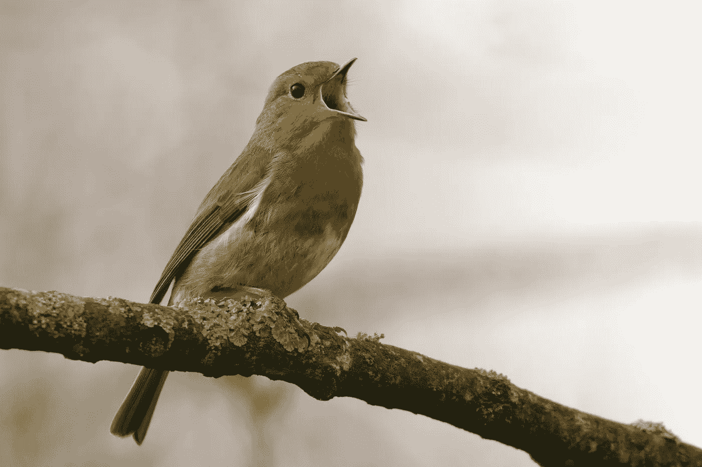

# 用机器学习从声音中识别鸟类

> 原文：<https://medium.com/codex/identify-birds-from-sounds-with-machine-learning-caa7fac56510?source=collection_archive---------7----------------------->

对于公民科学数据贡献者来说，这是一个绝佳的机会:你使用机器学习来识别鸟类，并帮助训练神经网络来改善其预测。开源 Github 在本帖底部链接。

来自 Unsplash 的[简·梅乌斯](https://unsplash.com/@janmeeus)

我们可以使用 BirdNET 记录它们的声音，这是一个允许你记录和识别鸟鸣的应用程序。