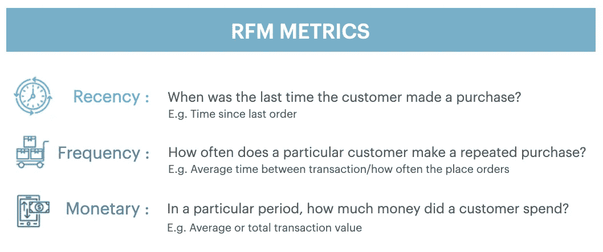
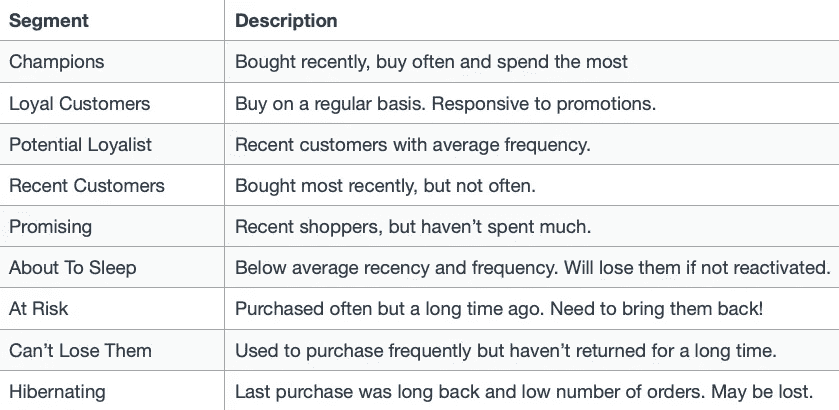
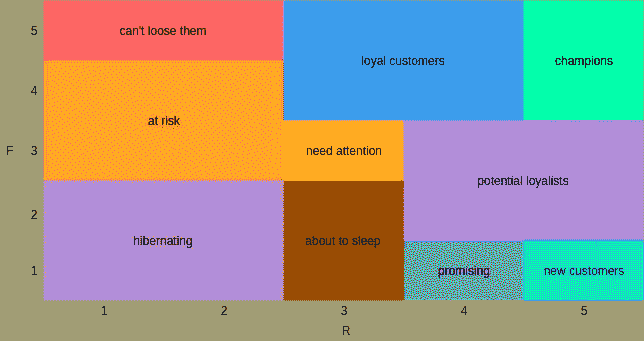
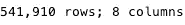
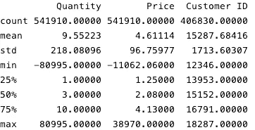
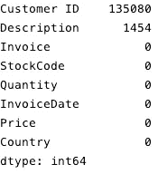
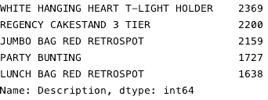
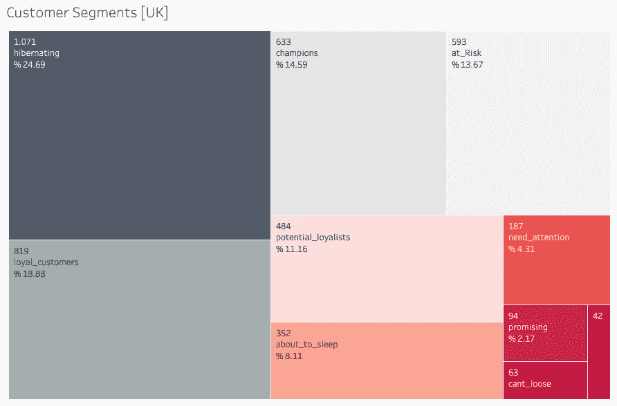
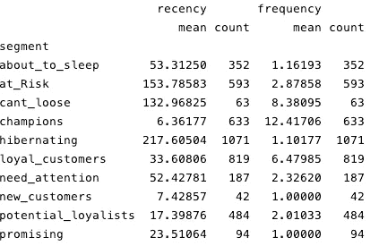

# 识别你有价值的客户

> 原文：<https://medium.com/codex/identify-your-valuable-customers-9738472dd36d?source=collection_archive---------7----------------------->

## 你是如何对现有客户开展营销活动的？

在这篇文章中，我将谈论 RFM，可以定制到许多不同的部门。我们将和感兴趣的人一起看看 **Python 分段**。

# **什么是 RFM？那能吃吗？**

我们称之为 RFM 来自于新近、频繁、不朽这些词。如果说这些话是什么意思，可以考察一下下图。



根据指定的 RFM 行为得分，可以将客户分为不同的类别，并进一步分析他们的盈利能力。

这三个值的综合得分对电子商务平台中的品牌最为有利，因为它需要持续监控客户行为。RFM 计算的洞察力可以让品牌更清楚地了解频繁的购物路径，并了解客户对新营销活动的反应。

RFM 模型已被广泛应用于许多实际领域，包括非营利组织和金融机构(银行和保险行业)、在线行业、电信行业、旅游行业和营销行业。此外，RFM 模型可用于细分客户，计算客户价值和客户终身价值(CLV)，观察客户行为，估计每种报价类型的响应概率，以及评估在线评论者。



RFM 细分市场描述

生成的矩阵如下所示:



RFM 分段矩阵

RFM 的优点是易于实施，并可用于不同类型的业务。它有助于策划更好的营销活动，提高客户关系管理和客户忠诚度。

据估计，RFM 得分高的客户将会再次购买该品牌的产品。特别关注这些**【忠诚】【冠军】客户**，品牌可以通过反馈优化其广告活动。

RFM 分数低的客户表明**不愿意成为忠实客户**。虽然他们对广告活动的反应可能无关紧要，但营销人员应该将注意力转向他们的新近参数，并找出什么让这些客户感到沮丧或没有吸引力。通过 RFM 分数，品牌确切地知道每个顾客应该关注哪个参数。

# 让我们开始编码吧！

我将使用 UCI 机器学习库中的在线零售数据集。

```
# Import libraries
import pandas as pd
import datetime as dt
from pandas.core.common import SettingWithCopyWarning
import warnings
import matplotlib.pyplot as plt

# Some display settings
pd.set_option('display.max_columns', None)
pd.set_option('display.max_rows', None)
pd.set_option('display.float_format', lambda x: '%.5f' % x)
warnings.simplefilter(action="ignore", category=SettingWithCopyWarning)# Read the 2010-2011 data in the Online Retail II excel.
sales = pd.read_excel(r"data/online_retail_II.xlsx", sheet_name="Year 2010-2011")
```

我们需要用一些描述性统计数据来理解我们的数据。

```
print(**'{:,} rows; {:,} columns'**.format(sales.shape[0], sales.shape[1]))
sales.describe()
sales.isnull().sum().sort_values(ascending=**False**)
```



*从数据集中删除缺失的观测值。使用“inplace=True”参数进行减法运算。*

```
sales.dropna(axis=0, inplace=**True**)
```

每种产品有多少？

```
sales[**"Description"**].value_counts().sort_values(ascending=**False**).head()
```



```
*# The 'C' in the invoices shows the canceled transactions. Remove the canceled transactions from the dataset.* df = sales[~sales[**"Invoice"**].str.contains(**"C"**, na=**False**)]

*# Create a variable named 'TotalPrice' that represents the total earnings per invoice.* df[**"TotalPrice"**] = df[**"Price"**] * df[**"Quantity"**]
df.dropna(axis=0, inplace=**True**)
```

我们继续计算 **RFM 指标**。我们需要将 today_date 定义为用于计算新近度的分析日期。

```
df[**"InvoiceDate"**].max()
*# Timestamp('2011-12-09 12:50:00')*today_date = dt.datetime(2011, 12, 11)rfm = df.groupby(**'Customer ID'**).agg({**'InvoiceDate'**: **lambda** invoicedate: (today_date - invoicedate.max()).days,
                                     **'Invoice'**: **lambda** invoice: invoice.nunique(),
                                     **'TotalPrice'**: **lambda** totalprice: totalprice.sum()})

rfm.columns = [**"recency"**, **"frequency"**, **"monetary"**]
rfm = rfm[(rfm[**'monetary'**] > 0)]
print(rfm.describe().T)
```

RFM 分数的计算和转化为一个变量

```
rfm[**"recency_score"**] = pd.qcut(rfm[**"recency"**], 5, labels=[5, 4, 3, 2, 1])
rfm[**"frequency_score"**] = pd.qcut(rfm[**'frequency'**].rank(method=**"first"**), 5, labels=[1, 2, 3, 4, 5])
*# We did not consider manutery in this problem due to the correlation relationship with frequency.* rfm[**"RFM_SCORE"**] = (rfm[**'recency_score'**].astype(str) + rfm[**'frequency_score'**].astype(str))
```

**现在是时候定义了！**

RFM 分数给了我们 53 = 125 个片段。这不容易操作。我们将根据 R 和 F 分数进行 10 个细分。我们已经建立了正则表达式(regex)结构，使用字典根据客户群的新近性和频率分数来命名客户群。

```
seg_map = {
    **r'[1-2][1-2]'**: **'hibernating'**,
    **r'[1-2][3-4]'**: **'at_Risk'**,
    **r'[1-2]5'**: **'cant_loose'**,
    **r'3[1-2]'**: **'about_to_sleep'**,
    **r'33'**: **'need_attention'**,
    **r'[3-4][4-5]'**: **'loyal_customers'**,
    **r'41'**: **'promising'**,
    **r'51'**: **'new_customers'**,
    **r'[4-5][2-3]'**: **'potential_loyalists'**,
    **r'5[4-5]'**: **'champions'** }rfm[**'segment'**] = rfm[**'RFM_SCORE'**].replace(seg_map, regex=**True**)
rfm.reset_index(inplace=**True**)
print(rfm.head())
rfm.to_excel(**"rfm_segments.xlsx"**
```

我们用 Tableau 可视化我们的输出数据。



**祝贺你！**一切就绪！

```
rfm[[**"segment"**, **"recency"**, **"frequency"**]].groupby(**"segment"**).agg([**"mean"**, **"count"**])
```



一般来说，频率值相当低。此时，组织促销和高折扣活动可能是明智的。我们需要优先考虑我们的客户，他们现在在场，但他们的忠诚度可能会日益下降。

**看到 cant_loose 段的客户在总平均**中有一个高频值 **，但是最近自己退出了系统。如果公司采用正确的策略，这一部分具有很高的盈利潜力。为了快速恢复，建议使用较大的折扣。可以创建一个诉诸情感的恢复活动。**

**风险客户群包括我们的客户，他们熟悉系统并有丰富的购物体验。**在需要重点关注的细分市场中，它应该排在第一位，它的恢复将为公司提供高回报。在这里，可以为他们为目标受众购买的产品组组织促销活动。可能会有一大批人通过购买库存产品而退出系统。可以向他们推荐基于产品的活动。

如果我错过了任何步骤，如果有些事情不太适合你，或者如果这个指南有帮助，请告诉我！感谢您的阅读！

**Github:**[https://github.com/nfzaltay/customer-segmentation-rfm](https://github.com/nfzaltay/customer-segmentation-rfm)

**参考文献:**

*   数据科学学校(Veri Bilimi Okulu)
*   魏若婷，林世炎，吴新红，2010，RFM 模型应用综述，*《非洲企业管理杂志》，*第 4 卷(19)，第 4199–4206 页