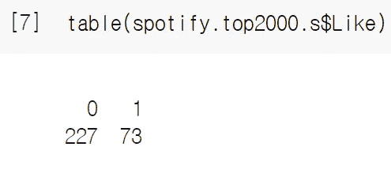
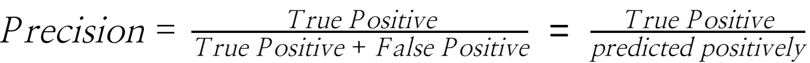

# 用 R 语言中的算法识别我喜欢的歌曲

> 原文：<https://medium.com/codex/identifying-songs-i-like-with-an-algorithm-in-r-a0c51cc44ec5?source=collection_archive---------9----------------------->


布雷特·乔丹在 [Unsplash](https://unsplash.com?utm_source=medium&utm_medium=referral) 上的照片

当我锻炼或学习的时候，有一件事总是萦绕在我心头。是音乐。如果我经常听音乐，我能改进什么？

# **问题陈述**

因为我大部分时间都和音乐在一起，所以经常觉得手机里存的歌不够用。另外，我真正喜欢的歌曲并不多。所以，跳歌找喜欢的每次都会发生。因此，我的工作流程经常被打乱。所以我经常不得不花额外的时间去寻找新歌。


我用来查找新歌的 Youtube 播放列表示例

Youtube 上的各种播放列表是我寻找新歌的地方。但是，这种方法仍然存在许多问题。随着我在 Youtube 上花的时间越来越多，找到新歌变得越来越难，因为大多数人都使用类似的歌曲来创建他们的播放列表。另一个问题是，我倾向于从每个播放列表中只喜欢 2 或 3 首歌曲。因此，我不得不花比预期更多的时间去寻找我喜欢的新歌。

如果有一种算法可以识别我喜欢的歌曲，事情会好得多。如果有可能，那我就不用付出额外的努力了。如果我想听新歌，我只需要随时运行这个算法。这可以节省我很多时间，所以我开始了这个项目。

# **数据探索**

既然一首歌怎么作曲决定了我喜不喜欢，我就需要一个数据集，把歌曲的特征转化成变量。它还应该给出这些变量的数值度量。

Spotify API 是一个完美的工具。不幸的是，它在我住的地方不起作用。感谢 Sumat Singh 上传了他在 Kaggle.com 的作品，我可以使用他的 Spotify 数据集。

然后，为了确定哪些歌曲是我喜欢的，哪些是我不喜欢的，我首先从数据集中抽取了 300 首歌曲的样本，并将 1 标记为喜欢，0 标记为不喜欢，因为由于时间问题，我无法浏览整个数据集。下图是数据集中的行的样子。


spotify 数据集的前三行

这个数据集的一个潜在问题是它是不平衡的。也就是说，积极和消极的观察值在数据集中分布不均。



显示 0 和 1 的不平等分布的表格

这降低了模型的性能，因为对于模型来说，从样本较少的类中学习歌曲的特征并将其与其他歌曲区分开来是一项挑战。另一个问题是，根据不同的情况，假阴性和假阳性可能被不平等地对待。因此，选择合适的指标至关重要。

包含大量变量的数据集的另一个潜在问题是共线性。由于共线性不能保证基于系数估计的基本假设，所以当我解释结果时会产生问题。然而，这并没有削弱模型的预测能力。因此，能量与响度和能量与声音之间的轻微共线性在这个项目中不会成为问题，因为目标是正确识别我喜欢的歌曲。


用 corrplot 包中的 corrplot()生成的相关矩阵

# **公制**

正如我上面提到的，我应该小心选择最佳模型的度量标准。但是为什么会这样呢？例如，假设有 1%的阳性病例，其余的都是阴性。当我们使用准确性时


作为一个评估标准——正确分类的观察值与整个数据集的比率——什么是好的模型？

你可以试着找到一个能正确分类所有观察结果的模型。但是有一个更简单的方法。一个简单的零模型将所有情况分类为负面的，给你 99%的准确率，当我们只看数字时，这已经足够好了。然而，这是一个误导的结果。


具有零模型的混淆矩阵达到 99%的准确度

当我们深入研究这些错误时，这个模型没有发现任何积极的方面。因此，当我们需要找到真正的积极因素时，这个模型就完全失败了。因此，该模型变得无用。因此，当我有一个不平衡的数据集时，准确性不是一个合适的衡量标准。那么，在这种情况下，我还可以使用什么其他指标呢？

换句话说，对于这个项目，我的主要兴趣是识别我喜欢的歌曲或真正积极的东西。因此，精确度



对我来说至关重要。同时也不想错过绝大多数正面标签的歌曲。如果一个模型给出了 100%的精确度，但是在 35 个阳性标记的病例中只识别了两个，那么这个模型有什么用呢？因此，回想一下


在这个项目中也很重要。

# **算法**

两类分类的方法之一是逻辑回归。与直接估计响应值的线性回归不同，逻辑回归估计响应属于某类的概率。因为它是关于概率的，当模型形成 S 形时，通过逻辑回归获得的值在 0 和 1 之间。根据我选择的阈值，每一类有多少变化。所以选择一个合适的门槛至关重要。

另一个要考虑的方面是变量。由于我在数据集中有 9 个预测因子，我必须选择在预测反应中有意义的因子。在这里，我可以使用套索或岭回归。两者的区别在于他们如何给每个变量赋予权重。


lasso 和 ridge 如何用系数区别对待无关紧要的变量|(左)lasso /(右)ridge

Lasso 保留重要变量，但对无关紧要的变量给出 0 系数。另一方面，ridge 总是在每个变量上保留不同权重的所有变量。因此，当几乎没有强有力的预测因素，并且所有其他因素都不重要时，套索往往能很好地发挥作用。相反，当大多数变量对响应具有同样强的能力时，脊是优选的。在执行任何分析之前，无法知道数据集中的真实关系。因此，我将在这个项目中使用这两种方法。

即使我有逻辑回归进行分类，也有其他方法更好的时候。当类被很好地分开或当样本量很小时，逻辑回归往往是不稳定的。所以在这些情况下，用线性判别分析——LDA 会更好。

LDA 首先假设观测值来自具有特定类别的均值向量和共同方差的高斯分布。然后，它将来自假设的估计值插入到贝叶斯分类器中，以预测观测值属于某个类别的概率。

与 LDA 不同，二次判别分析(QDA)假设每个类别都有自己的协方差矩阵。这导致了偏差-方差权衡的差异。因为 LDA 假设共享协方差矩阵，所以它不如 QDA 灵活。因此，LDA 具有较低的方差。然而，如果假设不成立，就会导致 LDA 中的高偏差。

因此，《统计学习简介》一书的作者说

> 如果训练观测值相对较少，LDA 往往比 QDA 更好，因此减少方差至关重要。相比之下，如果训练集非常大，因此分类器的方差不是主要问题，或者如果 K 个类的公共协方差矩阵的假设明显不成立，则推荐使用 QDA(James，150)。

# **数据预处理**

多亏了 Sumat Singh，数据集已经相当整洁了。所以我只需要稍微调整一下，就能符合我项目的目的了。因为我是根据一首歌是如何创作的来预测我是否喜欢这首歌，所以诸如年份和流行度之类的列是不合适的。因此，我删除了它们。

```
spotify.top2000 = read.csv("spotify_top2000_sample_labeled.csv")
spotify.top2000.s = spotify.top2000[,c(3,5,8:16)]
```


删除不必要的列后 spotify 数据集的前三行

从上面可以看出，预测值的范围变化很大。这将导致一个问题，当我执行脊和套索回归，因为他们不是规模等变。这意味着，不管真实的关系如何，1000 厘米比 1 美元的影响要大得多，因为 1000 是一个比 1 大得多的数字。因此，我将所有预测值标准化为均值为 0，标准差为 1。

```
predictors.sca = scale(spotify.top2000.s[,-c(1,2)])
response = spotify.top2000.s$Likepredictors.sca.df = as.data.frame(predictors.sca)
predictors.sca.df$Like = response
```


标准化预测值后 spotify 数据集的前三行

然后，我将数据集随机分成 50:50 比例的训练集和测试集，用测试集在后面的步骤中评估哪个模型优于其他模型。

```
# set.seed(1) for reproducibility
set.seed(1)
train = sample(1:nrow(predictors.sca), nrow(predictors.sca)/2)
test = (-train)
response.test = response[test]
```

但是因为原始数据集是不平衡的，所以训练集也是不平衡的。解决这个问题的一种方法是对训练集进行上采样或下采样，这两种方法各有利弊。

下采样是通过从多数类中移除一些观察值以粗略匹配多数类和少数类之间的观察值数量来实现的。这种方法的一个缺点是我可能会丢失有价值的信息，因为它删除了数据集的一部分。


缩减采样的工作原理

相比之下，上采样在少数类中复制观察值。这样做的一个缺点是，由于原始数据集中没有的额外观察，它可能会给模型带来偏差。


上采样的工作原理

所以一般来说，当我有很多观察值时，下采样是合适的，这样删除一些观察值就不会影响模型的性能。在这个项目中，我没有足够的数据。因此，我认为上采样会更合适，并在我的训练集中使用了脱字符号包中的 *upSample()* 。

```
train.up = upSample(x=predictors.sca[train,], 
                    y=as.factor(response[train]))
colnames(train.up)[10] = "Like"
```


上采样后的前几行以及 0 和 1 的数量

# **实施**

## 逻辑回归

为了用 lasso 实现逻辑回归，我首先创建了一个从 1e+10 到 0.01 的 100 个数字的列表，以测试识别最佳模型时的 lambda 值范围。该列表存储在*网格*变量中，并在函数构建逻辑回归模型时提供给 *glmnet()* 。要使用脊而不是套索，我只需将 *alpha=1* 参数改为 *alpha=0* 。

```
grid = 10^seq(10, -2, length=100)lasso.mod = glmnet(train.up[,1:9], train.up[,10], family="binomial",  
                   alpha=1, lambda=grid)
ridge.mod = glmnet(train.up[,1:9], train.up[,10], family="binomial", 
                   alpha=0, lambda=grid)
```

然后通过*图()*，我可以直观地看到随着 L1 范数或 L2 范数的增加，变量是如何被包含或排除的，这对应于λ的减少。


当 lambda 变化时，lasso 和 ridge 之间如何不同地包含或排除预测因子|(左)lasso /(右)ridge

因为我必须为我的模型选择一个最佳的 lambda 值，所以我使用了与 *cv.glmnet()* 的交叉验证来选择一个给出最低交叉验证误差的 lambda 值。利用从 *cv.10.out* 变量获得的 lambda 值，我预测了测试集中的观察值属于某个类别的概率。

```
cv.10.out = cv.glmnet(as.matrix(train.up[,1:9]), 
                      as.integer(train.up[,10]), alpha=1,
                      family="binomial", type.measure="class")
bestlambda.l = cv.10.out$lambda.minlasso.probs = predict(lasso.mod, s=bestlambda.l, 
                      newx=predictors.sca[test,], type="response")
```

通常，当你考虑两类分类时，比如掷硬币，你会认为每一类都有 50%的机会发生。因此，人们可能会尝试使用 0.5 作为阈值。然而，在这个项目中，情况有所不同。

首先，测试集是不平衡的。所以每一类发生的概率都不是 0.5，所以套用 0.5 作为阈值是没有意义的。其次，我要使用的度量标准不是一个错误分类的错误。因此，我需要使用不同度量的交叉验证来选择概率阈值。

正如我在指标部分提到的，精确度和召回率将帮助我确定最佳模型。但是两者之间，哪个更重要呢？

这个项目的目标是分发我喜欢的歌曲，这样我就不必花额外的时间去寻找它们。因此，拥有更高的精度比召回率更重要，并且有一种方法可以同时评估这两者。

F1 衡量标准是精确度和召回率之间的调和平均值，它同等地重视精确度和召回率。然而，在我的项目中，精度更为关键。因此，我没有使用 F1 度量，而是使用了 F0.5 度量，与 F1 度量相比，f 0.5 度量使用了不同的公式，更加注重精度。


现在我知道了用交叉验证来度量什么，我使用了一个 for 循环来遍历不同的概率阈值，并存储了 F0.5 度量，以便以后进行比较。

```
probs.grid = seq(0,1,0.01)
cv.error.precision = rep(0,101)
cv.error.recall = rep(0,101)for (i in 1:101){
    lasso.pred = rep(1, length(response.test))
    lasso.pred[lasso.probs<probs.grid[i]]=0
    t = table(lasso.pred, response.test) tunlike = t[1]
    flike = t[2]
    funlike = t[3]
    tlike = t[4] # this deal with cases when the table only has one row     
    if (length(t)==2){
        if (probs.grid[i]<control.point){
            tunlike = 0
            flike = t[1]
            funlike = 0
            tlike = t[2]
        }else{
            tunlike = t[1]
            flike = 0
            funlike = t[2]
            tlike = 0
        }
    } cv.error.precision[i] = tlike / (tlike+flike)
    cv.error.recall[i] = tlike / (tlike +funlike)
}lasso.f0.5 = (1.25*cv.error.precision*cv.error.recall) /
             (0.25*cv.error.precision+cv.error.recall)
lasso.f0.5[is.na(lasso.f0.5)] = 0
```

因为具有较高 F0.5 度量的模型意味着该模型比其他模型更好，所以我从上一步中创建的 *lasso.f0.5* 列表中选择了一个给出最高 F0.5 度量的模型。然后，通过使用用于创建 F0.5 度量的概率阈值，我生成了如下所示的混淆矩阵。

```
lasso.pred = rep(1, length(response.test))
lasso.pred[lasso.probs<probs.grid[which.max(lasso.f0,5)]] = 0
table(lasso.pred, response.test)
```


显示 f0.5 如何测量变化的图，以及来自具有最高 f0.5 值的逻辑回归(lasso)模型的混淆矩阵

如你所见，在 23 首被正面预测的歌曲中，有 11 首是真正的正面。所以模特给的歌有 47.8%是我会喜欢的。

因为从套索到脊的改变只需要改变一个参数，同样的过程可以用于脊的逻辑回归。正如你在下面看到的，这些是由山脊而不是套索产生的情节和混乱矩阵。在 18 首被正面预测的歌曲中，有 8 首是真正的正面。


显示 f0.5 如何测量变化的图，以及来自具有最高 f0.5 值的逻辑回归(岭)模型的混淆矩阵

## 线性和二次判别分析

LDA 遵循与逻辑回归相似的过程。首先，我制作了一个 *lda.fit* ，它使用训练集来制作模型。然后，我提供了 *lda.fit* 和测试集来预测每个观察值属于每个类的概率。最后，我使用 for 循环进行交叉验证，以选择合适的概率阈值。

```
lda.fit = lda(Like~., data=train.up)
lda.pred = predict(lda.fit, predictors.sca.df[test,])
```


LDA 产生的概率

通过交叉验证选择最佳模型，我得到了这个图和一个混淆矩阵。26 首歌中，11 首是真正的阳性。


显示 f0.5 如何测量变化的图，以及来自具有最高 f0.5 值的 LDA 模型的混淆矩阵

除了使用 *qda()* 代替 *lda()* 之外，二次判别分析的过程完全相同。下面的图片是 QDA 的输出。与 LDA 不同，它给出了 29 首阳性歌曲，但只有 12 首是真正的阳性。


显示 f0.5 如何衡量变化的图，以及来自具有最高 f0.5 值的 QDA 模型的混淆矩阵

# 模型评估

即使二次判别分析输出包含了最多的真阳性，我也应该考虑用户体验。作为一个想减少我寻找歌曲的时间的人，我不想在输出中有很多误报。因此，我认为使用 lasso 的逻辑回归识别与 QDA 相似数量的真阳性，但具有最低的假阳性率是更可取的。

最初，我认为一个能够正确识别 80%的正面标签歌曲并且在结果中给出少于 20%的误报的模型将是一个好模型。不幸的是，我用逻辑回归模型得到的结果和我最初想的不太一样。测试结果有 47%的假阳性，而不是 20%。

即使预期和现实之间存在这种差异，该模型也比随机预测要好。在原始数据集中，300 首歌曲中有 227 首被分类为不喜欢，73 首被分类为喜欢。所以，如果我随机预测我可能喜欢的歌曲，大概只有 24.3%的几率是正确的。考虑到模型的输出包含大约 52.6%的真阳性，我相信这是一个改进。

# **反思&改进**

项目中最具挑战性和最耗时的步骤是数据收集。由于没有数据集知道我喜欢或不喜欢什么歌曲，我不得不听所有的歌曲，并分别用 0 和 1 标记它们。正因为如此，这个项目花费的时间比我最初预计的要长。回过头来看，我想知道如果我先选择我喜欢的歌曲，然后随机添加我不喜欢的歌曲来制作样本数据集，是否会更节省时间，因为用这种方法我不必听所有花费大部分时间的歌曲。


新的数据收集方法如何工作/rawpixel.com[制作的手机图像](https://www.freepik.com/free-vector/digital-device-mockup_4122505.htm#page=1&query=phone&position=0)

该模型缺乏的另一点是，它没有从结果中学习。在它输出结果并且我使用它之后，那就是一个循环的结束。因此，为了改进，如果我在单独确认积极标记的歌曲后，将结果添加到训练集中，可能会更好。通过这种改进，当我重复使用模型时，模型可能会随着时间的推移而改进。

# Github 知识库

[https://github.com/bbeat2782/my_projects.git](https://github.com/bbeat2782/my_projects.git)

# 参考

[1]詹姆斯，加雷斯。*统计学习导论:在 r 中的应用*。斯普林格，2013。

[2]辛格，苏马特。“Spotify——前所未有的 2000 年大数据集。”www.kaggle.com/iamsumat/spotify-top-2000s-mega-dataset.2020 年 2 月 4 日*卡格尔*