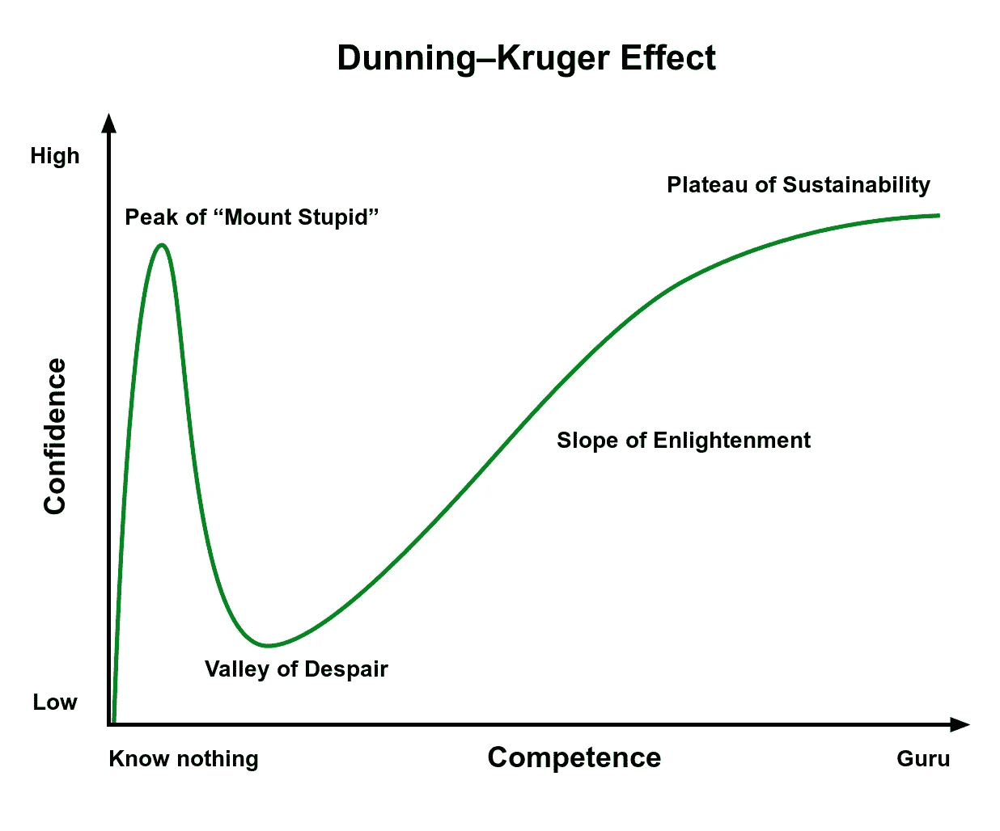

# 如果每个人都是前辈，那么没有人是前辈

> 原文：<https://medium.com/codex/if-everyone-is-senior-then-no-one-is-senior-70ad301bf96?source=collection_archive---------9----------------------->

由[维达尔·诺德里-马西森](https://unsplash.com/@vidarnm?utm_source=unsplash&utm_medium=referral&utm_content=creditCopyText)在 [Unsplash](https://unsplash.com/?utm_source=unsplash&utm_medium=referral&utm_content=creditCopyText) 上拍摄的封面照片

2 年足够让一个人“资深”吗？如果是…那什么是学妹？中间在哪里？

打开任何一个求职公告板，你都会觉得每个公司都只雇佣资深员工……但是如果每个人都是“资深员工”，那么就没有人是真正的“资深员工”。

正因为如此，你开始拥有像“职员”、“校长”、“专家”、“高级”、“专家”、“领导”、“摇滚明星”、“大师”以及这些职位的任何组合……(好吧，我实际上还没有见过“大师”这个职位……还没有。)

而如果非要创造新的职位来显示资历，那大四还不如小四呢！

# “多年经验”的神话

你可以几十年如一日地做完全相同的基本工作，也可以几年如一日地打零工，尝试各种各样的问题……在这种情况下，资历算什么？

有几本书和 TED 演讲是关于“[10000 小时](https://www.youtube.com/watch?v=zEUIfXbz0PA&ab_channel=TEDxTalks)”和“[前 20 小时](https://www.youtube.com/watch?v=5MgBikgcWnY&ab_channel=TEDxTalks)”。它们当然也适用于编程。

# 当然还有…

忍者猫, CC0, via Wikimedia Commons

我是不是说所有的 2 年级学生都在“愚蠢山”的顶峰？

不要！或者，也许？

有些人确实做到了这一点，毕竟，网络和关系，而不是技术型的关系，会给你带来工作和机会。也是为什么有些人患有冒名顶替综合症。

# 所以…为什么？

也许是自负？也许是自我实现的预言？也许是懒惰？也许是近视？也许所有这些？

你为什么不在评论里写上“为什么”？

# 为什么这样不好？

一句古老的谚语说，初级是给别人制造问题的人，中级是解决自己问题的人，高级是解决别人问题的人。

根据这个定义，高年级学生必须帮助他人才能成长。

不言而喻，你不能只是作为一个高年级生…你应该通过这些步骤。每个人可能需要不同的时间，但它会在那里。

# 对于开发商来说

撇开冒名顶替综合症不谈，开发人员不知道该申请什么，可能会出现失误，不管是哪种情况，总有人会有不好的时候。

# 对公司来说

他们花了很多钱来雇佣、留住并最终替换员工。但他们失去的不仅仅是知识。如果每个人都是高年级学生，他们会把知识传授给谁？他们离开后会发生什么？此外…让高年级学生做简单的食物和定心 div 是一种浪费，你不觉得吗？

# 我想让你思考的是

把人分成初级、中级和高级是有原因的。

如果它真的有意义的话，甚至可能有比这更多的情况。

你可以随时放弃这一点，选择某种级别的进展…

就像我们的函数和变量有有意义的名字、顺序和原因一样……开发者的位置也应该如此。

每个人都有工作和位置。一个高年级学生离开一个高年级团队时也会带着知识离开。一个高年级学生离开一个有低年级学生和中等年级学生的团队时，会把一些知识留给其他人。还有…他们最终会发展成老年人。

