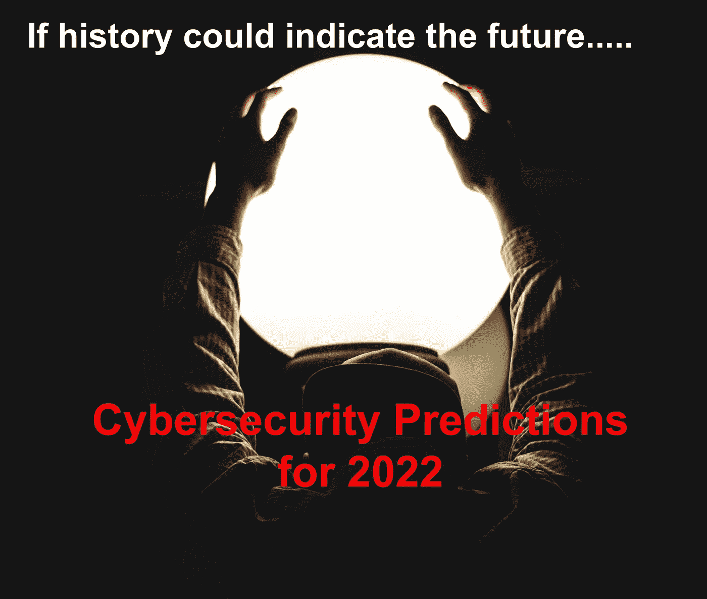

# 如果历史可以预示未来…..2022 年网络安全预测

> 原文：<https://medium.com/codex/if-history-could-indicate-the-future-cybersecurity-predictions-for-2022-b71c319ce208?source=collection_archive---------14----------------------->

*原载于 2022 年 1 月 9 日*https://cyberbakery.net/**

**在今年的第一篇文章中，我拿出水晶球来预测 2022 年及以后的网络安全前景。如果历史可以预示未来，我们将不会看到 2021 年有太大的不同**

****

**在全球和澳大利亚即将出现的感染 COVID19 的 Omicron 变种的情况下，我想通过今年的第一篇帖子祝你 2022 年新年快乐，相信你们今年都有一个良好的开端。**

**由于疫情的影响和一系列复杂的网络攻击，世界在过去两年发生了变化。在今年的第一篇文章中，我拿出水晶球来预测 2022 年及以后的网络安全前景。如果历史可以预示未来，让我总结一下过去 12 个月的一些网络安全事件。**

# **2021 年的顶级网络安全事件和漏洞**

# **COVID 和网络安全威胁:**

**冠状病毒及其各种变体在 2021 年继续扰乱我们的生活，坏人开始利用这种情况。[在 COVID 的第二波攻击中，爱尔兰健康服务管理局(HSE)](https://cyberbakery.net/if-history-could-indicate-the-future-cybersecurity-predictions-for-2022-2/The%20Ireland%20Health%20Service%20Executive%20(HSE)) 遭受了勒索软件攻击，由于无法访问患者信息，中断了患者护理。据估计，HSE 还花费了 6 亿美元的恢复成本，包括被勒索软件破坏的系统的更换和升级成本。**

# **JBS 食品勒索软件攻击和赎金:**

**全球肉类加工企业 JBS 食品公司遭遇了一次勒索软件攻击，该攻击归咎于 REvil 对其美国和澳大利亚业务的影响。该公司可能还向 REvil 支付了 1100 万美元的赎金。**

# **[日志 4JShell:](https://cyberbakery.net/keep-calm-it-is-just-another-zero-day/)**

**与以往不同的新的零日漏洞。没有人可以肯定地说，如果他们没有受到影响。该漏洞的影响是广泛的，影响了使用 Apache Framework 的 Log4J 库的各种应用程序。我们需要一段时间才能了解长期影响。**

# **[殖民地管道](https://cyberbakery.net/https-www-bleepingcomputer-com-news-security-the-week-in-ransomware-august-20th-2021-exploiting-windows/):**

**美国最大的燃料管道 Colonial Pipeline 在 2021 年 5 月遭受了黑暗面勒索软件攻击，导致其网络数据泄露。结果，该公司不得不关闭他们的业务，引发了美国的燃料短缺。在这次事件中，黑暗面操作员还在大约两个小时内从被入侵的殖民地管道系统中窃取了大约 100GBs 的文件。**

# **网络安全管理软件产品:**

**去年年初，我们目睹了近年来最复杂的供应链攻击之一。俄罗斯黑客组织 Cozy Bear 对流行的网络管理 Orion 平台进行了攻击。网络安全管理软件产品在 2020 年 3 月至 5 月期间发布了多个更新，后来被确定为安装 Sunburst 后门的特洛伊木马。太阳风攻击的目标是美国政府资产和私营部门的许多行业。**

# **Kaseya 供应链攻击:**

**与太阳风阳光后门攻击类似，另一个俄罗斯黑客组织 REvil 去年针对 Kaseya 远程管理平台对全球 2000 多家组织发起了勒索软件攻击。**

# **网络犯罪的增加:**

**研究机构网络安全风险投资公司估计，到 2025 年，全球网络犯罪的损失预计将达到每年 10.5 万亿美元，高于 2015 年的 3 万亿美元。**

# **缺乏网络安全技能:**

**由于网络攻击的增加，网络安全职业近年来发展迅猛。不幸的是，我们无法跟上应对保护应用程序、网络、基础架构和人员的挑战所需的技能。**

# **需要保护的数据量增加:**

**我们继续看到全球数据存储呈指数级增长，包括存储在公共和私有基础架构中的数据。**

# **混合工作环境:**

**在《疫情时报》看来，大多数人都在家工作，这带来了一系列新的网络安全挑战。这种改变似乎是永久性的。**

# **对 2022 年及以后的预测**

**在《疫情时报》上，很难预测第二天会发生什么，更不用说预测未来一年了。然而，让我拿出我的水晶球，预测我如何看待未来 12 个月的网络安全趋势。**

*   ****勒索软件挑战**:坏人发动勒索软件攻击变得越来越有创意。随着坏人的商业模式得到验证，勒索软件攻击将继续猖獗，并以新的方式传递恶意代码。**
*   ****中小型企业(SMB)** :长期以来，大型企业一直是坏人的主要目标。这些企业投入巨资来检测和应对网络攻击。坏人越来越难以成功地对这些企业发起网络攻击，因此，他们将注意力转移到了中小企业上。中小企业通常资源较少，因此不得不走捷径优先考虑网络安全，这使它们容易受到复杂的攻击。在未来的一年中，我们将会看到针对中小型企业的攻击越来越多。**
*   ****无密码**:对于每一个新的应用程序，你可能不得不记住另一个密码，这通常意味着糟糕的密码管理。我们知道，管理不善的密码是坏人用来发动攻击的目标。在未来一年，我们将看到无密码策略的采用呈指数级增长。**
*   ****供应链攻击:**2022 年，供应链攻击将成为常态。坏人将进一步利用已经中断的供应链向企业勒索赎金，威胁进一步剥削他们的客户，类似于我们在太阳风和 Kaseya 攻击中看到的情况。**
*   ****混合工作环境中的网络安全:**企业将专注于提高网络安全意识和技能，以改善其家庭 IT 环境的安全性。牢记安全第一的方法，我们将看到家庭整体安全的显著改善。**
*   ****威胁搜寻:**越来越多的企业将增加支出来提高或创建威胁搜寻能力。正如我们看到黑客使用创造性的方法来利用他们的受害者一样，网络团队必须发展识别和阻止坏人发动成功的网络攻击的能力。**
*   ****人工智能驱动的网络钓鱼攻击:**近年来，网络钓鱼攻击的质量大幅提高。其中一些攻击是“逼真的”。坏演员现在使用人工智能来研究目标，以模仿他们的行为来冒充网络钓鱼活动。企业必须在 2022 年投资反欺诈教育，以确保员工能够识别好邮件和坏邮件。**
*   ****软件定义的(SD)世界:**过去几年，软件定义的世界呈指数级增长。无论是软件定义的网络、基础设施还是应用，我们都看到了巨大的采用。2022 年将继续看到企业采用可持续发展技术，包括作为代码的基础设施和无服务器应用程序，它们可以是专门构建的，同时考虑到安全性。**
*   ****针对 DevOps 开发人员的国家行为者:**如果您可以合法登录系统，为什么要绕过安全控制？随着敏捷/DevOps 方法越来越多地被采用，开发人员证书已经成为新的“皇冠上的宝石”。黑客正利用各种技术瞄准开发人员，以获取特权凭证。DevOps 开发者今年将继续成为目标。**

**2022 年将继续看到民族国家威胁行为者利用不断变化的地缘政治局势的脆弱性，同样，骗子将利用乔维德疫情。**