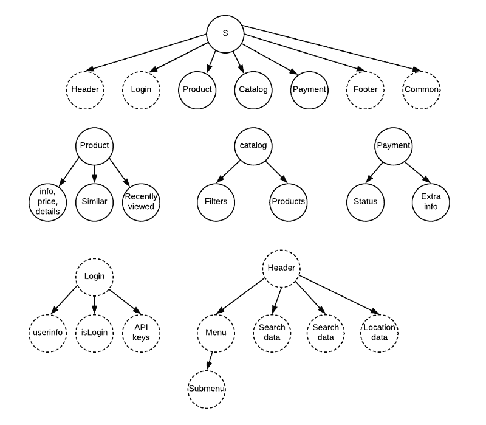

# “如果是我创造的，只有我能搬砖。”React 中的条件渲染

> 原文：<https://medium.com/codex/if-i-created-it-only-i-can-move-the-bricks-conditional-rendering-in-react-cfd93de9ee17?source=collection_archive---------4----------------------->


图片来自乐高创意网站。

这篇文章是我的关于 React 的文章的延续。如果您需要了解如何在 React/Redux 应用程序中实现 JWT 令牌。请随意阅读。

一旦我们的用户注册并登录到我们的应用程序，我们必须设置一些规则，用户将有权创建，更新和删除他们想要的所有内容，当他们想要的时候，以他们想要的方式。我们不希望我们的应用程序出现混乱。


我们不希望我们的应用程序看起来像一堆乐高积木。

这就是条件渲染发挥作用的地方。在我上一篇与身份验证相关的文章中，我提供了一个我编写的条件呈现，让用户知道他们是否需要登录，或者他们是否可以注销。

将使导航栏更改为以下内容:


我的 React/Redux 应用是用来分享和听播客的。因此，我需要为将要登录的用户提供正确的授权。只有创建者可以编辑和添加专题节目到他们的播客中。为了弄清楚我们如何编写条件语句，让我们回到`App.js`文件中的路径。

# 路线

我们使用 routerProps 将道具传递给播客组件。我们通过将 podcast 声明为变量并使用`.find`方法等于`routerProps.match.params.id`，在`/podcasts/:id`中找到请求的 podcast。如果请求的 id 存在，它将使用请求的播客数据呈现播客组件。如果 id 不存在，路径将呈现错误组件。

```
return (!!podcast) ? ( <Podcast {...routerProps} {...podcast}/> ) : ( < Error />)
```

看看我们如何使用条件语句，因为我们发送了一个显示特定播客的请求。如果你需要更多关于路由器道具如何工作的信息，我建议查看 [react-router 文档](https://v5.reactrouter.com/web/api/Route)。

# 该组件

正如你在上面看到的，这就是整个播客组件。我做的一个好决定是创建功能组件。毕竟，我的主要目标是呈现播客页面。不仅更容易编码，而且你还可以使用钩子，我喜欢使用它们。

首先，我们使用 return 迭代播客(记住，函数组件中没有 render)。我们正在显示播客标题、图像和网站。此外，我们需要在播客页面上的插曲。为了确保我们呈现正确的播客剧集，我们需要告诉应用程序显示那些特定的剧集，如果该播客创建了任何剧集的话。这就是条件渲染发挥作用的地方。在这里，我们将确保`history.location.pathname`与`podcast/:id`路线相同。

```
{(!!history && history.location.pathname === `/podcasts/${id}`) ? <EpisodesContainer podcast={{id, title, image_format, website, user_id, episodes}}  currentUser={user} /> : null} 
```

如您所见，我们调用了整个`EpisodesContainer`。由于这是一个只有两个剧集组件的小应用程序，我决定同时拥有`EpisodeInput`和剧集组件，因为我希望用户能同时看到这两个组件。在这行代码中，我们必须调用`EpisodeContainer`我们传递的播客道具。我们使用道具来观看我们想听的正确剧集，并且还能够向同一个播客添加其他剧集。

# 集装箱

上面是整个`EpisodesContainer`文件的代码，这是一个类组件，我还没有把它改成功能组件。我决定留下我所有的类组件有两个原因，我可以在我的项目中检查类组件，我也想留下我还是训练营学生时的基本框架。

为了让播客创建者添加剧集并进行修改，我们将返回播客组件并添加`useSelector`挂钩。

```
import { useSelector } from ‘react-redux’const user = useSelector(state => state.authorization.currentUser)
```

现在我们从 react-redux 导入了`[useSelector](https://react-redux.js.org/api/hooks)` [钩子，让我们通过创建一个名为 User 的变量来传递当前的 user 状态。](https://react-redux.js.org/api/hooks)

```
<EpisodesContainer podcast={{id, title, image_format, website, user_id, episodes}} currentUser={user} />
```

由于 redux 状态，这是我们调用剧集容器时作为 currentUser 传递的用户变量。

```
{(parseInt(this.props.podcast.user_id) === parseInt(this.props.currentUser?.data?.id)) ? < EpisodeInput podcast={this.props.podcast} /> : null}
```

回到剧集容器，是时候最终编码播客创作者会喜欢的条件呈现了。我们将确保`this.props.podcast.user_id`和`this.props.currentUser.data.id`是相同的。当使用`[parseInt()](https://developer.mozilla.org/en-US/docs/Web/JavaScript/Reference/Global_Objects/parseInt)`时，我们比较的 id 作为整数传递。

如果你使用 Redux 作为状态管理器，一定要记得检查数据树，确保调用你传递的道具和你想要比较的东西。在这种情况下，我想检查播客的 user_id 是否与 currentUser 相同。在 Redux 树中，这个用户 id 在数据内部。



图来自这篇关于 freeCodeCamp 的强烈推荐[文章。](https://www.freecodecamp.org/news/the-best-way-to-architect-your-redux-app-ad9bd16c8e2d/)

好了，我们终于把事情安排妥当了，一切都很棒。你的应用程序可以像最严谨的乐高积木一样有条理，由一些负责任的用户创建和发布内容。我希望这有助于您在自己的 React 项目中实现条件渲染，或者更好地理解它。编码快乐！


乐高电影，华纳兄弟的财产。

# 摘要

1.  条件渲染简介
2.  反应路由器
3.  React 组件，用户界面呈现
4.  用户选择器挂钩
5.  反应容器
6.  冗余状态树

# 参考

1.  React 路由器[文档](https://v5.reactrouter.com/web/api/)
2.  React Redux [文档](https://react-redux.js.org/api)
3.  MDN 网络文档， [parseInt](https://developer.mozilla.org/en-US/docs/Web/JavaScript/Reference/Global_Objects/parseInt)
4.  构建 Redux 应用程序的最佳方式是