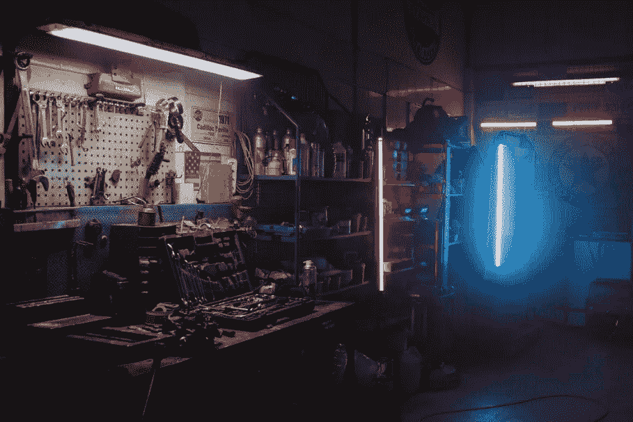

# 如果软件没坏，你还是要修复它

> 原文：<https://medium.com/codex/if-software-isnt-broke-you-still-have-to-fix-it-9773d5235448?source=collection_archive---------9----------------------->

## 如果你不改变一个正在运行的系统，它会自己崩溃

[Pexels 的 cottonbro 拍摄的照片](https://www.pexels.com/photo/black-and-gray-audio-mixer-4488660/)

> 如果你不改变一个正在运行的系统，环境会替你打破它

我看到许多公司有遗留软件，并有“不要改变运行系统”的方法，这基本上是“如果它…