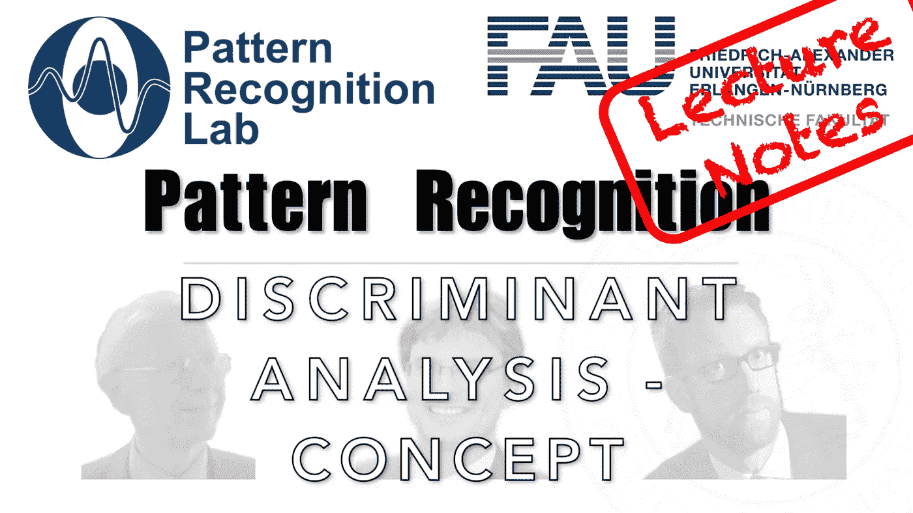

# 如果你的问题太难，把它线性化！

> 原文：<https://medium.com/codex/if-your-problem-is-too-hard-linearise-it-a4bcfcbe507f?source=collection_archive---------13----------------------->

## 模式识别中的 FAU 讲义，[抄本](http://medium.com/codex)

## 线性分离空间的梦想——线性判别分析导论

下图 [CC BY 4.0](https://creativecommons.org/licenses/by/4.0/) 来自[模式识别讲座](https://www.youtube.com/playlist?list=PLpOGQvPCDQzsWvT_bqmexrJ359RTQQuMO)

**这些是 FAU 的 YouTube 讲座** [**模式识别**](https://www.youtube.com/playlist?list=PLpOGQvPCDQzsWvT_bqmexrJ359RTQQuMO) **的讲义。这是讲座视频&** [**匹配**](https://doi.org/10.5281/zenodo.4429576) 的完整抄本…