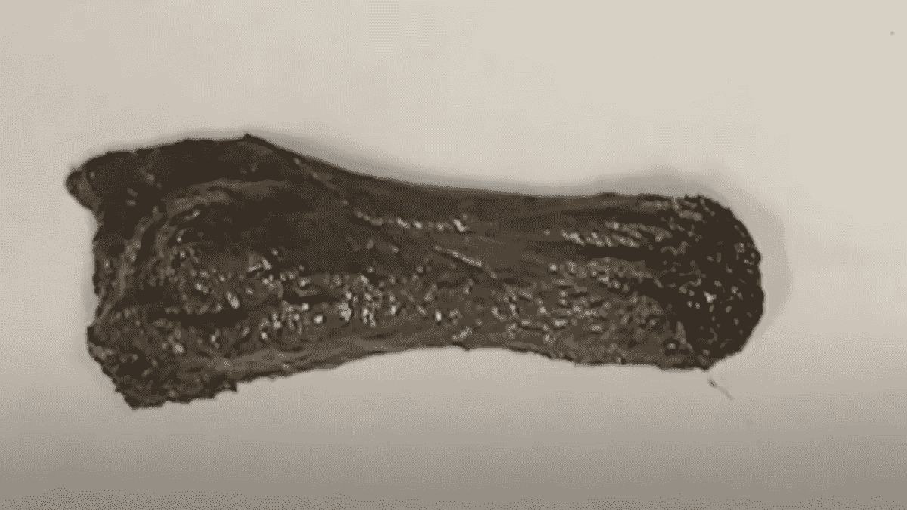

# 如果你见过一个机器人——等等，什么？

> 原文：<https://medium.com/codex/if-youve-seen-one-robot-wait-what-f72f2f84d2ae?source=collection_archive---------23----------------------->

是的，那是个机器人。鸣谢:孙等。先进功能材料

我们认为我们了解机器人，从老派的机器人 T2 罗比到可爱的 T4 R2-D2/C-3PO T5 到杂技机器人 T7 或者非常像人类的西部世界机器人 T9。但是你必须爱那些科学家:他们不断提出新的版本，打破我们的先入之见。其中两个特别引起了我的注意，一部分是因为它们都希望有医疗保健应用，另一部分是因为它们是如何被描述的。

提示:营销人员要在名字上做些工作。

让我们从机器人[开始，它的创造者](https://onlinelibrary.wiley.com/doi/abs/10.1002/adfm.202112508)——香港中文大学的一个团队——称它为“磁性粘液机器人”，一些媒体称它为“磁性大便机器人”(明白我对名字的意思了吧？).它具有所谓的“粘弹性”，合著者张丽教授解释说“有时它表现得像固体，有时它表现得像液体……当你快速触摸它时，它表现得像固体”。当你轻轻地、慢慢地触摸它时，它就像液体一样”

粘液是由一种叫做聚乙烯醇的聚合物、硼砂和钕磁铁颗粒制成的。这些磁性粒子允许它被其他磁体控制，但也是有毒的，所以研究人员添加了一层二氧化硅保护层，从理论上讲，这将允许它被摄入体内(尽管张教授警告说:“安全性也在很大程度上取决于你将它们保留在体内多长时间。”).

这种粘液的一大优势是它可以很容易地变形并穿过非常狭窄的空间。研究人员认为，它能够“抓住固体物体，吞咽和运输有害的东西，人体运动监测，以及电路切换和修复。”它甚至有自我修复的特性。

观看它的运行:

在视频中，在其他任务中，粘液围绕着一个小电池；研究人员发现，当有人吞下一个时，可以用粘液来帮助。张教授说:“为了避免有毒电解质泄漏，我们也许可以使用这种粘液机器人来进行封装，形成某种惰性涂层。”

不幸的是，这一发现的消息在 4 月 1 日被报道，导致一些人认为这是一个愚人节玩笑，而研究人员[坚持认为这不是。其他人将磁性黏液比作](https://www.wionews.com/science/watch-real-flubber-scientists-invent-moving-shape-changing-magnetic-slime-467622)[的绒毛](https://en.wikipedia.org/wiki/Flubber_(material))或[的毒液](https://bgr.com/science/this-robot-made-of-magnetic-slime-is-gross-but-brilliant/)，但是我们将不得不希望我们更好地利用它。

它还没有自主，所以有些人会说它实际上不是一个机器人，但张教授坚持认为，“最终目标是像机器人一样部署它。”

如果磁性粘液/粪便机器人不能为你做这件事，那么一个“磁性 tenacle 机器人”怎么样——有些人认为它是一个“蛇形”机器人？这个来自利兹大学风暴实验室的研究人员。风暴实验室的任务是:

我们致力于对威胁生命的疾病(如癌症)进行更早的诊断、更广泛的筛查和更有效的治疗……我们通过创造价格合理的智能机器人解决方案来实现这一目标，这些解决方案可以提高在医疗基础设施有限的环境中接受灵活内窥镜检查和腹腔镜手术的人们的生活质量。

在这种特殊情况下，磁性 tenacle 机器人提供了一种更小、更灵活和自主的选择，而不是使用直径可能为 3.5-4 毫米并由医生指导的传统支气管镜。风暴实验室主任 Pietro Valdastri 教授解释道:

尺寸为 2 毫米并且其形状可以被磁性控制以符合支气管树解剖结构的磁性触手机器人或导管可以到达肺部的大部分区域，并且将是调查和治疗可能的肺癌和其他肺部疾病的重要临床工具。

此外，“我们的系统使用了一个自主的磁引导系统，在手术过程中，病人不需要接受 x 光检查。”基于术前扫描的患者特定路线将被编程到机器人系统中。然后，它可以检查可疑病变，甚至输送药物。

他们团队成员之一的胸外科医生塞西莉亚·庞皮利博士说:“这项新技术将允许更可靠和安全地诊断和治疗肺癌，在肺部外围引导仪器，而不使用额外的 X 射线。”

观看它的运行:

该机器人在支气管树的 3D 复制品上进行测试，接下来将在尸体的肺上进行测试。可能需要几年时间才能达到临床应用。该团队还创造了一个低成本内窥镜和机器人结肠镜系统的原型，以及其他东西。

研究人员[得出结论](https://www.liebertpub.com/doi/10.1089/soro.2021.0090):

我们证明，与以前提出的磁导管插入技术相比，提出的方法可以进行侵入性更小的导航和更准确的靶向……我们相信，对广泛解剖特征的非创伤性自主探索将是可能的，具有减少创伤和提高诊断率的潜力。"

“这令人毛骨悚然，”瓦尔达斯特里教授[向*《华盛顿邮报》*](https://www.washingtonpost.com/technology/2022/04/01/autonomous-snake-robot-lung-cancer/) 承认。“但我的目标……是找到一种方法，以尽可能最小的侵入方式尽可能深入人体内部……根据肿瘤的位置，这可能是成功到达(它)的唯一方法。”

约翰·霍普金斯大学生物医学工程教授 Nitish V. Thakor 告诉《邮报》:我可以想象未来对肺部进行全面的 CAT 扫描，外科医生坐在电脑前，设计出这种蛇形机器人的导航路径，然后说:‘去拿吧。’他还看到了肺外应用的潜力，例如在心脏中的应用。

同样，梅奥诊所的外科医生 Janani S. Reisenauer 博士向《华盛顿邮报》宣称:“如果这是一个小型的、可操作的自主系统，可以在外面做一些事情，那将是革命性的。”

就我个人而言，我仍然对纳米粒子抱有希望，但在我们实现之前，这些柔软、灵活的机器人可能会很重要。当然，也许人们不愿意被告知他们必须吞下磁性粘液——更不用说磁性粪便——或者让一个蛇形机器人进入他们的喉咙，但这可能比插入内窥镜或被切开要好。

研究人员可以继续研究机器人；我们其他人可以想出更好的名字。