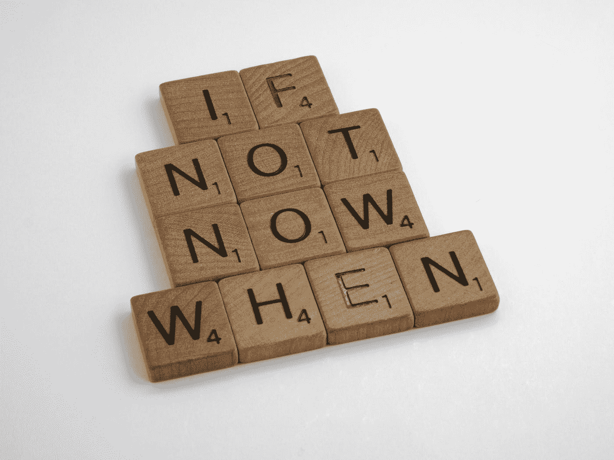
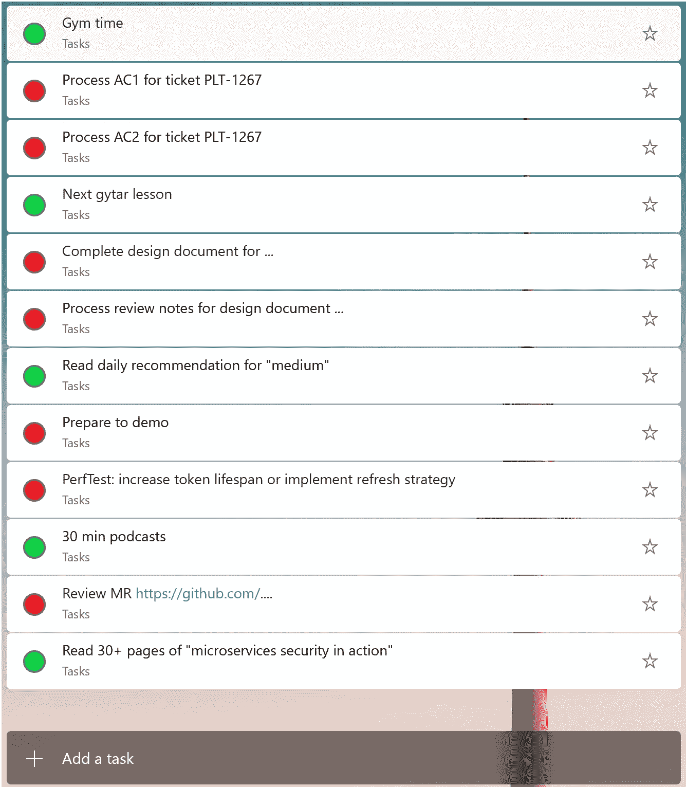
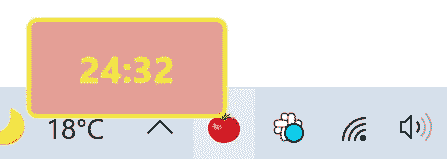

# 我是一个开发者，我在拖延

> 原文：<https://medium.com/codex/im-a-developer-and-i-m-procrastinating-3a108fad651d?source=collection_archive---------5----------------------->

这不是什么大秘密，开发人员工作日通常由一小部分有助于成长的任务和大部分旨在加强现有产品基础的任务组成:bug 修复、技术部门、改进现有行为等。

在一个正常的产品进化生命周期中，你不能只选择感兴趣的任务来工作，你也必须致力于巩固你的基础的任务，但是这两种类型的任务有不同的“满意”价格。

那么如何让热情保持在一个较高的水平，即使是对你来说不是很舒服的活动？在我的开发职业生涯中，有很多时候，从“热情的”任务切换到“无聊的”任务会两次降低我的性能。作为一名以性能为导向的工程师，我开始使用敏捷实践来观察和反思自己，并发现如此巨大差异的原因。

布雷特·乔丹在 [Unsplash](https://unsplash.com?utm_source=medium&utm_medium=referral) 上的照片

# 潜意识破坏

首先，我比较了两种类型活动的工作日——处理“无聊”和“有趣”的任务。

即使我知道我今天只需要处理日常事务，我也不会在工作日开始时迟到。相对来说。是的，我可以比平时花更多的时间喝咖啡，和同事聊天。但是多年养成的习惯会帮助你相对准时地开始。

午餐、例会、工作日结束——这里没有异常。没有相对耗时的活动可以解释生产力的降低。我像往常一样工作。

但是，我已经超过 **20 了！**今日语境转换者。这大约是“正常”工程时间的 5 倍。为什么会这样？我意识到，我下意识地改变了所有日常任务的优先顺序——从字面上看，一切都变得比我计划的工作更重要。作为这一变化的结果，任务委派的过程被中断。拥有高效且经验丰富的团队——无论如何，你是第一个帮助解决收入问题的人。

下意识地，我通过切换到其他，我认为，现在更重要的活动来尽快开始无聊的任务。也是出于一个好的机会，我切换回任何其他活动。它有效率吗？没有太多，因为我同时执行正常的团队工作，而不是将正确的问题委派给正确的人。

这是几十个这样的观察中的一个——在我个人的例子中，大多数都有相同的性质。所以最终我就如何克服这一点制定了个人指导。

# 通过创建待办事项清单开始你的一天

是的，利用在大学或高中学到的经验——你需要提前知道当天要完成的一系列严格定义的指令。准确地说，是最小数量的指令。唯一的区别是——你也是这些必需的日常活动的组织者。

只包括你必须完成的有限数量的任务。毫无疑问，你的日常活动会影响这个列表，一些其他的任务会出现或者现有的任务会被删除。但是如果你没有取消现有任务的理由，你必须完成它。在工作日，在家里，在午夜——都没关系。如果任务被添加—它**必须被完成**。

从我个人的例子中我知道，很难只保留相关的活动，只保留你一天可以完成的工作量。第一周我超负荷工作，因为我确信任务只有执行的代价，但这不是真的——任务有上下文切换、准备工作、计划和范围的代价。仅仅在 2 周内，我就准备了我的第一个计划。这个计划与当时的要求相关，执行起来也很乐观。

我使用[微软待办事项](https://todo.microsoft.com/tasks/)来管理我的日常工作，但是网络中有许多其他任务管理器可以替代使用。

# 奖励自己

如果每天的清单只包含“无聊”的活动——你的生产力会随着每一个活动而下降。最终，这个计划的所有好处都将消失。尝试配对相反的活动，在完成一项“无聊”的任务后“奖励”自己。你的“奖励”不仅仅是一种不同类型的发展活动。可以是读书时间，也可以是爱好时间。在下一个“无聊”的活动之前，给你的大脑一些时间放松。

# 将大任务分解成一系列小而清晰的子任务

更喜欢将其作为任务定义活动的一部分，但不是一个强有力的要求。复杂性总是令人害怕——分而治之。当你有一套原子的有限动作来解决整个问题时，计划和与复杂的人员一起工作就容易多了。你所需要的——只是适当地计划这些个人行动。

我在我的个人计划中使用下一个规则——如果我不能在 1 小时内完成这个任务，我就把它分开。再次使用这个规则，直到我的每个任务需要不到 1 小时来执行。

我这样做是出于可预测性的原因。与评估过程中的“故事点”相同——在时间上更大，更不确定。所以在日常计划过程中使用这种“不确定性的度量”。我敢打赌，你会对这个结果感到惊讶的。

# 不要更改待办事项列表中的顺序

避免无限期延迟无聊的任务——一旦任务列表准备好，就**永远不要**改变任务优先级。在提交你的日常活动之前——再读一遍，确认顺序是正确的。以后再也不改了。

毫无疑问，你的日常事务会产生今天必须包含和执行的其他任务。如果可能的话，把它们放在列表的最后。这有助于保持最初设计的秩序，并避免推迟当前秩序的诱惑。

# 任务执行的焦点

一旦任务列表准备好了——你需要做的就是按顺序执行每个任务。

开始时——将自己隔离一段时间，完全投入到这项特殊的任务中。没有其他干扰:懈怠，电子邮件。没有工间休息和咨询。只要选择合适的时间范围，比如 20 分钟，让自己切换到完全超然的状态。这有助于让你的注意力集中在解决一个特定的任务上。但是，不要将这种分离状态扩展到无限——始终只使用保留时间。不够？再来一轮。但是总的来说，把你的注意力集中在每天的计划上，而不是某个特定的任务上。

尝试用“番茄工作法”练习让自己保持专注，但不要延长专注时间。有几十种线上和线下的番茄工作法工具可供选择。使用您偏好的最佳套件。

# 总是完成待办事项

永远不要把任务移到第二天。如果你计划今天读一本新书的 50 页，你必须读 50 页，而不是 40 页。如果你试图欺骗或移动一次，最终你会意识到你没有真正的范围和优先权，因为一切都可以移动或改变。始终完成所有任务。

从少量的必需任务开始，如果你愿意完成更多的任务，增加第二天的数量。不是倒序。不要在锻炼的第一天给自己压力。这就妨碍了定期做的成长习惯。

最终，你会找到你的门槛。如果你认为事情超出了你的能力范围——完成所有的事情，减少第二天的计划，并教会自己不要为了压倒自己而延长任务清单。做尽可能多的任务，只要你觉得可以竞争。相信我——无论如何，你的表现会比你以前的表现好几倍。

# 结论

在这篇文章中，我分享了我的个人策略，不管我在做什么类型的工作。但是做这件事的主要动机——对你自己是可预测的，对你自己是可衡量的。你总是可以把一天的效率和其他日子进行比较，找到你反常的原因。这有助于你了解自己的弱点和优势，并做出调整来纠正它们。

我可以肯定地说——分析自己是一个非常有趣的过程。你总是可以证明任何事情(你的缓慢和消极的原因)，但是当你有自己的统计数据时——永远这么做要困难得多。