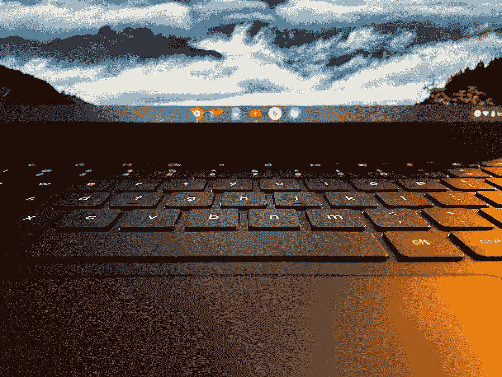

# 我要和 Chrome OS 说再见了…暂时的。

> 原文：<https://medium.com/codex/im-saying-goodbye-to-chrome-os-for-now-6593ffc674eb?source=collection_archive---------5----------------------->

## 这是一个时代的终结。

Pixelbook Go 图片作者。

我用 Chrome OS 已经很久很久了。我从一台便宜的三星 Chromebook(他们最初的那台)开始，我非常喜欢它，甚至用我值得信赖的 iPad 换了那台电脑。

那是在没有安卓应用、没有 Linux 支持、除了谷歌文档之外几乎没有任何离线功能的时候。但是那很好…