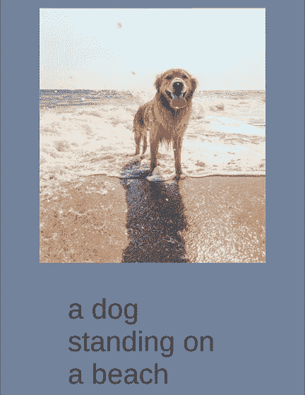
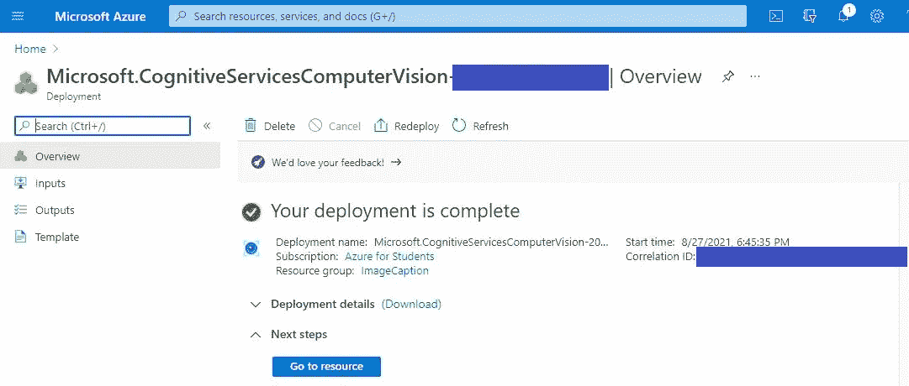
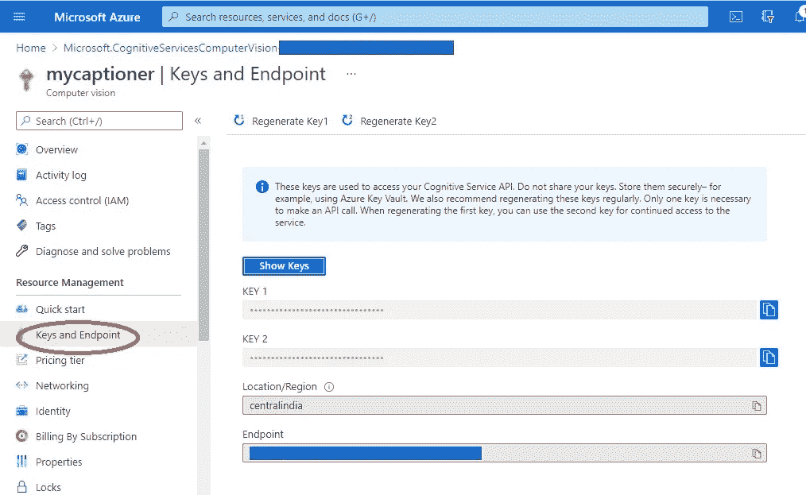
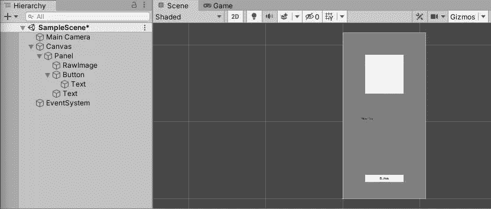
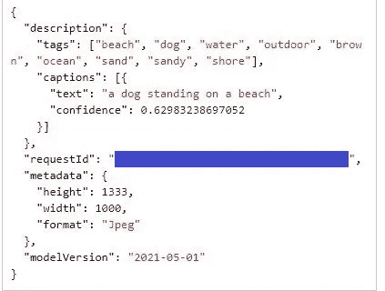
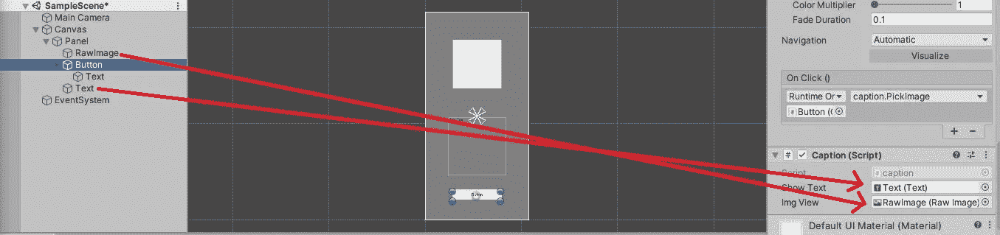
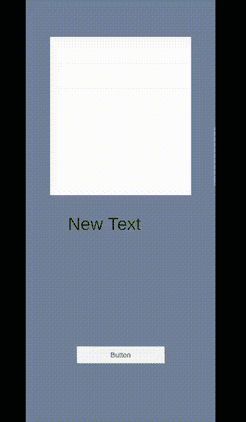

# 使用 Azure 计算机视觉的 Unity Android 中的图像字幕

> 原文：<https://medium.com/codex/image-captioning-in-unity-android-using-azure-computer-vision-c9424f9d1ab1?source=collection_archive---------15----------------------->



图像字幕是使用人工智能和机器学习来生成图像描述的能力，类似于人类描述图像内容的方式。

使用人工神经网络来开发这种图像字幕模型。LSTMs 是该领域中最常用的一种神经网络。训练这样一个模型以高精度生成字幕是一项非常密集的任务。幸运的是，微软 Azure 提供了一个免费的服务来分析图片和提取信息，包括图片的标题。

这篇文章是关于如何在 Unity 中使用 Azure 计算机视觉服务。我们将使用 Azure 计算机视觉服务为移动画廊中的选定图像生成图像标题，但这只是为了演示在 unity 中使用 Azure 计算机视觉的方法。Azure Computer Vision 服务除了图像字幕之外还有很多其他功能，只需改变 URL 中的几个参数就可以使用。

Azure 计算机视觉 API—*[Azure 计算机视觉](https://azure.microsoft.com/en-us/services/cognitive-services/computer-vision/#overview)网站上定义的“一种分析图像和视频内容的人工智能服务”*。

你可以在他们的网站上找到很多关于 Azure Computer Vision 的信息，其中也包括测试 API 的服务。

所以没有进一步的到期，让我们开始吧。

## 1.在 Azure 中创建 Azure 计算机视觉服务资源

为此，你需要一个 Azure 账户，你可以在[这里](https://azure.microsoft.com/en-us/free/cognitive-services/)注册。

接下来，登录 Azure 门户，进入这个[链接](https://portal.azure.com/#create/Microsoft.CognitiveServicesComputerVision)创建一个计算机视觉资源。您应该会看到下面的页面。


在这里，选择您的订阅类型、资源组(如果需要，创建一个)，然后选择离您的位置最近的地区，为实例命名(该名称也将用作端点)并根据您的需要指定定价等级。

免费层每月提供 5000 个 API 调用，每分钟 20 个调用。

接下来，接受条款和条件，并单击“审查+创建”。现在查看详细信息并单击“创建”,您将被重定向到如下页面。



接下来单击“转到资源”,您将转到资源页面。



点击“Keys and Endpoint ”,获取将在 Unity 应用程序中使用的 API 密钥和端点。

现在我们已经完成了 Vision API 资源的创建。你可以在这里测试你的资源。

## 2.创建 Unity 项目

让我们创建一个 Unity 项目，并从构建设置中将平台更改为 Android。

(文件->构建设置-> Android ->切换平台)

接下来，让我们添加一个面板和面板，一个 RawImage，按钮和一个文本，并根据您的意愿调整大小和位置。我也从游戏窗口把长宽比改成了 2160x1080 纵向。这是我的设置:



之后，让我们在 Assets 部分创建一个 C#脚本，并将其命名为“caption.cs”(或者提供您想要的任何名称)。

在开始编码之前，这个项目中有几件事情需要设置。

1.  **建立 Newtonsoft 库**

这里，我们将使用 Newtonsoft 来处理 JSON 相关的操作。在一个典型的 C#项目中，我们能够安装 Newtonsoft NuGet 包并轻松使用它，但在 Unity 中却不是这样。当使用这样的库时，我们需要手动将 DLL 文件添加到 Unity 中的 Assets 文件夹。我们可以这样做。

转到此[链接](https://www.nuget.org/packages/Newtonsoft.Json/)，点击“下载包”下载 Newtonsoft NuGet 包。下载后，我们将获得一个名为“newtonsoft.json.13.0.1.nupkg”的文件。将该文件重命名为“newtonsoft.json.13.0.1.zip ”,并从该 zip 文件中提取内容。在解压缩的文件夹中将有一个 lib 文件夹，其中包含一个名为“net45”的文件夹。在此文件夹中，您将找到一个名为“Newtonsoft”的 DLL 文件。Json.dll。将该文件复制到 Unity 项目的 assets 部分。

**2。设置 csc.rsp 文件**

我们需要做的下一件事是在 Unity 项目的 Assets 部分建立一个“csc.rsp”文件。您可以使用记事本创建此文件，并将其另存为“csc.rsp”。(文件扩展名应为' '。rsp '与非'。txt’)

将以下内容包含在该文件中并保存:

```
-r:System.Net.Http.dll 
-r:System.Web.dll
```

这样做的原因是我们将在我们的项目中使用上面的库，因此 Unity 需要访问相关的 DLL 文件。

**3。更改 API 兼容级别**

接下来，我们需要将 API 兼容级别更改为。要做到这一点，请在 Unity 项目中遵循以下步骤。

'编辑->项目设置->播放器->其他设置-> API 兼容级别从'。NET Standard 2.0 '到'。NET 4.x '。

这样做的原因是，我们将使用“动态”对象和 JSON 反序列化，这两者在使用时都会出错。NET 标准 2.0 版。

(如果只需要 API 调用返回的字符串结果，不需要 JSON 反序列化对象，就不需要更改 API 兼容级别)。

**4。设置 NativeGallery 插件**

由于我们将在手机上访问画廊，我们可以使用[本地画廊](https://github.com/yasirkula/UnityNativeGallery)插件，这是免费提供的感谢开发商。你可以从 [Github](https://github.com/yasirkula/UnityNativeGallery) 下载这个包，或者直接从 [Unity 资产商店](https://assetstore.unity.com/packages/tools/integration/native-gallery-for-android-ios-112630)下载。如果您选择从 Github 下载软件包，请将软件包文件拖放到 Unity Assets 文件夹中，并在出现的弹出窗口中选择 import all。

现在我们已经完成了设置，让我们开始编码。

**C#脚本**

首先，让我们导入这个项目所需的库。您可以跳过这一步，以后只要出现错误就添加库(Visual Studio 会自动建议所需的库导入)。

```
using Newtonsoft.Json;
using System;
using System.Collections.Generic;
using System.IO;
using System.Net.Http;
using System.Net.Http.Headers;
using System.Web;
using UnityEngine;
using UnityEngine.UI;
```

现在让我们设置项目所需的成员变量。创建静态字符串变量来存储订阅密钥、端点和 uriBase(包括我们从 Azure 请求的服务)。接下来，创建两个公共变量来存储我们之前创建的 RawImage 和文本游戏对象。为此，请在 Visual Studio 中打开“caption.cs”脚本，并在 caption 类中创建以下变量:

```
// Add your Computer Vision subscription key and endpoint
static string subscriptionKey = "PASTE_YOUR_COMPUTER_VISION_SUBSCRIPTION_KEY_HERE";//azure endpoint
static string endpoint = "PASTE_YOUR_COMPUTER_VISION_ENDPOINT_HERE";//azure endpoint service accessed
static string uriBase = endpoint + "vision/v3.2/describe?";public Text showText;
public RawImage imgView;
```

接下来，让我们创建一个函数来进行 API 调用。azure [在这里](https://github.com/Azure-Samples/cognitive-services-quickstart-code/blob/master/dotnet/ComputerVision/REST/CSharp-analyze.md)提供了这个任务的示例代码。我的代码也是从这个库中获得的，我已经对它进行了修改以适应我们的场景。

首先，让我们创建一个包含 try-catch 块的异步方法，如下所示:

```
async void MakeRequest(string path)
{
 try
 {
 }
 catch(Exception e)
 {
 }
}
```

在 try 块中，创建一个 HttpClient，添加订阅密钥，创建 URI 并设置请求参数，如下所示:

```
HttpClient client = new HttpClient();
var requestParameters = HttpUtility.ParseQueryString(string.Empty);// Request headers
client.DefaultRequestHeaders.Add("Ocp-Apim-Subscription-Key", subscriptionKey);// Request parameters
requestParameters["maxCandidates"] = "1";
requestParameters["language"] = "en";
requestParameters["model-version"] = "latest";// Assemble the URI for the REST API method.
string uri = uriBase + requestParameters;HttpResponseMessage response;
```

此外，如上声明一个 HttpResponseMessage 对象。

接下来，我们需要以字节数组的形式获取图像。为此，请包含以下代码:

```
// Request body
byte[] byteData = GetImageAsByteArray(path);
```

“GetImageAsByteArray()”函数是一个将图像转换为字节数组的函数，我们将在后面实现。所以现在忽略任何错误。

接下来，包含以下代码片段，以异步调用 API 并获得结果。

```
using (var content = new ByteArrayContent(byteData))
{
 content.Headers.ContentType = new MediaTypeHeaderValue("application/octet-stream"); // Asynchronously call the REST API method.
 response = await client.PostAsync(uri, content); // Asynchronously get the JSON response.
 String responseText = await response.Content.ReadAsStringAsync(); try
 {
  //convert result to a dictionary
  var jsonResult = JsonConvert.DeserializeObject<Dictionary<string, dynamic>>(responseText); //obtain captions object from jsonResult
  var captionsObj = jsonResult["description"]["captions"]; //convert to string
  String captions = captionsObj.ToString(); //replace '[' and ']' symbols
  captions = captions.Replace("[", "");
  captions = captions.Replace("]", ""); //reuse dictionary to store captions dictionary
  jsonResult = JsonConvert.DeserializeObject<Dictionary<string, dynamic>>(captions); //get CaptionText Object
  var captionText = jsonResult["text"]; //set Textview to caption
  showText.text = captionText.ToString();
 }
 catch (Exception e)
 {
  //display any exception
  showText.text = e.Message + "\n " + responseText;
 }
}
```

为了对上面的代码提供一个简单的解释，使用我们获得的图像的字节数组，我们对之前创建的 URI 进行一个 API 调用。接下来，我们将结果存储在“responseText”字符串变量中。我们得到的结果是 JSON 格式的，如这里的[所示](https://docs.microsoft.com/en-us/azure/cognitive-services/computer-vision/quickstarts-sdk/image-analysis-client-library?tabs=visual-studio&pivots=programming-language-rest-api)。



因此，首先，我们使用 JsonConvert 将 JSON 字符串反序列化为一个字典。接下来，我们获得“描述”对象，并由此获得“标题”对象。这是使用以下代码(已经包含在前面的代码段中)完成的:

```
//obtain captions object from jsonResult
var captionsObj = jsonResult["description"]["captions"];
```

不幸的是，我们不能直接获得标题文本，因为标题对象中有“[”和“]”符号，这使我们无法进一步反序列化该对象。因此，我们需要将这个“captionsObj”转换为一个字符串，并删除“[”和“]”符号。现在我们可以将这个字符串反序列化回字典，并获得标题的文本。这是使用以下代码完成的:

```
//convert to string
String captions = captionsObj.ToString();//replace '[' and ']' symbols
captions = captions.Replace("[", "");
captions = captions.Replace("]", "");//reuse dictionary to store captions dictionary
jsonResult = JsonConvert.DeserializeObject<Dictionary<string, dynamic>>(captions);//get CaptionText Object
var captionText = jsonResult["text"];//set Textview to caption
showText.text = captionText.ToString();
```

这些代码以前包含在 MakeRequest()函数中，所以注意不要再次添加它们。最终的 MakeRequest()函数应该如下所示:

```
async void MakeRequest(string path)
{
 try
 {
  HttpClient client = new HttpClient();
  var requestParameters = HttpUtility.ParseQueryString(string.Empty); // Request headers
  client.DefaultRequestHeaders.Add("Ocp-Apim-Subscription-Key", subscriptionKey); // Request parameters
  requestParameters["maxCandidates"] = "1";
  requestParameters["language"] = "en";
  requestParameters["model-version"] = "latest"; // Assemble the URI for the REST API method.
  string uri = uriBase + requestParameters; HttpResponseMessage response; // Request body
  byte[] byteData = GetImageAsByteArray(path); using (var content = new ByteArrayContent(byteData))
  {
   content.Headers.ContentType = new MediaTypeHeaderValue("application/octet-stream"); // Asynchronously call the REST API method.
   response = await client.PostAsync(uri, content); // Asynchronously get the JSON response.
   String responseText = await response.Content.ReadAsStringAsync(); try
   {
    //convert result to a dictionary
    var jsonResult = JsonConvert.DeserializeObject<Dictionary<string, dynamic>>(responseText); //obtain captions object from jsonResult
    var captionsObj = jsonResult["description"]["captions"];

    //convert to string
    String captions = captionsObj.ToString(); //replace '[' and ']' symbols
    captions = captions.Replace("[", "");
    captions = captions.Replace("]", ""); //reuse dictionary to store captions dictionary
    jsonResult = JsonConvert.DeserializeObject<Dictionary<string, dynamic>>(captions); //get CaptionText Object
    var captionText = jsonResult["text"]; //set Textview to caption
    showText.text = captionText.ToString();
   }
   catch (Exception e)
   {
    //display any exception
    showText.text = e.Message + "\n " + responseText;
   }
  }
 }
 catch(Exception e)
 {
 }
}
```

现在让我们创建 GetImageAsByteArray()函数。在 [Github](https://github.com/Azure-Samples/cognitive-services-quickstart-code/blob/master/dotnet/ComputerVision/REST/CSharp-analyze.md) 上的 azure 示例中提供了这个功能。

```
byte[] GetImageAsByteArray(string imageFilePath)
{
 // Open a read-only file stream for the specified file.
 using (FileStream fileStream = new FileStream(imageFilePath, FileMode.Open, FileAccess.Read)) {
  // Read the file's contents into a byte array.
  BinaryReader binaryReader = new BinaryReader(fileStream);
  return binaryReader.ReadBytes((int)fileStream.Length);
 }
}
```

这个函数主要接受图像文件的路径，并返回图像的字节数组。

现在，要打开手机上的图库并允许用户选择图像并生成标题，让我们包含以下代码:

```
public void PickImage()
{
 //set max size
 int maxSize = 512;
 NativeGallery.Permission permission = NativeGallery.GetImageFromGallery((path) =>
  {
   if (path != null)
    {
     //change showText to waiting
     showText.text = "Waiting..."; // Create Texture from selected image
     Texture2D texture = NativeGallery.LoadImageAtPath(path, maxSize); if (texture == null)
     {
      Debug.Log("Couldn't load texture from " + path);
      return;
     } //  set image Texture
     imgView.texture = texture; //pass path to get caption
     MakeRequest(path);
    }
   }, "Select a PNG image", "image/*");
}
```

在 GetImageFromGallery()函数的回调内部，我们调用 MakeRequest()函数并传递图像文件路径来获取标题。

关于 NativeGallery 函数的更多信息，请访问开发者的 [Github](https://github.com/yasirkula/UnityNativeGallery) 库。

现在，我们完成了编码。让我们回到 unity，将“caption.cs”脚本作为组件添加到我们创建的按钮游戏对象中。接下来，将原始图像和文本游戏对象拖放到字幕脚本变量中，如下所示。



接下来，选择按钮，在检查器窗口中，在按钮部分的 OnClick()部分下，单击+图标并添加一个 Click 事件。选择按钮作为对象，并将功能设置为“标题”。' PickImage '如上图所示。

现在我们已经完成了我们的项目。构建并运行项目以测试应用程序。这是我得到的:



这个应用程序似乎没什么用，因为很明显，我们可以看到图像中的内容😅但我创建这个应用程序是为了演示如何在 Unity 中使用 Azure 计算机视觉服务。这项服务还有很多其他有用的应用可以集成到 unity 和 Android 中。这里有一个例子，我创建了一个为视觉障碍者描述周围环境的应用程序——[虚拟眼睛——一个为视觉障碍者描述周围环境的简单应用程序](/geekculture/virtual-eyes-a-simple-surrounding-describing-app-for-the-visually-impaired-3ac2af7e99f0)。

这个项目到此为止。请让我知道你的反馈。谢谢大家！干杯！😀