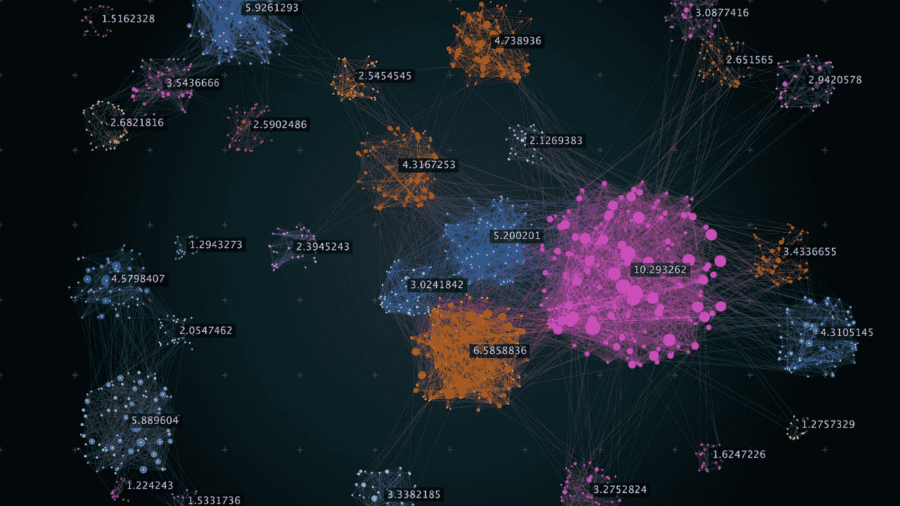
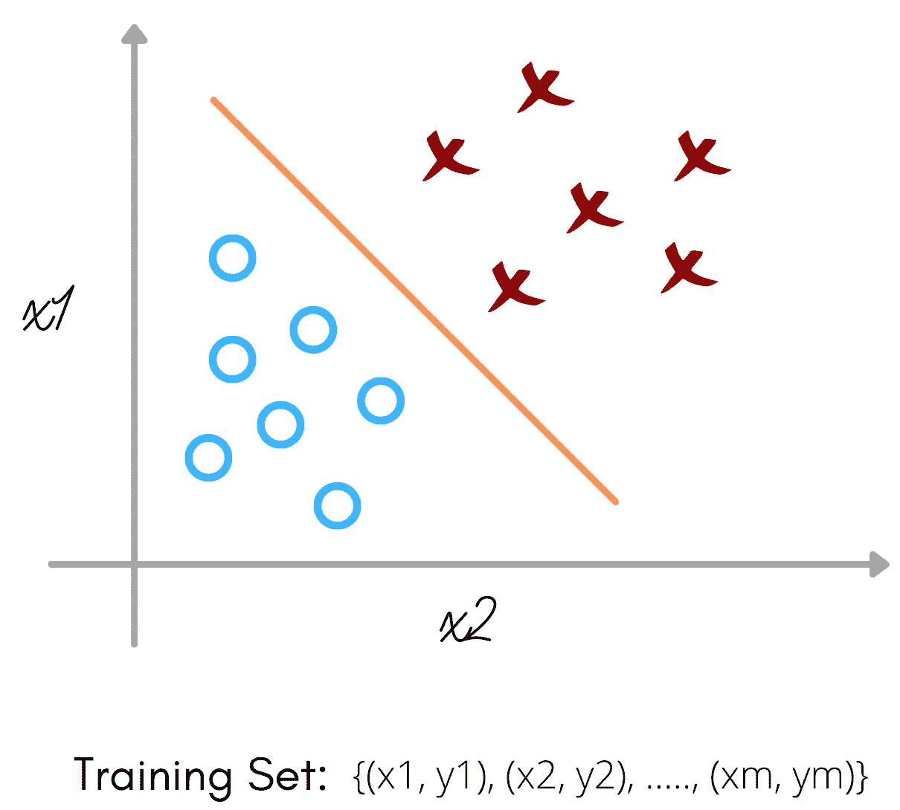
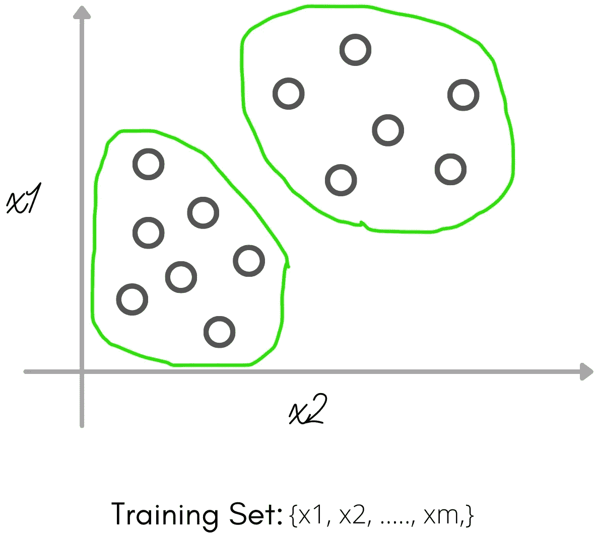
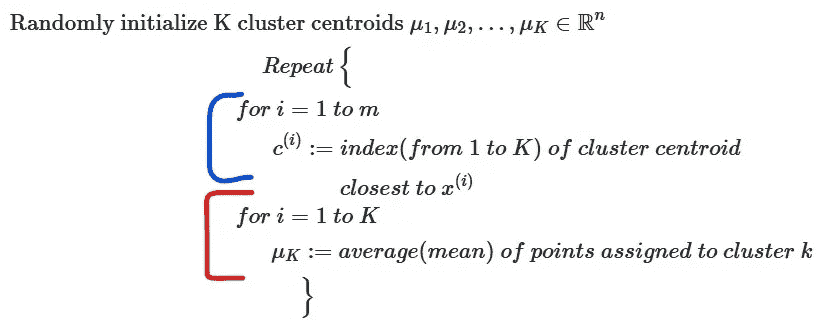
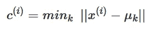
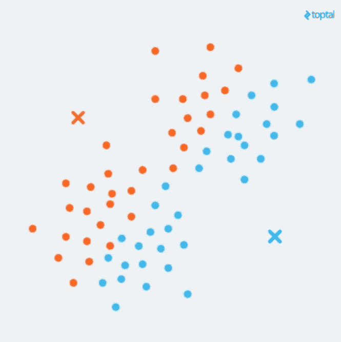
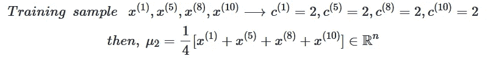
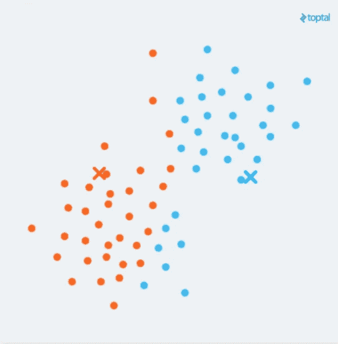
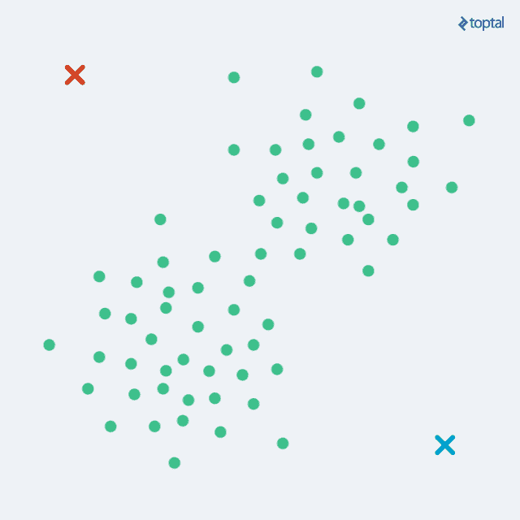
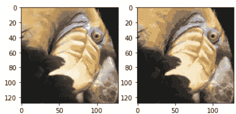

# 基于 K 均值聚类的图像压缩

> 原文：<https://medium.com/codex/image-compression-with-k-means-clustering-48e989055729?source=collection_archive---------2----------------------->



来源:[https://www . vertica . com/blog/finding-the-k-in-k-means-clustering-with-a-UDF/](https://www.vertica.com/blog/finding-the-k-in-k-means-clustering-with-a-udf/)

大家好。我们只在我以前的文章中看到过监督学习算法。但是今天，我们将进入我们的第一个无监督学习算法。在本帖中，我们将学习 K-means，并从一个 2D 数据集的例子开始。接下来，我们将应用 K-means 算法，通过将图片中的颜色数量减少到该图片中常见的颜色来压缩图像。

在无监督学习中，我们的算法将从未标记的数据中学习，而不是从标记的数据中学习。那么，什么是无监督学习呢？我在 [***里简单讲过，机器学习的类型有哪些？***](/codex/what-are-the-types-of-machine-learning-53360b7db8b4) ***。*** 但是对比监督学习还是很有用的。所以下面是监督学习的问题:



监督学习

在上面的例子中，给定一组标签来拟合一个假设。相反，在无监督学习问题中，我们得到的数据没有任何与之相关的标签。所以我们得到了如下的数据集:



无监督学习

这里，数据集给定了一组点，但没有标签，因此我们的训练集只是写为 x1，x2，…，xm，我们没有得到任何标签 y。因此，在无监督学习中，我们只是要求算法在这些未标记的数据中找到一些结构或模式。上面画圈的叫做聚类。这是我们第一种无监督学习算法。

## 什么是 K-means？

K-means 算法是一种将相似数据样本自动分组的技术。例如，假设您有一个训练集 x1，…，xm，并希望将数据整理成几个单一的统一“集群”。

其使用的更具体的例子是:

*   **市场细分:**您可能有一个客户数据库，并希望将其归入不同的市场群体。因此，您可以独立地向他们销售，或者更好地服务于您的各种目标群体。
*   **社交网络分析:**像脸书、Instagram 等东西。例如，关于你最经常给谁发电子邮件以及他们给谁发电子邮件最频繁的信息，以便发现一个有凝聚力的个人群体。另一种聚类算法，你想在社交网络中找到其他连贯的朋友群。
*   **组织数据中心:**如果你知道数据中心的哪些计算机和哪个集群倾向于协同工作。您可以使用它来识别您的资源，以及您如何布局网络，如何设计您的数据中心和通信。
*   **探索星系:**聚类算法了解星系形成，并利用它来了解如何理解天文数据。

让我们快速加载数据集:

```
import numpy as np
from scipy.io import loadmat
import matplotlib.pyplot as plt
import matplotlib.image as imgmat = loadmat('ex7data2.mat')
X = mat['X']
```

## k 均值算法；



k-均值算法

蓝色分组的是簇分配步骤，红色分组的是移动质心步骤。

**聚类分配步骤:**在这个步骤中，我们根据最接近的聚类质心将所有的训练样本涂成红色或蓝色。
c⁽ⁱ⁾是范围从 1 到 k 的值，其指示训练样本是更接近红叉还是更接近蓝叉。



在上面的公式中，我们取训练样本 x⁽ⁱ⁾，并测量 x⁽ⁱ⁾和每个μₖ(质心)之间的距离。它会找到使 x⁽ⁱ⁾和μₖ.之间的距离最小的 k 值请注意，这里使用的 k 是小写的 k，它表示每个聚类的质心。大写的 K 用来表示质心的总数。

看到下图可以获得直觉。



集群分配步骤

**移动质心步骤:**在该步骤中，对于从 1 到 K 的质心，我们平均分配给每个聚类质心 K 的点。对于更具体的例子，



假设，你取训练样本 x⁽ ⁾、x⁽⁵⁾、x⁽⁸⁾、x⁽ ⁰⁾，并且它们被分配到第二聚类质心(即，k=2)，那么它被表示为 c⁽ ⁾=2、c⁽⁵⁾=2、c⁽⁸⁾=2、c⁽ ⁰⁾=2(这里 2 表示聚类质心 k=2，上标表示相应的训练示例)。在移动质心步骤中，我们执行以下操作:以第二个聚类质心为例，从上面我们可以看到 4 个样本(即，x⁽ ⁾、x⁽⁵⁾、x⁽⁸⁾、x⁽ ⁰⁾)被分配给它。通过取平均值，我们可以移动质心。



移动质心步长

通过重复这两个步骤，我们可以将它们分组。下面的 gif 可以帮助你理解这个算法的迭代过程。



来源: [Topal](https://www.toptal.com/machine-learning/clustering-algorithms)

**随机初始化:**

1.  应该具有 K < m(即，质心的总数必须小于训练集中样本的总数)
2.  随机挑选 K 个训练例子。
3.  设定μ₁,….，μₖ等于这 k 个例子。我们需要在特定的训练例子上指定μₖ。

随机初始化:

```
# Random Initializationdef kMeansInit(X, K):

    m, n = X.shape
    centroids = np.zeros((K, n))

    for i in range(K):
        centroids[i] = X[np.random.randint(0, m+1), :]
    return centroids
```

集群分配步骤:

```
# 1\. Cluster Assignment Step
# Finding closest centroid (i.e., c⁽ⁱ⁾)def findClosestCentroids(X, centroids):
    K = centroids.shape[0]
    m = X.shape[0]

    idx = np.zeros((m, 1))
    temp = np.zeros((K, 1))

    for i in range(m):
        for j in range(K):
            temp[j] = np.sqrt(np.sum( (X[i, :] - centroids[j, :])**2 ))
        idx[i] = np.argmin(temp)+1
    return idx
```

移动质心步长:

```
# 2\. Move Centroid Step
# Computing Centroids (i.e., averaging over assigned examples μₖ)def computeCentroids(X, idx, K):
    m, n = X.shape
    centroids = np.zeros((K, n))
    count = np.zeros((K, 1))
    for i in range(m):
        index = int((idx[i]-1)[0])
        centroids[index, :] += X[i, :]
        count[index] += 1
    return centroids/count
```

可视化:

```
# Visualizing k-means on each iterationdef plotKmeans(X, idx, K, centroids, num_iters):
    m, n = X.shape
    fig, axis = plt.subplots(nrows=num_iters, ncols=1, figsize=(6, 36))

    for i in range(num_iters):
        color = 'rgb'
        for k in range(1, K+1):
            grp = (idx==k).reshape(m, 1)
            axis[i].scatter(X[grp[:, 0], 0], X[grp[:, 0], 1], c=color[k-1], s=15)
        axis[i].scatter(centroids[:, 0], centroids[:, 1], s=120, marker="x", c="black", linewidth=3)
        title = "Iteration Number: " + str(i)
        axis[i].set_title(title)
        centroids = computeCentroids(X, idx, K)
        idx = findClosestCentroids(X, centroids)
        plt.tight_layout()
```

## 图像压缩

加载我们的图像:

```
mat2 = loadmat('bird_small.mat')
A = mat2['A']
```

在给定图像上运行 K-means:

```
X2 = (A/255).reshape(128*128, 3)K2 = 16
num_iters = 10def runKMeans(X, initial_centroids, K, num_iters):
    idx = findClosestCentroids(X, initial_centroids)

    for i in range(num_iters):
        centroids = computeCentroids(X, idx, K)
        idx = findClosestCentroids(X, centroids)
    return centroids, idx
initial_centroids = kMeansInit(X2, K2)
centroids2, idx2 = runKMeans(X2, initial_centroids, K2, num_iters)
```

压缩和可视化:

```
m2, n2 = X2.shape
X2_recovered = X2.copy()

for i in range(1,K2+1):
    X2_recovered[(idx2==i).ravel(),:] = centroids2[i-1]

X2_recovered = X2_recovered.reshape(128,128,3)

import matplotlib.image as mpimg
fig, ax = plt.subplots(1,2)
ax[0].imshow(X2.reshape(128,128,3))
ax[1].imshow(X2_recovered)
```



上面右边的图像被压缩成 16 种最主要的颜色。尝试更改 K2 的值。

# 结论

今天，我们看到了 K-means 的内幕以及它实际上是如何工作的。然后用 python 的 numpy，pandas 和 matplotlib 从头开始创建。数据集和最终代码上传到 github。尝试使用 K2 的值，您可以看到每个模块的输出。

在这里查看一下 [K 的意思是](https://github.com/jagajith23/Andrew-Ng-s-Machine-Learning-in-Python/tree/gh-pages/Unsupervised%20Machine%20Learning)。

# 如果你喜欢这篇文章，那么看看我在这个系列中的其他文章

## 1.[什么是机器学习？](/@jagajith23/what-is-machine-learning-daeac9a2ceca)

## 2.[机器学习有哪些类型？](/codex/what-are-the-types-of-machine-learning-53360b7db8b4)

## 3.[一元线性回归](/codex/linear-regression-on-single-variable-f35e6a73dab6)

## 4.[多元线性回归](/codex/linear-regression-on-multiple-variables-1893e4d940b1)

## 5.[逻辑回归](/codex/logistic-regression-eee2fd028ffd)

## 6.[什么是神经网络？](/@jagajith23/what-are-neural-networks-3a0965e2ebfb)

## 7.[使用神经网络的数字分类器](/codex/digit-classifier-using-neural-networks-ad17749a8f00)

## 8.[使用 PCA 对人脸进行降维](/@jagajith23/dimensionality-reduction-on-face-using-pca-e3fec3bb4cee)

## 9.[使用异常检测来检测网络上的故障服务器](https://jagajith23.medium.com/detect-failing-servers-on-a-network-using-anomaly-detection-1c447bc8a46a)

# 最后做的事

如果你喜欢我的文章，请鼓掌👏一个追随者会是🤘非常感谢🤘而且有助于媒体推广这篇文章，让其他人也能阅读。*我是 Jagajith，下一集再来抓你。*