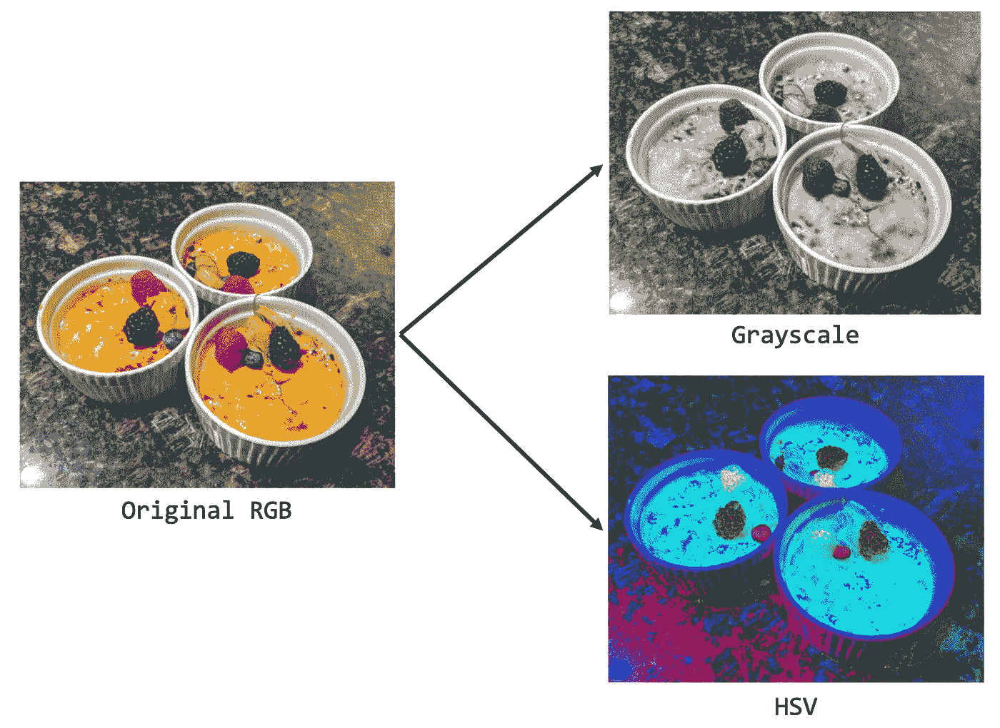

# 图像处理:颜色转换

> 原文：<https://medium.com/codex/image-processing-color-conversions-7090b98d583?source=collection_archive---------4----------------------->

许多应用中都需要图像处理。本文(以及随后的几篇)致力于强调如何在 Python 中执行经典的图像处理技术。具体来说，在本文中，我们将介绍一些颜色转换/分色:

1.  将红绿蓝(RGB)图像作为 Python 的输入，并分离各个颜色通道
2.  重新组合 RGB 颜色…