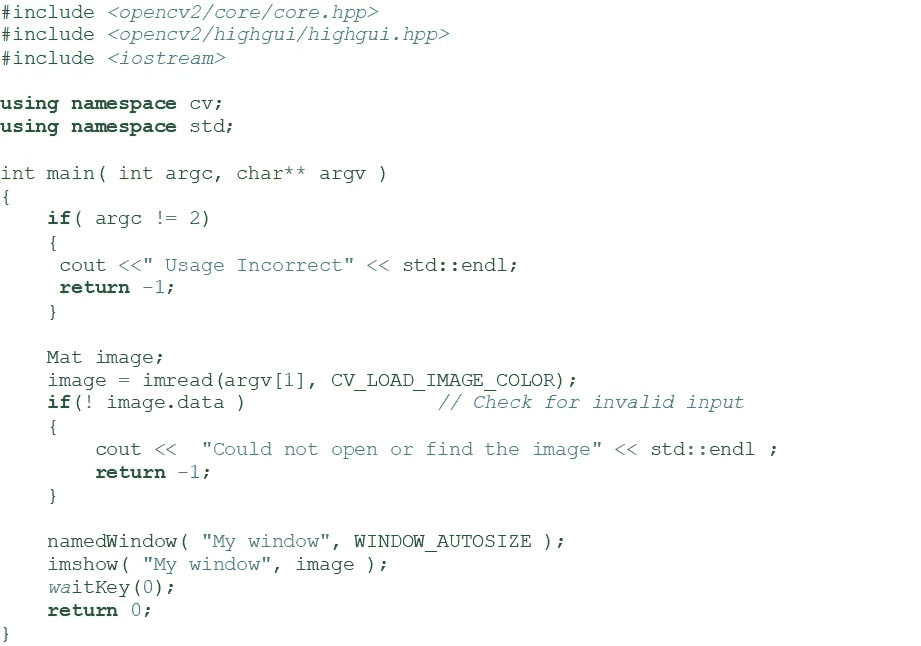

# 使用 OpenCV 和 C++进行图像处理

> 原文：<https://medium.com/codex/image-processing-using-opencv-and-c-5dfaa7f49be?source=collection_archive---------9----------------------->

开源计算机视觉(OpenCV)是一个主要针对实时计算机视觉的函数库。这个库是跨平台的，可以免费使用。OpenCV 以一种强大的方式处理不同的图像操作和视频分析，可以用于对象检测、人脸识别等应用中。本文通过一个代码片段解释了 OpenCV 中的基本操作。我们选择 C++语言而不是 python。这可能有助于早期和有经验的 C++程序员迁移到计算机视觉。

图像处理的基本操作包括加载和显示图像。下面的代码有助于在 C++中加载和显示图像。

来源:OpenCV 2.4.13.7 文档

在上面的程序代码中，使用了 openCV 中的以下函数。

1) imread()加载图像是由 imread()函数完成的。imread()有两个参数。第一个参数是图像名称。第二个参数指定了我们想要的图像格式。指定的不同参数值是:

CV _ LOAD _ IMAGE _ gray(0)将图像加载为强度图像

CV_LOAD_IMAGE_COLOR (>0)以 BGR 格式加载图像

CV_LOAD_IMAGE_UNCHANGED(<0)按原样加载图像

如果未指定此参数，则隐含 CV_LOAD_IMAGE_COLOR。

2) namedWindow()创建一个 openCV 窗口来显示图像。这个函数也有两个参数。第一个参数是窗口的名称，第二个参数表示窗口的大小。窗口大小的值为:

WINDOW_AUTOSIZE 使窗口大小等于它显示的图像大小。

图像会根据当前的窗口大小自动调整大小。

如果用户没有指定第二个参数，则暗示它是 WINDOW_AUTOSIZE。

3) imshow()在窗口中显示图像。该函数的第一个参数表示窗口名称，第二个参数是图像变量。

4)waitKey()应用延迟参数。这个函数只有一个参数，指示它应该等待用户输入多长时间(以毫秒为单位)。零值意味着无限期等待。

希望通过这篇文章使图像处理的第一步变得容易。让我们在以后的文章中讨论更多。