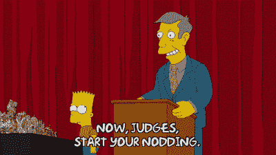

# 美国最受欢迎的动画电视家庭的图像识别

> 原文：<https://medium.com/codex/image-recognition-with-americas-favorite-animated-tv-family-95274b45c610?source=collection_archive---------14----------------------->

## 在 Alteryx Designer 中构建图像分类模型

斯蒂芬·格雷奇在 [Unsplash](https://unsplash.com?utm_source=medium&utm_medium=referral) 上拍摄的照片

如果你对美国流行文化有一点了解，你大概能说出上图中的人物。《辛普森一家》已经在电视上播了 30 多年了，它提供了大量的“训练数据”,所以我们可以认出剧中的所有或许多角色。另外，作为人类，我们非常擅长解读图像。

但是为了识别图像，计算机不仅需要训练数据，还需要一种理解图像并预测图像中的人或物的方法。幸运的是，随着 Alteryx Designer 21.3 的发布，智能套件中的新[图像识别工具](https://help.alteryx.com/20213/designer/image-recognition)正好提供了这一点。此工具可帮助您构建一个影像分类模型，该模型针对一组带有两个或更多类别的已标记影像进行训练(多类别分类)。然后，您可以使用机器学习工具组中的[预测工具](https://help.alteryx.com/20213/designer/predict-tool)来标记新图像。

让我们看看如何使用图像识别来训练一个模型，它可以像你和我一样识别辛普森一家的成员。

*图像通过* [*GIPHY*](https://media.giphy.com/media/Sbq7EL4jPZlbj9wUKD/giphy.gif)

# 不要大惊小怪，伙计:准备和输入图像

《辛普森一家》中的这个[图像数据集](https://www.kaggle.com/mathurinache/simpsons-images)可以在 Kaggle 上获得，它包括该剧的 16，000 多张静止图像，组织成代表 19 个不同角色的训练和测试目录。为了简单起见，我使用了 5637 张图片，每张图片只显示了四个角色中的一个:荷马、玛吉、巴特和丽莎。该模型将尝试按照它认为显示的字符“分类”每个图像，本质上是“识别”该字符。

我将 70%的图像放入训练数据集中，20%放入验证集中，10%放入维持集中。(要了解为什么这种划分如此重要，请看[这篇文章](https://community.alteryx.com/t5/Data-Science/Holdouts-and-Cross-Validation-Why-the-Data-Used-to-Evaluate-your/ba-p/448982?utm_content=802313&utm_source=tds)。)目录工具使得引入完整的训练和验证目录变得容易，加上由四个 Simpsons 角色中的每一个组织的子目录。我使用公式工具从每个子目录的名称中提取标签名称(图中显示的 Simpsons 字符)，并将其放入一个名为“Class”的新字段中。组织好图像并建立标签后，图像输入工具就可以输入实际的图像文件了。

作者图片

但是——“哦！”正如荷马所说——我们还没有准备好建立模型。为了一致性和与模型建立过程的兼容性，首先处理图像是很重要的。特别是，你可能需要使用[图像处理工具](https://help.alteryx.com/20212/designer/image-processing)——在[这篇博文](https://community.alteryx.com/t5/Data-Science/Picture-Perfect-Inside-Image-Processing/ba-p/767828?utm_content=802313&utm_source=tds)中讨论过——来使图像大小一致，并应用他们可能需要的其他变换。(但是，不要将其转换为灰度，因为这与图像识别工具不兼容。)为图像选择统一的大小；您的图像越小，您的模型将越快，但它可能有较低的准确性。图像的最小尺寸取决于您选择的预训练模型(稍后将详细介绍)。一个好的起点是 128 x 128，这就是我在这里使用的。你可以试验一下，看看哪个维度能给你最好的结果。对训练、验证和测试图像应用相同的处理很重要。

*图像通过* [*GIPHY*](https://media.giphy.com/media/26BGIqWh2R1fi6JDa/giphy.gif)

# 呜-呼！配置图像识别

图像识别工具是工作流程中的下一步，如下所示，它需要一些配置选择。我们需要指定训练和验证图像来自哪里，以及每个数据流中的哪个字段包含图像的标签。

作者图片

我们还可以选择时期和批量大小。这里的一个*批次*是我们训练数据的子集，工具中的默认是 32 张图像。这 32 幅图像是通过正在构建的神经网络发送的；基于该组计算误差，并且更新模型参数以尝试减少误差。

epochs 的数量表示您希望*所有*训练数据(在一个或多个批次中)通过进行中的模型发送的次数。这里的默认值是 10，但是您可以尝试不同的值，看看哪一个最适合您的数据集。这个想法是让数据在模型中运行足够长的时间，以找到最小化误差的参数。

32 个批次，10 个历元，你的模型的参数会更新 320 次；因此，请记住，如果增加这些数字，您的工作流将需要更长的时间。添加更多的纪元[也会导致](https://datascience.stackexchange.com/questions/46523/is-a-large-number-of-epochs-good-or-bad-idea-in-cnn/46534)过度拟合你的模型。同样，您可以尝试这些选项，看看哪种组合会产生最好的结果。

*图片 via* [*GIPHY*](https://media.giphy.com/media/3orif8Epddpd8KSELe/giphy.gif)

# 嗯，模型:选择预训练模型

最后，您有一个预训练模型的选择列表。图像识别工具并没有完全从零开始建立一个用于图像分类的深度[卷积神经网络](https://en.wikipedia.org/wiki/Convolutional_neural_network)模型。你可能不希望这样，除非你有大量的计算能力和时间！相反，它使用由拥有这些资源的专家建立的预训练模型，加上数百万张图像来训练和完善他们的模型。可以说，预先训练的模型包含关于图像特征的现有“知识”，并且它们可以将该知识“转移”到分析您的图像(因此有术语“[转移学习](https://builtin.com/data-science/transfer-learning)”，这是一种也用于其他类型的数据的方法，例如在自然语言处理中)。

这里的默认值是 InceptionV3，但是您也可以选择 VGG16、InceptionResNetV2 或 Resnet50V2。正如图像识别工具[文档](https://help.alteryx.com/20213/designer/image-recognition)所解释的，每种工具在准确性、速度和计算费用方面都有自己的优势和劣势，您需要根据您的使用情况对这些标准进行优先排序。同样，您可以在这里轻松地尝试多个选项，并查看您的模型的每个版本的执行情况。如果您的图像很小，请务必记下预训练模型所需的最小尺寸；VGG16 和 ResNet50V2 需要 32 x 32，InceptionV3 和 InceptionResNetV2 需要 75 x 75。

最后，为了使用训练好的模型对新的、未标记的图像进行预测，您可以将新数据和预测过程包含在同一个工作流中，也许可以使用容器来分隔过程的各个部分。或者，您可以保存模型以供以后在单独的工作流中使用。要保存模型，请在图像识别工具之后添加一个输出工具，将模型放入一个. yxdb 文件中。

*图片经由* [*GIPHY*](https://media.giphy.com/media/3orieR4zl3zCoNhGV2/giphy.gif)

# 科瓦邦加！训练模型并进行预测

当您运行工作流时，您可以在结果窗口中观看您的纪元。您将看到进度，以及每个时期中，模型在训练和验证数据上的表现。通常，尽管不总是如此，随着时代的发展，你会看到准确性大部分增加，而损失大部分减少。这种模式表明，随着模型反复查看数据并对其自身参数进行调整，其预测图像标签的能力正在提高。

作者图片

*(想看看所有预训练的模型选项表现如何？详细内容见本帖* *中的* [*。)*](https://community.alteryx.com/t5/Data-Science/Image-Recognition-Classification-Models-Made-Simple/ba-p/802313?utm_content=802313&utm_source=tds)

现在，您可以直接在同一工作流中或在单独的工作流中使用您的模型进行预测。无论您选择哪个选项，在预测它们的标签之前，您的用于分类的新图像应该以与您的原始图像相同的方式进行处理；在我的工作流程中，我把新的无标签图像的尺寸也调整为 128 x 128。

作者图片

我设置了工作流的第二部分，通过输入工具引入保存的图像识别模型。在预测工具上，我将模型连接到 M 输入锚，将我的维持数据连接到 D 锚。

我还在 Predict 工具之后添加了一些数据整理和分析，以评估我的模型在维持图像上的表现如何。我添加了一个变量来标记预测是否与图像上的原始标签匹配，这让我可以使用过滤工具快速查看哪些图像的标签预测正确，哪些预测不正确。

最后，我使用列联表工具来显示本质上的混淆矩阵，比较图像的实际标签和预测标签。这种可视化可以让您快速了解您的模型正在学习什么以及它在哪里出错。

作者图片

我的表现最好的模型使用了 ResNet50V2 预训练模型，它在所有类(在本例中是字符)上实现了 90%的整体准确性。与巴特和荷马相比，它在辨认丽莎和玛吉方面做得稍好一些。我可以进一步试验图像和批次大小，以及时期的数量，看看是否能得到更好的结果。干得好，图像识别！

*图片经由* [*GIPHY*](https://media.giphy.com/media/3orifhaiBq26JjDbsQ/giphy-downsized.gif)

# 真人表演:图像分类应用

在你收集的有趣数据中，有哪些图像？您可能需要手动标记一些图像来开始，但是有了足够的准备好的示例，您可以根据新数据生成预测。还要记住，在使用图像，尤其是人的图像时，有一些重要的伦理考虑要牢记在心；这里有一些要考虑的问题的简要概述，还有更多的资源。

像往常一样，从您的图像生成的数据可以在您的工作流程中与其他数据源混合，这意味着您再次扩展了数据的可能性。或者，就像他们在斯普林菲尔德说的，“孕育”了他们。

# 推荐阅读

*   [用于视觉识别的卷积神经网络:图像分类](https://cs231n.github.io/)
*   [神经网络中批次和时期之间的差异](https://machinelearningmastery.com/difference-between-a-batch-and-an-epoch/)
*   [精度和损耗](https://docs.paperspace.com/machine-learning/wiki/accuracy-and-loss)

*原载于* [*Alteryx 社区数据科学博客*](https://community.alteryx.com/t5/Data-Science/Image-Recognition-Classification-Models-Made-Simple/ba-p/802313?utm_content=802313&utm_source=tds) *。*