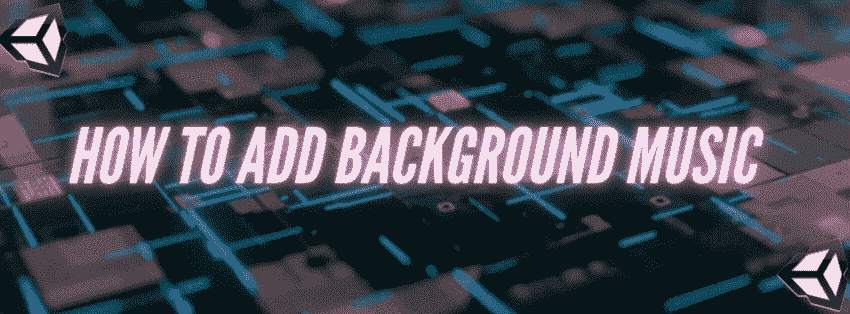
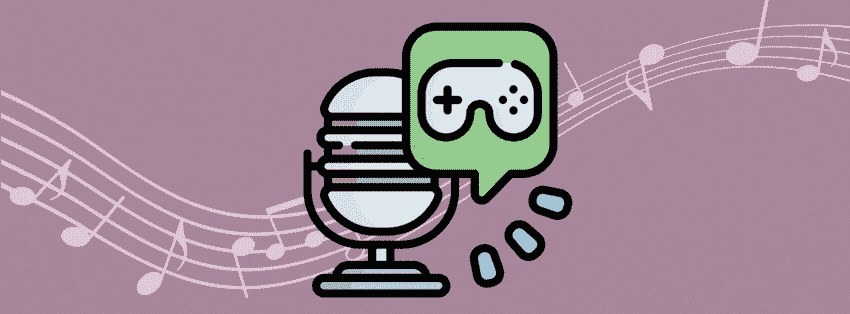
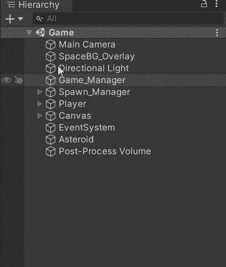
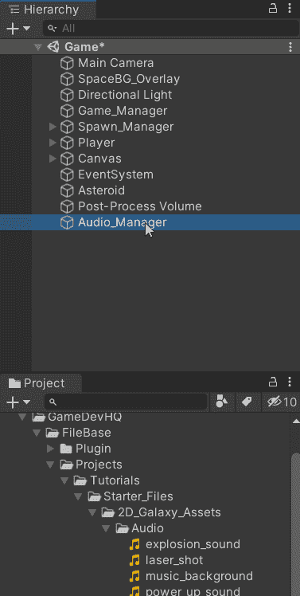
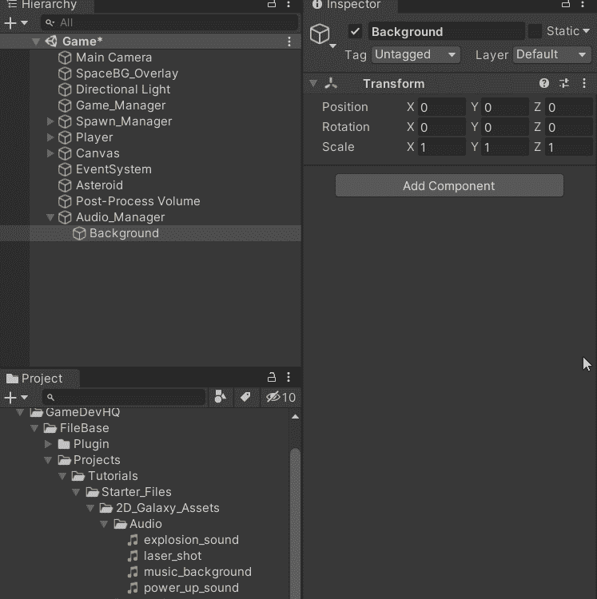
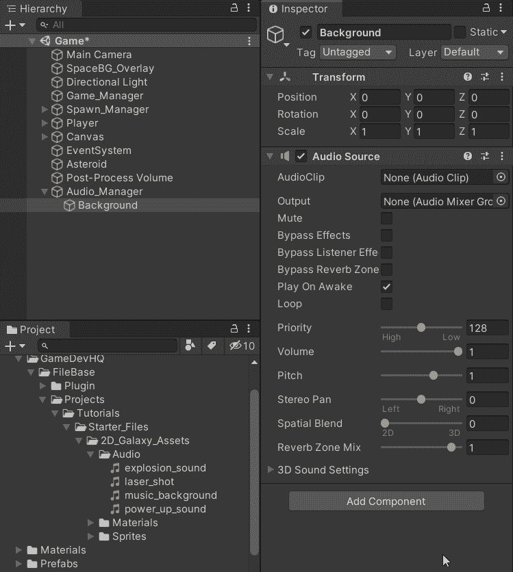
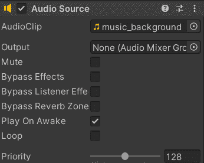

# 沉浸从声音开始

> 原文：<https://medium.com/codex/immersion-starts-with-sound-6f51eefbd9e7?source=collection_archive---------14----------------------->

无论你是游戏玩家还是在游戏行业工作的人，单词 *immersion* 以非凡的决心脱颖而出。事实上，从设计师和消费者的角度来看，它已经成为电子游戏中最受欢迎的品质之一。开发团队不知疲倦地持续工作，将沉浸感带入我们的屏幕——从复杂的游戏、迷人的故事、令人敬畏的图形和丰富的声音。

增加沉浸感的最简单方法之一是通过音乐。音乐是一种强有力的载体，它能以一种其他媒体形式无法做到的方式即时唤起情感。它可以在玩家和游戏之间产生更深层次的互动，并塑造游戏的基调和其中的各种情况。

# 如何添加背景音乐

**目标**:添加一首音乐曲目，在游戏开始时循环播放。

1.  创建一个空的游戏对象。这将是我们的音频管理器对象，所有游戏的音频将被处理。

2.因为游戏有多种音频类型，所以最好把它们组织成独立的、容易找到的结构。因此，在音频管理器中创建一个空对象，这将是专门负责管理背景音乐的对象。

3.将[音源组件](https://docs.unity3d.com/ScriptReference/AudioSource.html)添加到你的背景对象中。

4.将所需的背景音乐插入组件的相应插槽中。

5.确保点击循环并在唤醒时播放，以便音频在关卡开始时立即播放，并且在循环时播放。

**结果:**

下一篇文章，我们就来看看[**如何播放音效**！](https://dennisse-pd.medium.com/how-to-play-sound-effects-in-unity-6a122bb32970)