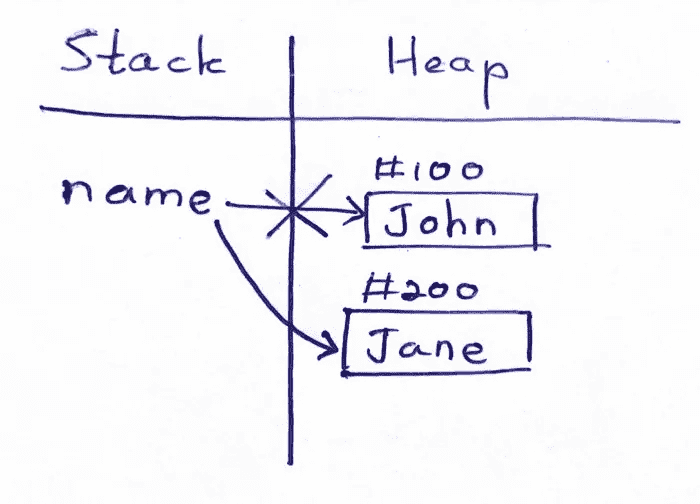
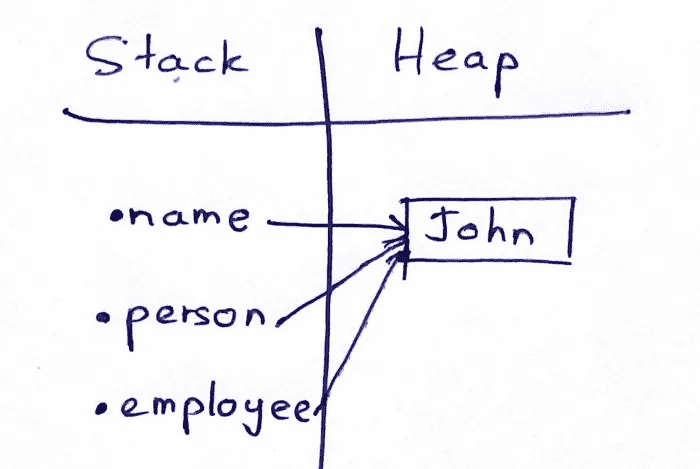
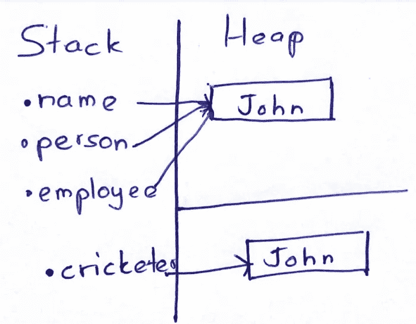
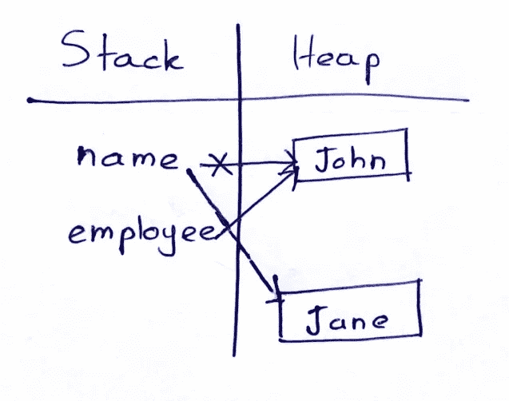

# Java 中的不变性

> 原文：<https://medium.com/codex/immutability-in-java-283d8bc9e634?source=collection_archive---------1----------------------->


## 什么是不变性？！！

如果一个对象的状态在构造后不能改变，那么它就被认为是*不可变的*。最大限度地依赖不可变对象被广泛认为是创建简单、可靠代码的合理策略。

## 字符串是不可变的对象！

字符串是一个不可变的对象，我们可以改变字符串变量中的值。字符串中发生了什么？

例如:

```
String name = "John";
name = "Jane";
```

上面的代码没有任何错误，是一个成功的编译。

实际上，Jvm 在幕后工作**，上面例子中的 JVM 将创建一个新对象并指向新值，但是直到现在最后一个值已经存在于内存中。但是更改后我们无法访问它。**

> **为了更好的理解，请看下图。**

****

**在 Java 中我们有一个字符串池，你指的是什么？我们来解释一下。**

## **字符串池:**

**例如，如果我们有如下代码所示的 3 个变量:**

```
String name = "John";
String person = "John";
String employee = "John";
```

**如果我们需要在内存中保存这个值，内存将重复这个值 3 次。**

**但是字符串池第一次会为值创建一个新的位置，第二次和第三次会指向第一个位置而不创建新的分配。**

> **为了更好的理解，请看下图。**

****

**并且您可以使用`==`来检查两个`String`之间的位置是否相同。**

**String bool 是一个有效的搜索和节省值，也可以考虑。**

**JVM 使用的**栈**和**堆**你可以从这个[链接](https://blog.devgenius.io/what-is-garbage-collector-stack-heap-in-java-80c33c2a0234)中读到这个。**

****新字符串:对象:****

**我们可以检索最后一个示例代码，并添加一个新行，如下所示。**

```
String name = "John";
String person = "John";
String employee = "John";
String cricketer = new String(“John”);
```

**从上面的代码中，我们强制 **JVM** 创建一个新对象和新位置，而不查看新对象的值或者检查该值是否存在于**字符串池中。****

> **为了更好的理解，请看下图。**

****

**现在，如果我们想检查字符串池中的位置，我们可以编写如下代码。**

```
name == person // will print true
name == cricketer // will print false
```

****分配的字符串:****

**例如，当把字符串的值改为另一个值时，JVM 会怎么做呢？让我们看看下面的例子。**

```
String name = "John";
String person = "John";
name = "jane"
```

**在这种情况下，在堆中创建新值后，会将字符串池中的位置从 John 位置更改为 Jane 位置。就这么简单。**

> **为了更好的理解，请看下图。**

****

> **不要忘记在文章上拍手，每篇文章可以拍手 50 次。还有你在这里找到我的[**LinkedIn**](https://www.linkedin.com/in/abd-alrhman-alkraien-83a93a1b1/)**

## **参考资料:**

*   **[https://docs . Oracle . com/javase/tutorial/essential/concurrency/immutable . html #:~:text = An % 20 object % 20 is % 20 视为% 20 不可变，特别是% 20 useful % 20 in % 20 concurrent % 20 applications](https://docs.oracle.com/javase/tutorial/essential/concurrency/immutable.html#:~:text=An%20object%20is%20considered%20immutable,particularly%20useful%20in%20concurrent%20applications)。**
*   **[https://blog . dev genius . io/what-is-garbage-collector-stack-heap-in-Java-80 c 33 C2 a 0234](https://blog.devgenius.io/what-is-garbage-collector-stack-heap-in-java-80c33c2a0234)**