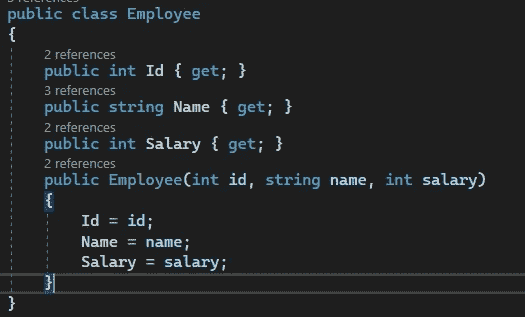
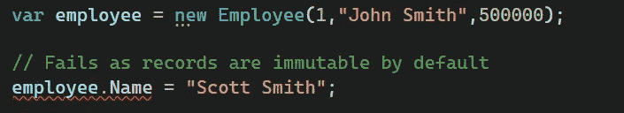
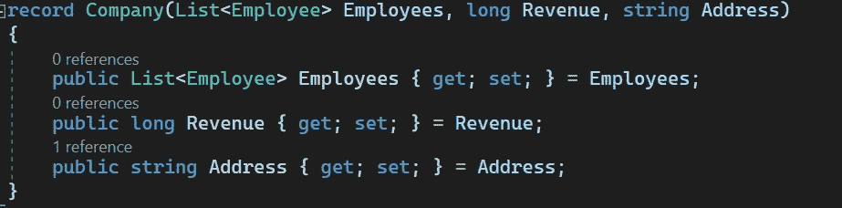
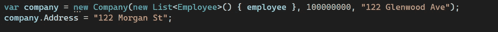
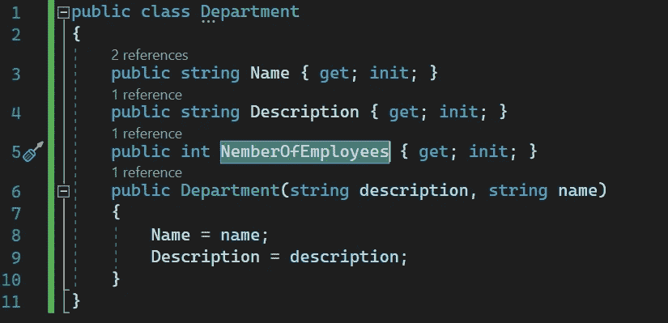
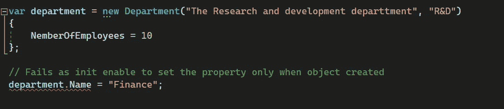

# C# 9 中的不可变对象

> 原文：<https://medium.com/codex/immutable-objects-in-c-9-4b934e7755a7?source=collection_archive---------2----------------------->

有些情况下，我们希望使用不可变的对象，而不是可变的对象。不可变对象是线程安全的，但另一方面，在许多情况下，它们会导致性能问题(尤其是在 GUI 应用程序中)。每个开发人员日常使用的最流行的不可变对象是*字符串*。

## C#中的不变性:

一般来说，在 C#中，不可变性是需要付出代价的，因为在默认情况下，它是一种主要可变的语言。如果我们想选择不变性，我们可以为对象的属性设置一些像只读或非设置方法这样的结构。

例如:

C# 8 中的不可变类

在这种情况下，我们不能使用[对象初始化器](https://learn.microsoft.com/en-us/dotnet/csharp/programming-guide/classes-and-structs/object-and-collection-initializers)语法。这将迫使我们使用长构造函数，增加类型的样板代码的成本。“更改”对象的属性可以通过创建一个新方法来完成，该方法返回一个新实例，其中包含对属性的所需更改。创建一个新方法需要我们维护更多的代码。基本上，这意味着我们必须在易用性和不变性之间做出选择。

## C# 9 中的新特性:

**记录:**

> C# 9 引入了 [*记录*](https://learn.microsoft.com/en-us/dotnet/csharp/language-reference/builtin-types/record) ，这是一个新的引用类型，你可以创建它来代替类或结构。记录与类的区别在于记录类型使用基于值的等式

*默认情况下，记录是不可变的，所以如果我们想要创建一个不可变的对象，我们只需要将它声明为记录。这可以在一行代码中完成，如下例所示:*

**

*记录定义*

**

*创建员工记录，并尝试更改其属性失败*

*“改变”不可变记录的属性可以通过`with`表达式来完成。`[With](https://learn.microsoft.com/en-us/dotnet/csharp/language-reference/operators/with-expression)`生成其操作数的副本，并修改指定的属性和字段:*

**

*通过创建具有不同名称属性值的新实例来“更改”记录值*

*记录也可能是可变的。要将记录从不可变类型转换为可变类型，我们需要执行以下操作:*

**

*可变记录*

**

***初始化:***

*Init 属性很像 setters，但是它们只能在对象的构造阶段使用。 *Init 属性*，意味着它们可以在构造函数中设置或者使用属性初始化器。这意味着对象的不可变属性可以参与对象初始化器，从而消除了类型中所有构造函数样板文件的需要。*

*在这个例子中，你可以看到我们有一个带有 *init properties* 的 *Department* 类，我们不必创建复杂的构造函数，因为我们可以使用[对象初始化器](https://learn.microsoft.com/en-us/dotnet/csharp/programming-guide/classes-and-structs/object-and-collection-initializers)语法。*

**

*具有 **init** 属性的类*

*当我们试图在对象创建后更改 *init 属性*时，我们会失败，因为我们已经脱离了对象的构建阶段。*

*这样我们就得到一个完全不可变的对象，或者只有一些不可变的属性，这取决于我们的目的。*

**