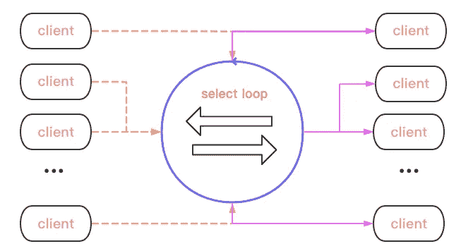
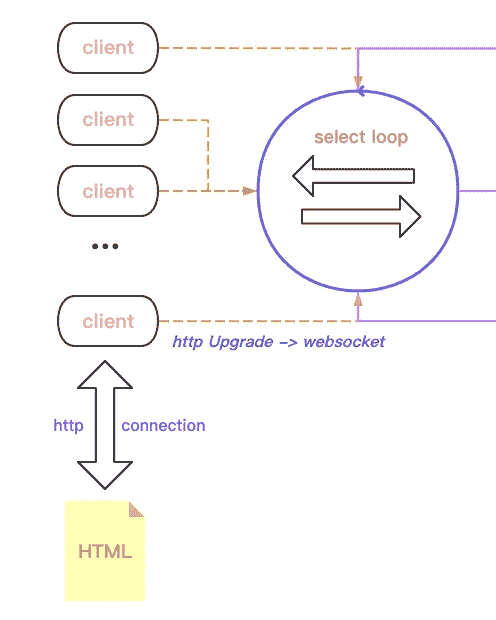

# 用 Go + WebSocket 实现聊天服务

> 原文：<https://medium.com/codex/implement-a-chat-service-with-go-websocket-591cc9f9e33f?source=collection_archive---------3----------------------->

# 背景

在`go-zero`开源后，很多用户询问`websocket`是否会被支持，何时会被支持，最终在`v1.1.6`我们得到了框架级支持的`websocket`，下面我们将以`chat`为例来解释如何使用`go-zero`实现一个带有`websocket`的`chat`服务。

# 总设计

下面我们以`zero-example`中的`chat`聊天室为例，一步步来讲解`websocket`的实现，分为以下几个部分。

1.  多客户端访问
2.  消息广播
3.  及时的在线和离线客户端
4.  全双工通信【客户端本身就是发送方和接收方】。

首先，我们放一张一般数据传输的示意图。



中间有一个`select loop`是整个`chat`的`engine`。首先，支持双方沟通。

*   必须有一个管道来交换数据。客户端仅从*管道*读取/传输数据。
*   客户端在线。不能说你离线了还传输数据给你。

# 数据流

数据流是`engine`的主要功能，先不急着过代码，先想想`client`如何访问并被`engine`感知。

1.  首先从前端发送一个`websocket`请求。
2.  建立联系；准备接收/发送通道。
3.  注册到`engine`。



代码如下所示:

```
 // HTML manipulation {js}
 if (window["WebSocket"]) {
   conn = new WebSocket("ws://" + document.location.host + "/ws");
   conn.onclose = function (evt) {
     var item = document.createElement("div");
     item.innerHTML = "<b>Connection closed.</b>";
     appendLog(item);
   };
   ...
 }
 ​
 // Routing
 engine.AddRoute(rest.Route{
   Method: http.MethodGet,
   Path: "/ws",
   Handler: func(w http.ResponseWriter, r *http.Request) {
     internal.ServeWs(hub, w, r)
   },
 })
 ​
 // Access logic
 func ServeWs(hub *Hub, w http.ResponseWriter, r *http.Request) {
   // escalate http requests to websockets
   conn, err := upgrader.Upgrade(w, r, nil)
   ...
   // build client: hub{engine}, con{websocker conn}, send{channel buff}
   client := &Client{
     hub: hub,
     conn: conn,
     send: make(chan []byte, bufSize),
   }
   client.hub.register <- client
   // Start client-side duplex communication, receiving and writing data
   go client.writePump()
   go client.readPump()
 }
```

这样，新访问的`client`被添加到*注册*通道。

# 轮毂发动机

当`engine`发出*寄存器*动作时，它做什么？

```
 type Hub struct {
   clients map[*Client]bool // uplink clients
   broadcast chan []byte // message sent by client -> broadcast to other clients
   register chan *Client // register chan, receive registration msg
   unregister chan *Client // go offline chan
 }
 ​
 func (h *Hub) Run() {
   for {
     select {
     // register chan: stored in the registry, and the data flow happens in these clients
     case client := <-h.register:
       h.clients[client] = true
     // Offline channels: remove from the registry
     case client := <-h.unregister:
       if _, ok := h.clients[client]; ok {
         delete(h.clients, client)
         close(client.send)
       }
     // Broadcast message: sent to client in the registry, received by send and displayed to client
     case message := <-h.broadcast:
       for client := range h.clients {
         select {
         case client.send <- message:
         default:
           close(client.send)
           delete(h.clients, client)
         }
       }
     }
   }
 }
```

1.  接收注册消息->添加到全局注册表
2.  如果`engine.broadcast`收到它，它会将*注册表*中的`msg`传递给`client.sendChan`。

这样从 **HTML - >客户端- > hub - >其他客户端**的整个数据流就一目了然了。

# 广播数据

它说`engine.broadcast`接收数据，但是数据是如何发送到这里的，从页面开始？

```
 func (c *Client) readPump() {
   ...
   for {
     // 1
     _, message, err := c.conn.ReadMessage()
     if err ! = nil {
       if websocket.IsUnexpectedCloseError(err, websocket.CloseGoingAway, websocket.CloseAbnormalClosure) {
         log.Printf("error: %v", err)
       }
       break
     }
     message = bytes.TrimSpace(bytes.Replace(message, newline, space, -1))
     // 2.
     c.hub.broadcast <- message
   }
 }
```

1.  从`conn`【点击页面后通过】继续阅读`msg`
2.  将`msg`传入`engine.broadcast`向其他`clients`广播。3.
3.  当出现发送异常或超时时，将离线触发异常退出`client`

同时，你应该知道不止一个`client`在发送消息，可能有很多。然后将它发送给其他客户，他们将从自己的`send channel`中读取，如下所示

```
 func (c *Client) writePump() {
   // write timeout control
   ticker := time.NewTicker(pingPeriod)
   ...
   for {
     select {
     case message, ok := <-c.send:
       // Extend the write timeout when receiving a message to write.
       c.conn.SetWriteDeadline(time.Now().Add(writeWait))
       ...
       w, err := c.conn.NextWriter(websocket.TextMessage)
       ...
       w.Write(message)
 ​
       // Read the messages in send in sequence and write
       n := len(c.send)
       for i := 0; i < n; i++ {
         w.Write(newline)
         w.Write(<-c.send)
       }
       ...
     case <-ticker:
       c.conn.SetWriteDeadline(time.Now().Add(writeWait))
       ...
     }
   }
 }
```

如上所述，`send`有来自各自客户端的 msg:所以当`send`被检测到时，它继续接收消息并写入当前客户端；同时，当到达写入超时时，它检查 websocket 长连接是否还活着，如果是，则继续读取`send chan`，如果断开，则直接返回。

# 完整的示例代码

[https://github.com/zeromicro/zero-examples/tree/main/chat](https://github.com/zeromicro/zero-examples/tree/main/chat)

# 摘要

本文描述了如何在使用`go-zero`的情况下启动您的`websocket`项目，因此您可以根据自己的需要对其进行调整。

更多关于`go-zero`的设计和实现文章，请继续关注我们。

[https://github.com/zeromicro/go-zero](https://github.com/zeromicro/go-zero)

请随意使用 **go-zero** 并给予 **star** 支持我们！