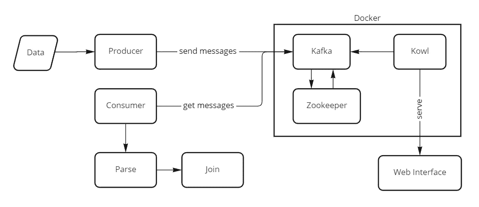
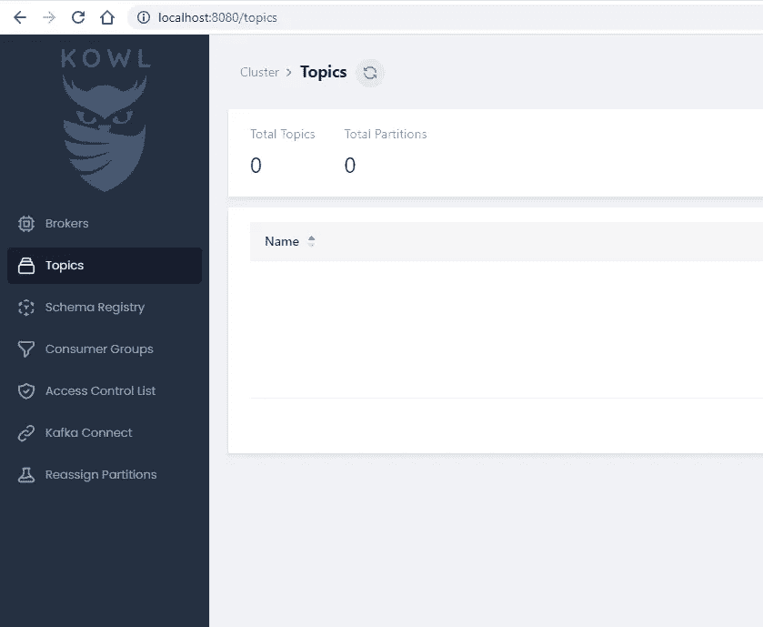
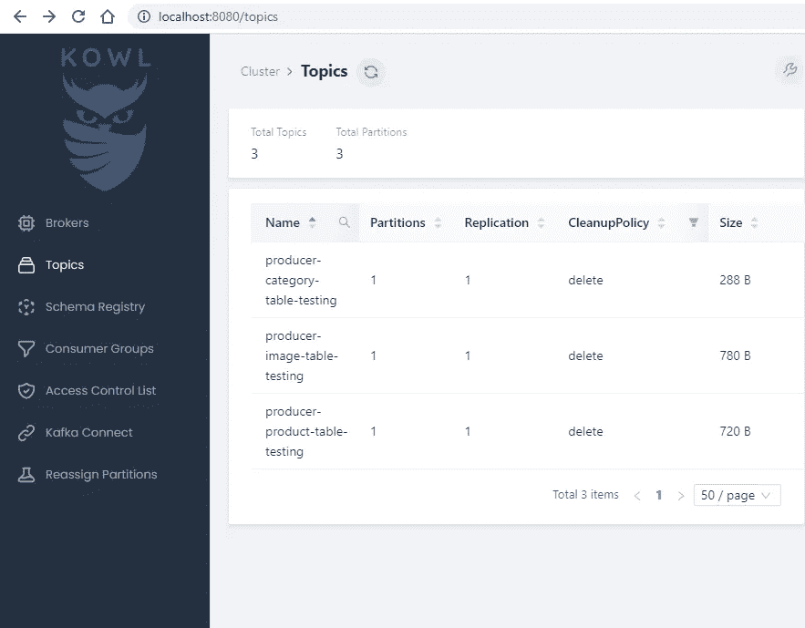
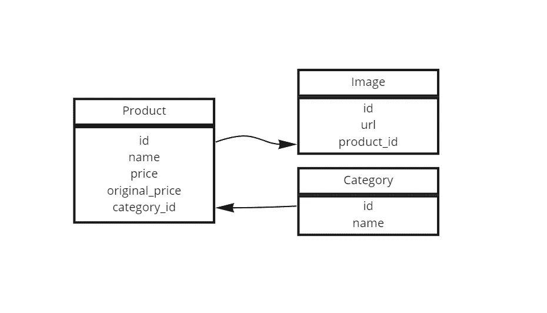

# 用 Golang 实现 Kafka 主题 Joiner🔥

> 原文：<https://medium.com/codex/implement-kafka-topics-joiner-with-golang-f8a9c046fcbe?source=collection_archive---------1----------------------->

你好。今天，我们将在 Go 中构建一个 Kafka 生产者和消费者。泛型，Golang 的一个新特性，将对我们有利。当在同一上下文中处理多种类型时，泛型非常有用。

# 工具

让我们评估一下我们的需求； ✨

*   *码头工人*
*   *Golang 1.18 或更新版本*

我们可以设置我们的文件夹层次结构，如下所示:

```
- producer
  - producer.go
  - main.go
  - types.go
- consumer
  - main.go
  - types.go
  - connection.go
main.go
.gitignore
config.yaml
docker-compose.yaml
```

我们将建立的系统如下:[🏋️](https://emojipedia.org/person-lifting-weights/)



golang-Kafka-生产者和消费者-加入-主题

# 归档

`docker-compose`文件应该是这样的。对于这个项目，我们将 Kowl、Zookeeper 和 Kafka 添加到`docker-compose`文件中。

我们现在需要用一些 Kowl 配置更新`config.yaml`文件；

用于 kowl 的配置文件

运行 Docker，在你喜欢的任何终端进入你的项目文件夹；

```
docker compose up -d
```

几次重启后，一旦卡夫卡准备好了，Kowl 就可以在`localhost:8080`访问仪表盘。



# 编码

好的。我们可以开始编码了。首先，有两个戈朗卡夫卡图书馆。`segmentio/kafka-go`和`confluent-kafka-go`

你必须安装 C 编译器，因为合流使用 CGO。SegmentIO 不使用 CGO；而是可以直接使用 Golang。在本文中，我将演示如何使用这两个库。

你可以在主分支中找到合流生产者，我在另一个分支中添加了 SegmentIO 生产者；

[](https://github.com/muhammedikinci/go-generics-with-kafka) [## GitHub-muhammedikinci/go-generics-with-Kafka

### 此时您不能执行该操作。您已使用另一个标签页或窗口登录。您已在另一个选项卡中注销，或者…

github.com](https://github.com/muhammedikinci/go-generics-with-kafka) [](https://github.com/muhammedikinci/go-generics-with-kafka/tree/segmentio-producer) [## GitHub-muhammedikinci/go-generics-with-Kafka at segment io-producer

### 此时您不能执行该操作。您已使用另一个标签页或窗口登录。您已在另一个选项卡中注销，或者…

github.com](https://github.com/muhammedikinci/go-generics-with-kafka/tree/segmentio-producer) 

## 生产者

导航到 producer 文件夹后，在终端中输入以下命令；

```
cd producer
go mod init producer
get get github.com/segmentio/kafka-go
```

我们将在产品、类别和形象之间建立联系。`types.go`文件如下所示:

让我们创建我们的主题和数据。我们在连接卡夫卡，创造我们需要的主题；

现在我们可以创建生产者对象并在`main.go`文件中使用它。生产者向我们的话题推送消息。

当我们运行生产者时；

```
go run .
```

卡夫卡中的结果一定是这样的:



我们将开始为消费者编码。我们将从我们创建的主题中接收消息，然后我们将尝试通过将它们与它们的键相关联来加入消息。我还想直观地展示我们正在做的事情。



go-Kafka-join-tutorial-example-d B- structure

我们有产品、图片和类别表。在我们的数据库结构中；一个产品可以有多张照片。但是，一个产品只能有一个类别。

## 消费者

让我们开始创造消费者吧！

```
cd consumer
go mod init consumer
get get github.com/segmentio/kafka-go
```

在消费者中，我们有相同的`types.go`文件。可以从制作方复制&粘贴过来。

我在`connection.go`文件中用如下的泛型创建了一个消费者结构

```
type Consumer[T comparable] struct {
  reader *kafka.Reader
  dialer *kafka.Dialer
  topic  string
}
```

我为消费者放置了名为 CreateConnection 的接收器函数。这个函数连接到 Kafka 并返回给我们 reader 对象。

```
func (c *Consumer[T]) CreateConnection() {
  c.reader = kafka.NewReader(kafka.ReaderConfig{
    Brokers:   []string{"localhost:9092"},
    Topic:     c.topic,
    Partition: 0,
    MinBytes:  10e3, // 10KB
    MaxBytes:  10e6, // 10MB
    MaxWait:   time.Millisecond * 10,
    Dialer:    c.dialer,
  })
  c.reader.SetOffset(0)
}
```

我创建了另一个名为 Read 的接收函数。这个函数有两个参数:

*   模型—我们的桌子
*   回调—我们将另一个表进程传递到这里，用于合并表

```
func (c *Consumer[T]) Read(model T, callback func(T, error)) {
  for {
    ctx, _ := context.WithTimeout(context.Background(), time.Millisecond*80)
    message, err := c.reader.ReadMessage(ctx) if err != nil {
      callback(model, err)
      return
    } err = json.Unmarshal(message.Value, &model)
    if err != nil {
      callback(model, err)
      continue
    }
    callback(model, nil)
  }
}
```

我们在寻找新的信息，直到卡夫卡的语境结束。当没有收到任何消息时，上下文将在 80 毫秒后被终止。

我们正在打开`main.go`文件，创造消费者连接。

```
dialer := &kafka.Dialer{
  Timeout:   10 * time.Second,
  DualStack: true,
}productConsumer := Consumer[Product]{
  dialer: dialer,
  topic:  "producer-product-table-testing",
}
productConsumer.CreateConnection()imageConsumer := Consumer[Image]{
  dialer: dialer,
  topic:  "producer-image-table-testing",
}
imageConsumer.CreateConnection()categoryConsumer := Consumer[Category]{
  dialer: dialer,
  topic:  "producer-category-table-testing",
}
categoryConsumer.CreateConnection()
```

现在我们开始在这里合并我们的表。我开始阅读卡夫卡的作品；

```
productConsumer.Read(Product{}, func(product Product, err error) {
  collectedProduct := CollectedProduct{
    ID:            product.ID,
    Name:          product.Name,
    Price:         product.Price,
    OriginalPrice: product.OriginalPrice,
    Images:        []string{},
  }
```

在第一个参数中，我说我想获得产品型号和回调参数，read 函数向我们发送产品数据和错误(如果是)

在回调函数中，这一次我开始读取图像，也开始加入。我们把来自卡夫卡的图像放入产品对象中

```
imageConsumer.Read(Image{}, func(image Image, err error) {
  if product.ID == image.ProductID {
    collectedProduct.Images = append(
      collectedProduct.Images, image.URL,
    )
  }
})
```

我们的主文件最后看起来如下

## 结果

如果我们运行消费者，结果将是这样的:

```
{0 product1 23 34  [[http://google.com/image1.jpg](http://google.com/image1.jpg) [http://google.com/image2.jpg](http://google.com/image2.jpg)]}
{2 product2 23 34 Category1 [[http://google.com/image4.jpg](http://google.com/image4.jpg)]}
{3 product3 23 34 Category3 [[http://google.com/image5.jpg](http://google.com/image5.jpg) [http://google.com/image6.jpg](http://google.com/image6.jpg) [http://google.com/image6.jpg](http://google.com/image6.jpg)]}
{4 product4 23 34 Category1 []}
{5 product5 23 34 Category2 []}
{5 product5 23 34 Category2 []}
```

正如你所看到的，我们在每个循环中将图片和分类主题的偏移量设置为 0。这意味着每个产品循环图像和类别主题都要从头开始。如果不希望这样，可以为旧的传递消息创建一个缓存机制。

```
imageConsumer.reader.SetOffset(0)
categoryConsumer.reader.SetOffset(0)
```

我不知道这种方式有多高效。在本文中，我只关注创建一个主题加入者系统。如果你想要更多的工具和效率，最好的选择是 Kafka 和 Java

感谢阅读！👋