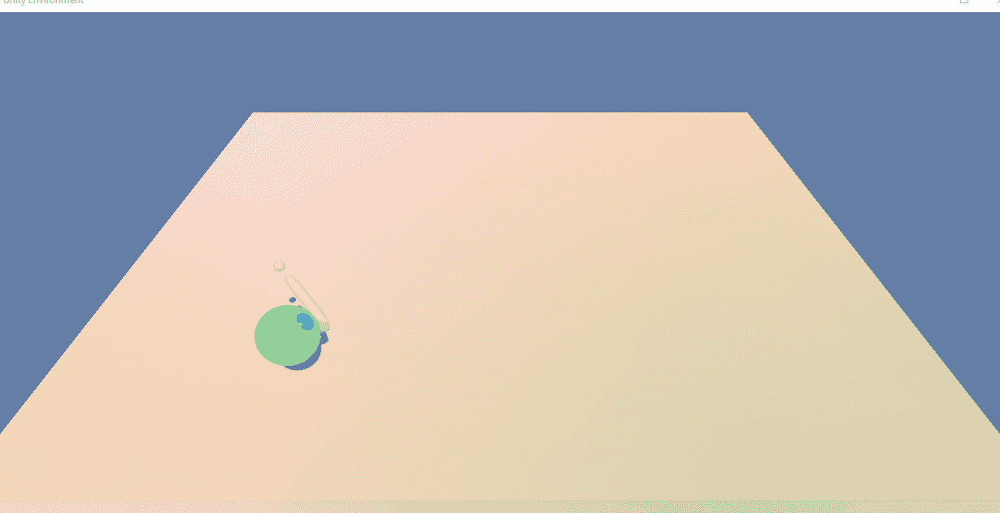
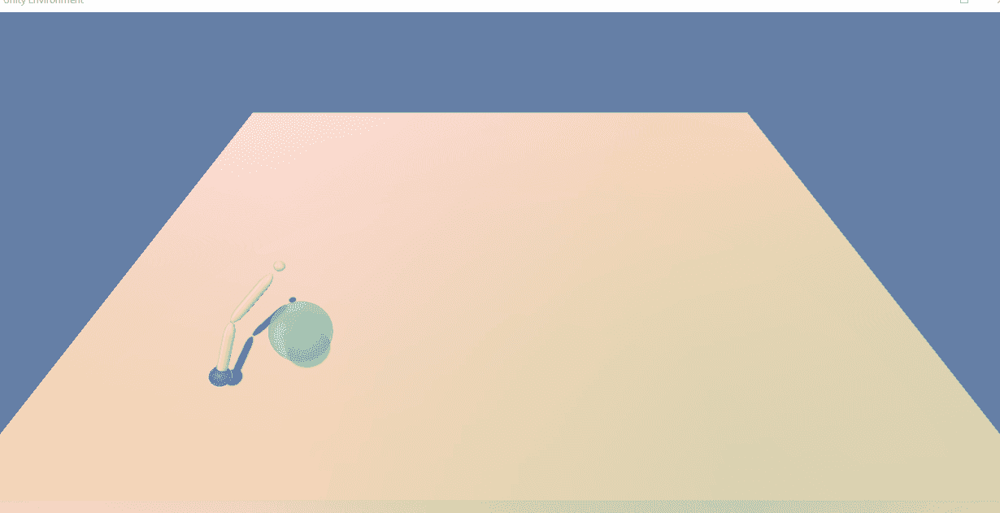
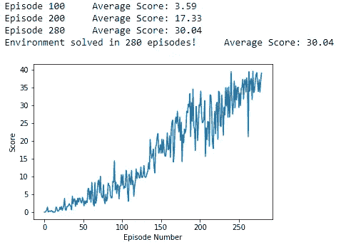

# 使用深度强化学习训练机械臂夹持物体

> 原文：<https://medium.com/codex/implementation-of-deep-deterministic-policy-gradient-ddpg-algorithm-to-train-a-robotic-arm-to-2763a9a31633?source=collection_archive---------15----------------------->


**经过训练的机械臂抓手使用深度强化学习握住物体(图片来源:**[**https://www.gettyimages.in/illustrations/automated**](https://www.gettyimages.in/illustrations/automated)**)**

# 在单智能体 Reacher Unity ML-Agent 环境中，实现深度确定性策略梯度(DDPG)算法来训练机械臂一致地到达动态移动的目标位置



# 问题陈述的简要介绍

使用多智能体 Reacher Unity ML-Agent 环境的单智能体版本，该项目的目标是训练一个双关节机械臂智能体，该智能体可以伸出到目标位置(围绕机械臂旋转的绿色球体),以尽可能多的时间步长保持其在目标位置的位置，即使目标实时动态改变其位置。对于机械臂代理处于目标位置的每个时间步长，提供+ 0.1 的奖励。智能体的观察空间由 33 个变量组成，分别对应于双关节机械臂的位置、旋转、速度和角速度。代理的动作空间是连续的。每个动作都是一个向量，有 4 个数字(大小:4)对应于适用于机械臂两个关节的扭矩。动作向量中的每个条目都应该在(-1，1)的范围内。任务是情节性的，为了解决环境，代理必须在连续 100 集内获得+30 的平均分。

# 结果展示:

# 一个未经训练的机械臂代理人采取随机行动，无法到达移动目标位置



# 一个训练有素的机器人手臂代理不断伸出到移动的目标位置


# 状态空间:

观察空间由 33 个变量组成，对应于双关节机械臂的位置、旋转、速度和角速度

# 行动空间:

动作空间是连续的。每个动作是一个向量，有 4 个数字(大小:4)对应于适用于机械臂两个关节的扭矩。动作向量中的每个条目都应该在(-1，1)的范围内

# 解决方案标准:

```
Only one robotic arm agent is present and the task is episodic.
The environment is considered as solved when the agent gets an average score of +30 over 100 consecutive episodes.
```

# 注意:

当前的实现只针对单代理 Reacher 环境。

# 相关概念

本节提供了一个理论背景，描述了当前在这一领域的工作，以及在这项工作中使用的概念和技术。

**a)强化学习:**随着 AlphaGo 等最近的突破和对雅达利 2600 游戏的掌握，强化学习变得非常流行。强化学习(RL)是一个学习策略的框架，该策略通过与环境的交互来最大化代理的长期回报。策略将情况(状态)映射到操作。在每次状态转换后，代理会收到一个即时的短期奖励。一个国家的长期回报是由一个价值函数决定的。状态的值大致对应于代理从该状态开始可以累积的总奖励。对应于在状态 s 中采取行动 a 之后的长期奖励的行动值函数通常被称为 Q 值，并且形成了被称为 Q 学习的最广泛使用的 RL 技术的基础

**b)时间差异学习:**时间差异学习是现代 RL 的中心思想，并且通过基于其他估计更新动作值函数的估计来工作。这确保代理不必等到完成一集后的实际累积奖励来更新其估计，而是能够从每个动作中学习。

**c)Q-学习:**Q-学习是一种非策略时间差分(TD)控制算法。非策略方法评估或改进不同于决策策略的策略。因此，这些决策可以由人类专家或随机策略做出，生成(状态、动作、奖励、新状态)条目以从中学习最优策略。

```
Q-learning learns a function Q that approximates the optimal action-value function. It does this by randomly initializing Q and then generating actions using a policy derived from Q, such as e-greedy. An e-greedy policy chooses the action with the highest Q value or a random action with a (low) probability of , promoting exploration 
as e (epsilon) increases. With this newly generated (state (St), action (At), reward (Rt+1), new state (St+1)) pair , Q is updated using rule 1.This update rule essentially states that the current estimate must be updated using the received immediate reward plus a discounted estimation of the maximum action-value for the new state. It is important to note here that the update is done immediately after performing the action using an estimate instead of waiting for the true cumulative reward, demonstrating TD in action. The learning rate α decides how much to alter the current estimate and the
discount rate γ decides how important future rewards (estimated action-value) are compared to the immediate reward.
```

**d)经验重放:**经验重放是一种在固定大小的缓冲区中存储以前的经验(St，At，Rt+1，St+1)的机制。然后，对小批次进行随机采样，添加到当前时间步长的经验中，并用于增量训练神经网络。这种方法可以对抗灾难性遗忘，通过多次训练来更有效地利用数据，并表现出更好的收敛行为

**e)固定 Q 目标:**在使用函数逼近器的 Q 学习算法中，TD 目标也依赖于正在学习/更新的网络参数 w，这可能导致不稳定性。为了解决这个问题，使用了具有相同架构但不同权重的独立网络。并且这个单独的目标网络的权重每隔几步更新一次，以等于持续更新的本地网络。

**f)深度 Q 学习算法:**在现代 Q 学习中，使用神经网络来估计函数 Q，该神经网络将状态作为输入，并输出每个可能动作的预测 Q 值。它通常用 Q(S，A，θ)表示，其中θ表示网络的权重。用于控制的实际策略可以随后通过估计给定当前状态的每个动作的 Q 值并应用ε-贪婪策略从 Q 中导出。深度 Q 学习简单地意味着使用多层前馈神经网络或者甚至卷积神经网络(CNN)来处理原始像素输入

**g)基于价值的方法:**诸如 Q 学习和深度 Q 学习之类的基于价值的方法旨在通过试图找到最优动作价值函数的估计，从与环境的交互中学习最优策略。而对于具有小状态空间的环境，通过以 Q 表的形式表示最优动作值函数来实现 Q 学习，其中每个状态一行，每个动作一列，通过从对应于每个状态的行中拉出具有最大值的动作，每次一个状态地构建最优策略；不可能为具有巨大状态空间的环境维护 Q 表，在这种情况下，最佳动作值函数使用非线性函数逼近器来表示，例如形成深度 Q 学习算法基础的神经网络模型。

**h)基于策略的方法(用于离散动作空间):**
与基于值的方法不同，最佳策略可以直接从与环境的交互中找到，而不需要首先通过使用基于策略的方法找到最佳动作值函数的估计。为此，构建一个神经网络来逼近最佳策略，该策略将状态空间中的所有状态作为输入(输入神经元的数量等于状态的数量)，并返回在动作空间中选择每个动作的概率(输出神经元的数量等于动作空间中的动作数量)。代理使用该策略，通过仅将最近的状态作为输入传递给神经网络模型，来与环境进行交互。然后，代理从动作概率中取样，输出一个动作作为响应。该算法需要优化网络权重，以便在训练过程中最有可能为每次迭代选择最佳行动，这种逻辑有助于代理实现其目标，即最大化预期回报。

```
**NOTE :** The above mentioned process explains the way to approximate a Stochastic Policy using Neural-Net by sampling of action
probabilities. Policy-Based Methods can be used to approximate a Deterministic Policy as well by selecting only the Greedy Action for the latest input state fed to the model during forward pass for each iteration during training
```

**i)基于策略的方法(对于连续动作空间):**基于策略的方法可以用于具有连续动作空间的环境，通过使用用于估计最优策略的神经网络，该神经网络具有输出层，该输出层通过输出正态分布的平均值和方差来参数化连续概率分布。然后，为了选择一个动作，代理只需要将最近的状态作为输入传递给网络，然后使用输出均值和方差从分布中进行采样。

```
Policy-Based Methods are better than the Value-Based Methods owing to the following factors:
a) Policy-Based Methods are simpler than Value-Based Methods because they do away with the intermediate step of estimating the optimal action-value function and directly estimate the optimal policy.
b) Policy-Based Methods tend to learn the true desired stochastic policy whereas Value-Based Methods tend to learn a deterministic or near-deterministic policy.
c) Policy-Based Methods are best suited for estimating optimal policy for environments with Continuous Action-Spaces as they
directly map a state to action unlike Value-Based Methods which need to first estimate the best action for each state which can be carried out provided that the action space is discrete with finite number of actions ; but in case of Continuous Action Space the Value-Based Methods need to find the global maximum of a non-trivial continuous action function which turns out to be an Optimization Problem in itself.
```

**j)政策梯度法:**政策梯度法是基于政策的方法的一个子类，其通过首先估计所有轨迹上的预期回报(累积回报)的梯度来估计最优政策的权重，该预期回报是神经网络模型的网络权重的函数，该神经网络模型表示要使用随机梯度上升来优化的政策 PI，该随机梯度上升通过分别查看轨迹中的每个状态-动作对并考虑累积回报的大小，即该轨迹的预期回报。或者更新网络权重以在接收到正奖励的情况下增加为特定状态选择动作的概率，或者更新网络权重以在接收到负奖励的情况下降低为特定状态选择动作的概率，这是通过计算梯度，即在给定状态下使用具有权重θ的策略 PI 选择动作的概率的对数的导数，并将其乘以在所有采样的一组轨迹上求和的轨迹中存在的所有状态-动作对上接收的奖励(预期回报)来实现的。策略的权重θ现在用经过几次迭代计算的梯度估计来更新，最终目标是收敛到最优策略的权重。

行动者-批评家方法:行动者-批评家方法是基于价值的方法(如 Deep-Q Network)和基于政策的方法(如 Reinforce)的交叉点。他们使用基于价值的方法来估计最优行动价值函数，然后将其作为基线来减少基于政策的方法的差异。演员-评论家代理比基于价值的代理更稳定，并且比基于政策的代理需要更少的样本/数据来学习。这里使用了两个神经网络，一个用于演员，一个用于评论家。批评神经网络接收状态，输出策略 PI 的状态值函数。行动者神经网络接受一个状态，并输出对于该状态最有可能采取的动作，然后通过使用当前状态和下一个状态的回报，使用该动作来计算当前状态的 TD 估计。Critic 神经网络使用该 TD 估计值进行训练。然后，评论家神经网络被用于计算优势函数(当前状态的奖励和下一状态的折扣 TD 估计与当前状态的 TD 估计的差的总和)，该优势函数然后被用作训练演员神经网络的基线。

# 所用学习算法的描述

**深度确定性策略梯度(DDPG)算法:** DDPG 算法最好被描述为用于连续动作空间的深度 Q 网络方法，而不是被称为实际的行动者-批评家方法。DDPG 算法中的 Critic 神经网络模型用于逼近下一状态的 Q 值的最大值，而不是作为学习基线来减少 Actor 神经网络模型的方差。深 Q-网络方法不能用于连续动作空间。在 DDPG 方法 2 中，神经网络用于演员和评论家，类似于基本的演员-评论家方法。行动者神经网络通过只输出给定状态的最佳动作而不是每个动作的概率分布来确定性地逼近最优策略。批评家神经网络使用行动者神经网络输出的最可信动作来估计给定状态的最佳动作值函数。因此，在这里，Actor 被用作近似最大化器来计算新的目标值，以训练批评家来估计该状态的行动值函数。DDPG 算法使用重放缓冲器来存储和获得经验元组的采样集，并使用软更新的概念来更新演员和评论家的目标网络，如下所述。

**演员和评论家网络权重的软更新:**在 DDPG 算法中，演员和评论家网络都有常规和目标网络权重。通过将小部分常规网络权重添加到当前目标网络权重，保持当前目标网络权重的大部分，在每个时间步长更新目标网络权重。使用这种软更新策略来更新目标网络权重对加速学习有很大帮助。

# 使用的神经网络架构:

# a)演员神经网络模型的架构:

```
A multilayer feed-forward Neural Net Architecture was used with 2 Hidden layers each having 128 hidden neurons. The input layer
has number of input neurons equal to the state size and the the output layer has number of output neurons equal to action size. A
ReLU (Rectified Linear Unit) Activation Function was used over the inputs of the 2 hidden layers while a tanh activation function
was used over the input of the output layer. Weight initialization was done for the first 2  layers  from uniform distribution
in the negative to positive range of reciprocal of the square root of number of weights for each layer. Weight initialization
for the final layer was done from uniform distribution in the range of (-3e-3, 3e-3).
```

# Critic 神经网络模型的体系结构:

```
A multilayer feed-forward Neural Net Architecture was used with 2 Hidden layers. The input layer has number of input neurons equal
to the state size and the the output layer has number of output neurons equal to 1.The first hidden layer has hidden neurons equal
to sum of 128 and action size while the second hidden layer has 128 hidden neurons. A Leaky ReLU (Rectified Linear Unit) Activation
Function was used over the inputs of the 2 hidden layers. Weight initialization was done for the first 2 layers from uniform       
distribution in the negative to positive range of reciprocal of the square root of number of weights for each layer. Weight 
initialization for the final layer was done from uniform distribution in the range of (-3e-3, 3e-3).
```

# c)其他实施细节:

```
1) **Adam Optimizer** was used for learning the neural network parameters with a learning rate of 1e-4 for Actor Neural-Net Model and a learning rate of 3e-4 and L2 weight decay of 0.0001 for Critic Neural-Net Model.

2) For the **exploration noise process** an **Ornstein-Ulhenbeck Process** was used with mu=0.(mean), theta=0.15 and sigma=0.1(variance)
to enable exploration of the physical environment in the simulation by the Robotic Arm Agent. But before adding noise to the action returned for the current state using the current policy the noise quantity was multiplied by a value equivalent to the reciprocal of square root of total number of current episodes to prefer exploration over exploitation only during the initial stages of training and gradually prefer exploitation over exploration during later stages of training as the value of the reciprocal of square root of total number of current episodes gradually decreases as training proceeds.
```

# 使用的超参数:

1.  **集数:** 5000
2.  **最大时间步长:** 1000
3.  **LR _ ACTOR:**1e-4(ACTOR 神经网络模型的学习率)
4.  **LR _ CRITIC:**3e-4(CRITIC 神经网络模型的学习率)
5.  **权重衰减:**0.0001(Critic 神经网络模型使用的 L2 权重衰减)
6.  **BUFFER_SIZE :** int(1e6)(重放缓冲区大小)
7.  **批量大小:** 64(小批量)
8.  **伽玛:** 0.99(贴现因子)
9.  **TAU :** 1e-3(用于目标参数的软更新)
10.  **目标得分:**大于等于 30

```
**NOTE (Extra Hyperparameter) :**
**EXPLORATION_NOISE_DECAY :** 1/SQUARE-ROOT(Current Episode) (Not declared as a variable but value used during training)
```

# 每集奖励图

**深度确定性策略梯度(DDPG)算法结果:**



在 280 集里获得了+30 的分数

# 结论

在训练过程中获得的上述结果是在多次不成功的开始后获得的，使用了一组不同于最终使用的超参数和神经网络架构。根据经验总结，一个简单的神经网络结构(演员和评论家最多有 2-3 个隐藏层)最适合于这种实现，关键的游戏规则改变者是在训练期间引入噪声衰减参数，以便在训练的初始阶段更喜欢探索而不是开发，然后在后期阶段更喜欢开发而不是探索，因为到那时代理已经学习和训练了足够多，然后应该给它一个机会来实现它的学习 除了探索环境之外，选择行动以实现预期目标，但与训练的初始阶段相比，其比例相对较小。 这种方法有助于加速多方面的训练过程，并更快地收敛到最优策略的网络权重估计，因为代理因此仅在 300 集内就实现了目标分数，而之前的尝试超过了 2000 集。此外，我在训练 critic 网络时使用了梯度剪辑来稳定代理的训练过程，这似乎有助于实现预期的结果。

# 设置项目的安装说明:

# 1)设置 Python 环境:

```
a) Download and install Anaconda 3 (latest version 5.3) from this link (https://www.anaconda.com/download/)for the specific Operating System and Architecture (64-bit or 32-bit) being used for Python 3.6 + version onwards

b) Create (and activate) a new environment with Python 3.6.:
   Open Anaconda prompt and then execute the below given commands

   Linux or Mac:
   conda create --name drlnd python=3.6
   source activate drlnd

   Windows:
   conda create --name drlnd python=3.6 
   activate drlnd

 c) Minimal Installation of OpenAi Gym Environment
    Below are the instructions to do minimal install of gym :

    git clone https://github.com/openai/gym.git
    cd gym
    pip install -e .

    A minimal install of the packaged version can be done directly from PyPI: pip install gym

 d) Clone the repository (https://github.com/udacity/deep-reinforcement-learning.git) and navigate to the python/ folder.
Then, install several dependencies by executing the below commands in Anaconda Prompt Shell :
git clone https://github.com/udacity/deep-reinforcement-learning.git
cd deep-reinforcement-learning/python
pip install . (or pip install [all] )

 e) Create an Ipython Kernel for the drlnd environment :
python -m ipykernel install --user --name drlnd --display-name "drlnd"

 f) Before running code in a notebook, change the kernel to match the drlnd environment by using the drop-down Kernel menu.
```

# 2)安装 Unity ML-代理相关的库/模块:

```
Clone the GitHub Repository (https://github.com/Unity-Technologies/ml-agents.git)
and install the required libraries by running the below mentioned commands in the Anaconda Prompt

git clone https://github.com/Unity-Technologies/ml-agents.git
cd ml-agents/ml-agents (navigate inside ml-agents subfolder)
pip install . or (pip install [all]) (install the modules required)
```

# 3)下载 Unity 环境:

```
a) For this project, Unity is not necessary to be installed because readymade built environment has already been provided, and can be downloaded from one of the links below as per the operating system being used:

**Single-Agent Reacher Environment :**
   Linux: https://s3-us-west-1.amazonaws.com/udacity-drlnd/P2/Reacher/one_agent/Reacher_Linux.zip
   Mac OSX: https://s3-us-west-1.amazonaws.com/udacity-drlnd/P2/Reacher/one_agent/Reacher.app.zip
   Windows (32-bit): https://s3-us-west-1.amazonaws.com/udacity-drlnd/P2/Reacher/one_agent/Reacher_Windows_x86.zip
   Windows (64-bit): https://s3-us-west-1.amazonaws.com/udacity-drlnd/P2/Reacher/one_agent/Reacher_Windows_x86_64.zipPlace the downloaded file in the p2_continuous-control/ as well as python/ folder in the DRLND GitHub repository, and unzip (or decompress) the file.

c) (For AWS) If the agent is to be trained on AWS (and a virtual screen is not enabled), then please use this link 
**(https://s3-us-west-1.amazonaws.com/udacity-drlnd/P2/Reacher/one_agent/Reacher_Linux_NoVis.zip)** for Single-Agent 
Reacher Environment to obtain the "headless" version of the environment. Watching the agent during training is not possible without enabling a virtual screen.(To watch the agent , follow the instructions to enable a virtual screen (https://github.com/Unity-Technologies/ml-agents/blob/master/docs/Training-on-Amazon-Web-Service.md)and then download the environment for the Linux operating  system above.)
```

# 运行代码以训练代理/测试已训练代理的详细信息:

1.  首先在本地系统上克隆这个存储库([https://github . com/PranayKr/Deep _ Reinforcement _ Learning _ projects . git](https://github.com/PranayKr/Deep_Reinforcement_Learning_Projects.git))。
2.  还要在本地系统上克隆前面提到的存储库([https://github.com/udacity/deep-reinforcement-learning.git](https://github.com/udacity/deep-reinforcement-learning.git))。
3.  现在，将这个克隆的 GitHub Repo 中存在的所有源代码文件和预训练模型权重放入 Deep-RL 克隆存储库文件夹的 python/文件夹中。
4.  接下来，将包含已下载的用于 Windows (64 位)操作系统的 unity 环境文件的文件夹放入 Deep-RL 克隆存储库文件夹的 python/文件夹中。
5.  打开 Anaconda 提示符 shell 窗口，并在 Deep-RL 克隆存储库文件夹中的 python/文件夹内导航。
6.  在 Anaconda 提示符 shell 窗口中运行命令“jupyter notebook ”,在浏览器中打开 jupyter notebook web-app 工具，从该工具中可以找到笔记本中提供的任何培训和测试源代码。ipynb 文件)可以打开。
7.  在笔记本中运行/执行代码之前，使用下拉内核菜单更改内核(为 drlnd 环境创建的 IPython 内核)以匹配 drlnd 环境。
8.  提供的培训和测试笔记本中的源代码(。ipynb 文件)也可以在各自的新 python 文件(.py 文件)，然后使用命令“python <filename.py>”从 Anaconda 提示符 shell 窗口直接执行。</filename.py>

**注:**

1.  通过选择内核选项卡中的选项(重新启动并全部运行),可以同时执行所有单元。
2.  请更改(*的名称。pth)文件，模型权重在训练期间保存在该文件中，以避免用相同的文件名覆盖现有的预训练模型权重。

**深度确定性策略梯度(DDPG)算法训练/测试细节(使用的文件):**

```
**For Training :** Open the below mentioned Jupyter Notebook and execute all the cells
**Continuous_Control-Reacher_SingleAgent_DDPG_WorkingSoln.ipynb** 

**Neural Net Model Architecture file Used : ModelTest.py**
**The Unity Agent file used : Test2_Agent.py**

**For Testing :** open the Jupyter Notebook file **"DDPGAgent_Test.ipynb"** and run the code to test the results obtained using Pre-trained model weights for Actor Neural-Net Model and Critic Neural-Net Model

**Pretrained Model Weights provided : 1) checkpoint_actor.pth  
                                    2) checkpoint_critic.pth**
```

# 参考资料:

1.  深度强化学习的连续控制([https://arxiv.org/pdf/1509.02971.pdf](https://arxiv.org/pdf/1509.02971.pdf))
2.  持续控制的基准深度强化学习([https://arxiv.org/pdf/1604.06778.pdf](https://arxiv.org/pdf/1604.06778.pdf))
3.  用 OpenAI Gym 的 Pendulum 环境实现 DDPG([https://github . com/uda city/deep-reinforcement-learning/tree/master/ddpg-Pendulum](https://github.com/udacity/deep-reinforcement-learning/tree/master/ddpg-pendulum))
4.  用 OpenAI Gym 的 BipedalWalker 环境([https://github . com/uda city/deep-reinforcement-learning/tree/master/ddpg-bipedal](https://github.com/udacity/deep-reinforcement-learning/tree/master/ddpg-bipedal))实现 DDPG

## 注意:

1.  这篇文章也发表在 LinkedIn([https://www . LinkedIn . com/pulse/robotic-arm-gripper-trained-hold-object-using-deep-learning-Kumar](https://www.linkedin.com/pulse/robotic-arm-gripper-trained-hold-object-using-deep-learning-kumar))
2.  如果你想联系我，请通过 LinkedIn**(【https://www.linkedin.com/in/pranay-kumar-02b35524/】)**给我留言，或者发邮件到 pranay.scorpio9@gmail.com****