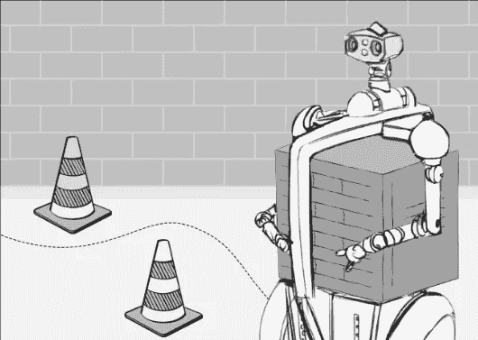
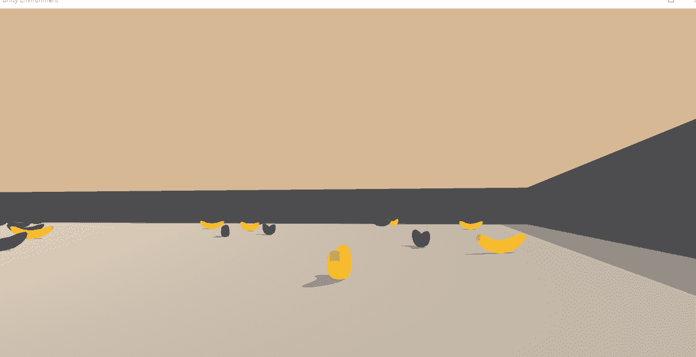
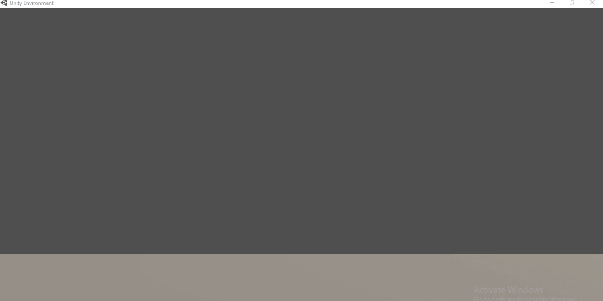
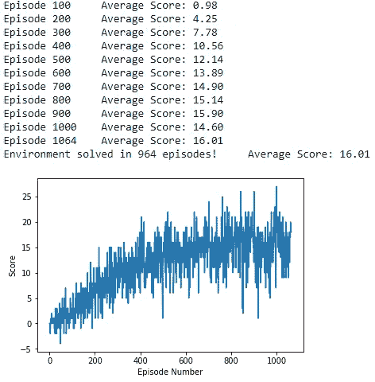
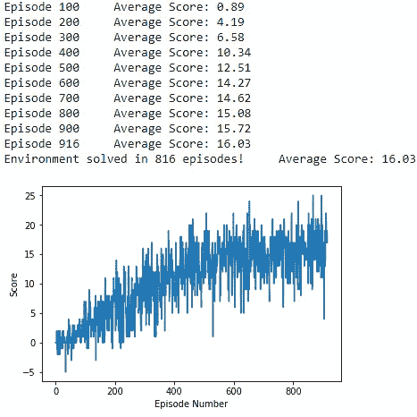
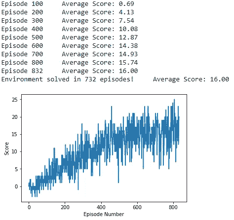

# 使用深度强化学习的自主导航

> 原文：<https://medium.com/codex/implementation-of-deep-reinforcement-learning-algorithms-to-solve-banana-collector-unity-ml-agent-55a7c7d92f3e?source=collection_archive---------16----------------------->



**自主导航采用深度强化学习(图片来源:**[**【https://waypointrobotics.com/blog/what-autonomous-robots/】**](https://waypointrobotics.com/blog/what-autonomous-robots/)**)**

# 实现深度 Q 学习算法来解决香蕉收集器 Unity ML-Agent 导航问题语句



# 问题陈述的简要介绍

使用香蕉收集器 Unity ML-Agent 环境的简化版本，该项目的目标是训练一个 Agent 在一个大的正方形世界中导航并只收集黄色香蕉。收集一个黄色香蕉提供+1 的奖励，收集一个蓝色香蕉提供-1 的奖励(即惩罚)。因此，代理的目标是收集尽可能多的黄色香蕉，同时避免蓝色香蕉。代理的观察空间是 37 维的，代理的动作空间是 4 维的(向前、向后、向左转和向右转)。任务是插曲式的，为了解决环境，代理人必须在连续 100 集内获得+13 的平均分。

# 实施的强化算法:

## a)香草深度 Q-学习

## b)双重深度 Q 学习

## c)双重深度 Q 学习，优先体验重放

# 结果展示:

## **未经训练的代理在环境中随机导航**



## 一个训练有素的代理导航的目标是收集黄色香蕉和避免蓝色香蕉


# 状态空间:

观察是在 37 维连续空间中进行的，对应于代理前进方向周围物体的 35 维基于射线的感知和 2 维速度。光线感知的 35 个维度分解为:7 条光线从代理人以下列角度投射(并以同样的顺序返回):【20，90，160，45，135，70，110】其中 90°在代理人正前方。每条光线都是 5 维的，它被投射到场景上。如果它遇到四个可检测对象之一(即黄香蕉、墙、蓝香蕉、试剂)，则数组中该位置的值被设置为 1。最后有一个距离度量，它是射线长度的一部分。每条光线都是[黄香蕉，墙，蓝香蕉，代理，距离]。代理的速度是二维的:左/右速度和前/后速度。观察空间是完全可观察的，因为它包括了关于障碍物类型、到障碍物的距离和智能体速度的所有必要信息。因此，不需要增加观测值就可以完全观测到。因此，输入的观测值可以直接用作状态表示。

# 行动空间:

动作空间是四维的。四个离散动作对应于:

a) 0:向前移动

b) 1:向后移动

c) 2:向左移动

d) 3:向右移动

# 解决方案标准:

当代理在连续 100 集内平均得分为+13 时，环境被视为已解决。

# 相关概念

本节提供了一个理论背景，描述了当前在这一领域的工作，以及在这项工作中使用的概念和技术。

**a)** **强化学习:**随着 AlphaGo 等最近的突破和对雅达利 2600 游戏的掌握，强化学习变得非常流行。强化学习(RL)是一个学习策略的框架，该策略通过与环境的交互来最大化代理的长期回报。策略将情况(状态)映射到操作。在每次状态转换后，代理会收到一个即时的短期奖励。一个国家的长期回报是由一个价值函数决定的。状态的值大致对应于代理从该状态开始可以累积的总奖励。对应于在状态 s 中采取行动 a 之后的长期奖励的行动值函数通常被称为 Q 值，并且形成了被称为 Q 学习的最广泛使用的 RL 技术的基础

**b)时间差异学习:**时间差异学习是现代 RL 的中心思想，并且通过基于其他估计更新动作值函数的估计来工作。这确保代理不必等到完成一集后的实际累积奖励来更新其估计，而是能够从每个动作中学习。

**c)Q-学习:**Q-学习是一种偏离策略的时间差分(TD)控制算法。非策略方法评估或改进不同于决策策略的策略。因此，这些决策可以由人类专家或随机策略做出，生成(状态、动作、奖励、新状态)条目以从中学习最优策略。

```
Q-learning learns a function Q that approximates the optimal action-value function. It does this by randomly initializing Q and then generating actions using a policy derived from Q, such as e-greedy. An e-greedy policy chooses the action with the highest Q value or a random action with a (low) probability of , promoting exploration 
as e (epsilon) increases. With this newly generated (state (St), action (At), reward (Rt+1), new state (St+1)) pair,
Q is updated using rule 1.

This update rule essentially states that the current estimate must be updated using the received immediate reward plus a discounted estimation of the maximum action-value for the new state. It is important to note here that the update is done immediately after performing the action using an estimate instead of waiting for the true cumulative reward, demonstrating TD in action. The learning rate α decides how much to alter the current estimate and the
discount rate γ decides how important future rewards (estimated action-value) are compared to the immediate reward.
```

**d)经验重放:**经验重放是在固定大小的缓冲区中存储以前的经验(St，At，Rt+1，St+1)的机制。然后，对小批次进行随机采样，添加到当前时间步长的经验中，并用于增量训练神经网络。这种方法可以对抗灾难性遗忘，通过多次训练来更有效地利用数据，并表现出更好的收敛行为

**e)固定的 Q 目标:**在使用函数逼近器的 Q 学习算法中，TD 目标还取决于正在学习/更新的网络参数 w，这可能导致不稳定性。为了解决这个问题，使用了具有相同架构但不同权重的独立网络。并且这个单独的目标网络的权重每隔几步更新一次，以等于持续更新的本地网络。

# 所用学习算法的描述

1.  **深度 Q 学习算法:**在现代 Q 学习中，使用神经网络来估计函数 Q，该神经网络将状态作为输入，并输出每个可能动作的预测 Q 值。它通常用 Q(S，A，θ)表示，其中θ表示网络的权重。用于控制的实际策略可以随后通过估计给定当前状态的每个动作的 Q 值并应用ε-贪婪策略从 Q 中导出。深度 Q 学习简单地意味着使用多层前馈神经网络或者甚至卷积神经网络(CNN)来处理原始像素输入
2.  **双深度 Q 学习算法:**深度 Q 学习是基于 Q 学习算法，以深度神经网络作为函数逼近器。然而，Q-learning 遇到的一个问题是在其更新方程中过高估计了 TD 目标。期望值总是大于或等于期望值的贪婪动作。因此，Q-learning 最终会高估 Q 值，从而降低学习效率。为了解决这个问题，我们使用双 Q 学习算法，其中有两个独立的 Q 表。在每个时间步，我们随机决定使用哪个 q 表，并使用一个 q 表中的贪婪动作来评估另一个 q 表的 q 值
3.  **使用双深度 Q 学习算法的优先化体验重放:**对于记忆重放，代理收集元组(状态、奖励、下一状态、动作、完成)并重用它们用于将来的学习。在优先重放的情况下，代理必须根据每个元组对学习的贡献来分配优先级。之后，这些元组基于它们的优先级被重用，从而导致更高效的学习。

为此实现引入了两个新参数:

**a) ALPHA :** 优先级指数，可以调整该指数，以确定可以重新引入多少因子随机采样，从而避免仅通过使用优先级经验样本而过度拟合。ALPHA 的值 1 对应于仅使用优先级经验样本。ALPHA 的值 0 对应于仅随机使用经验样本

**b)β:**重要性采样权重指数，用于确定在训练时 Q-net 模型的权重被修改了多少因子，β参数的值可以在训练期间逐渐增加，以在模型最终收敛到预期结果时，在训练的后期阶段给予更新的权重更多的重要性

# 使用的神经网络架构:

使用具有 2 个隐藏层的多层前馈神经网络体系结构，每个隐藏层具有 64 个隐藏神经元。在 2 个隐藏层的输入上使用 ReLU(校正线性单元)激活函数。在一个实现中，我也尝试初始化权重，以查看模型的学习是否增加，但是在没有神经网络层的权重初始化的情况下，在所获得的结果中没有发现太大差异。在修改的实现中，我也尝试降低学习速率，以获得更快的结果，而在模型的训练中没有任何显著的改进

此外，在双重深度 Q-Net 实现中，在训练期间实现的奖励被剪切到-1 到 1 的范围内，以去除训练期间的异常值

# 使用的超参数:

1.  **集数:** 5000
2.  **最大时间步长:** 1000
3.  **Eps _ start:**1(e-greedy 策略中使用的起始ε值)
4.  **Eps _ End:**0.01(e-greedy 策略中使用的ε值下限)
5.  **Eps _ Decay:**0.995(ε值减少的系数)
6.  **BUFFER_SIZE :** int(1e5)
7.  **批量大小:** 64
8.  **伽玛:** 0.99(贴现率)
9.  **TAU :** 1e-3(用于目标参数的软更新)
10.  **目标得分:**大于等于 16

# 优先体验重放实施的额外参数:

1.  **ALPHA :** 0.6(优先级指数)
2.  **INIT_BETA :** 0.4(重要性采样指数)

# 每集奖励图

1.  **深度 Q 学习算法结果(使用学习率 1e-4 获得的最佳结果):**



使用学习率 1e-4，在 964 集中获得+16 分

**2。双重深度 Q 学习算法结果(通过在-1 到 1 的范围内剪裁奖励获得的最佳结果):**



816 集的+16 分

**3。具有双重深度 Q 学习算法结果的优先体验重放:**



在 732 集里获得了+16 的分数

# 结论

从上面通过实施 3 种不同算法实现的结果可以明显看出，具有双重深度 Q-net 算法的优先体验重放在仅仅 732 集内执行了与目标分数的最佳转换，而双重深度 Q-net 算法在 816 集内收敛到目标分数，并且简单深度 Q-net 算法实施花费最大集数，即 964 集来达到+16 的目标分数

在所有 3 个实现中，学习率为 1e-4 时获得了最佳结果，并且在双重深度 Q-Net 实现的情况下，在训练期间获得的奖励被剪切到-1 到 1 的范围内，以去除训练期间的异常值

# 设置项目的安装说明:

# 1)设置 Python 环境:

```
a) Download and install Anaconda 3 (latest version 5.3) from this link (https://www.anaconda.com/download/)for the specific Operating System and Architecture (64-bit or 32-bit) being used for Python 3.6 + version onwards

 b) Create (and activate) a new environment with Python 3.6.:
    Open Anaconda prompt and then execute the below given commands

    Linux or Mac:
    conda create --name drlnd python=3.6
    source activate drlnd

    Windows:
    conda create --name drlnd python=3.6 
    activate drlnd

 c) Minimal Installation of OpenAi Gym Environment
    Below are the instructions to do minimal install of gym : git clone https://github.com/openai/gym.git
    cd gym
    pip install -e .

A minimal install of the packaged version can be done directly from PyPI: pip install gym

 d) Clone the repository (https://github.com/udacity/deep-reinforcement-learning.git) and navigate to the python/ folder.
Then, install several dependencies by executing the below commands in Anaconda Prompt Shell :

git clone https://github.com/udacity/deep-reinforcement-learning.git
cd deep-reinforcement-learning/python
pip install . (or pip install [all] )

 e) Create an Ipython Kernel for the drlnd environment :
python -m ipykernel install --user --name drlnd --display-name "drlnd"

 f) Before running code in a notebook, change the kernel to match the drlnd environment by using the drop-down Kernel menu.
```

# 2)安装 Unity ML-代理相关的库/模块:

```
Clone the GitHub Repository (https://github.com/Unity-Technologies/ml-agents.git)and install the required libraries by running the below mentioned commands in the Anaconda Prompt :git clone https://github.com/Unity-Technologies/ml-agents.git
cd ml-agents/ml-agents (navigate inside ml-agents subfolder)
pip install . or (pip install [all]) (install the modules required)
```

# 3)下载 Unity 环境:

```
a)For this project, Unity is not necessary to be installed because readymade built environment has already been provided, and can be downloaded from one of the links below as per the operating system being used:Linux: https://s3-us-west-1.amazonaws.com/udacity-drlnd/P1/Banana/Banana_Linux.zip
Mac OSX: https://s3-us-west-1.amazonaws.com/udacity-drlnd/P1/Banana/Banana.app.zip
Windows (32-bit): https://s3-us-west-1.amazonaws.com/udacity-drlnd/P1/Banana/Banana_Windows_x86.zip
Windows (64-bit): https://s3-us-west-1.amazonaws.com/udacity-drlnd/P1/Banana/Banana_Windows_x86_64.zip

Place the downloaded file in the p1_navigation/ as well as python/ folder in the DRLND GitHub repository, and unzip (or decompress) the file.b)(For AWS) If the agent is to be trained on AWS (and a virtual screen is not enabled), then please use this link (https://s3-us-west-1.amazonaws.com/udacity-drlnd/P1/Banana/Banana_Linux_NoVis.zip) to obtain the "headless" version of the environment. Watching the agent during training is not possible without enabling a virtual screen.(To watch the agent, follow the instructions to enable a virtual screen (https://github.com/Unity-Technologies/ml-agents/blob/master/docs/Training-on-Amazon-Web-Service.md)
and then download the environment for the Linux operating  system above.)
```

# 运行代码以训练代理/测试已训练代理的详细信息:

1.  首先在本地系统上克隆这个存储库([https://github . com/PranayKr/Deep _ Reinforcement _ Learning _ projects . git](https://github.com/PranayKr/Deep_Reinforcement_Learning_Projects.git))。
2.  还要在本地系统上克隆前面提到的存储库(【https://github.com/udacity/deep-reinforcement-learning.git】T2)。
3.  现在，将这个克隆的 GitHub Repo 中存在的所有源代码文件和预训练模型权重放入 Deep-RL 克隆存储库文件夹的 python/文件夹中。
4.  接下来，将包含已下载的用于 Windows (64 位)操作系统的 unity 环境文件的文件夹放入 Deep-RL 克隆存储库文件夹的 python/文件夹中。
5.  打开 Anaconda 提示符 shell 窗口，并在 Deep-RL 克隆存储库文件夹中的 python/文件夹内导航。
6.  在 Anaconda 提示符 shell 窗口中运行命令“jupyter notebook ”,在浏览器中打开 jupyter notebook web-app 工具，从该工具中可以找到笔记本中提供的任何培训和测试源代码。ipynb 文件)可以打开。
7.  在笔记本中运行/执行代码之前，使用下拉内核菜单更改内核(为 drlnd 环境创建的 IPython 内核)以匹配 drlnd 环境。
8.  提供的培训和测试笔记本中的源代码(。ipynb 文件)也可以在各自的新 python 文件(.py 文件)，然后使用命令“python <filename.py>”从 Anaconda 提示符 shell 窗口直接执行。</filename.py>

**注:**

1.  通过选择内核选项卡中的选项(重新启动并全部运行),可以同时执行所有单元
2.  请更改(*的名称。pth)文件，模型权重在训练期间保存在该文件中，以避免用相同的文件名覆盖现有的预训练模型权重

**a)普通深度 Q-net 算法训练/测试细节(使用的文件):**

```
**For Training :** Open either of the below mentioned Jupyter Notebook and execute all the cells

    1) **DeepQ-Net_Navigation_Solution-LR_(1e-4).ipynb** (using Learning Rate Hyperparameter val : 1e-4)
    2) **DeepQ-Net_Navigation_Solution-LR_(5e-4).ipynb** (using Learning Rate Hyperparameter val : 5e-4)
    3) **DeepQ-Net_Navigation_Solution-LR_(5e-5).ipynb** (using Learning Rate Hyperparameter val : 5e-5)

    **Neural Net Model Architecture file Used :** **NN_Model.py**
    **The Unity Agent file used :** **DeepQN_Agent.py**

    **For Testing :** open the Jupyter Notebook file **"DeepQNet_Test.ipynb"** and run the code to test the results obtained using Pre-trained model weights

    **Pretrained Model Weights provided :** 1)**DQN_Checkpoint.pth**
                                        2)**DQN_Checkpoint_2.pth**
                                        3)**DQN_Checkpoint_3.pth**
```

**b)双深度 Q-net 算法训练/测试细节(使用的文件):**

```
**For Training :** Open either of the below mentioned Jupyter Notebook and execute all the cells

    1) **DoubleDeepQ-Net_Navigation_Solution.ipynb** 
    2) **DoubleDeepQ-Net_Navigation_Solution2.ipynb** 
    3) **DoubleDeepQ-Net_Navigation_Solution-RewardsClipped.ipynb**
    4) **DoubleDeepQ-Net_Navigation_Solution-RewardsClipped-LRDecay.ipynb**

    **Neural Net Model Architecture file Used :** **DDQN_NN_Model.py**
    **The Unity Agent file used :** 
    1) **DoubleDeepQN_Agent.py**
    2) **DoubleDeepQN_Agent_WeightsInitialized.py**

    **For Testing :** open the Jupyter Notebook file 
**"DoubleDeepQ-Net_Test.ipynb"** and run the code to test the results obtained using Pre-trained model weights

    **Pretrained Model Weights provided :** 
    1)**DoubleDQN_Checkpoint_1.pth**
    2)**DoubleDQN_Checkpoint_1_RewardsClipped.pth**
    3)**DoubleDQN_Checkpoint_2.pth**
```

**c)具有优先经验的双深度 Q-net 重放算法训练/测试细节(使用的文件):**

```
**For Training :** Open the below mentioned Jupyter Notebook and execute all the cells
**PrioritizedExpReplaay_DoubleDeepQ-Net_Navigation_Solution.ipynb** 

**Neural Net Model Architecture file Used** : **DDQN_NN_Model.py**
**The Unity Agent file used** : **PriorityExpReplay_DoubleDeepQN_Agent.py**

**For Testing :** open the Jupyter Notebook file **"PriorityExp_DoubleDeepQ-Net_Test.ipynb"** and run the code to test the results obtained using Pre-trained model weights.

**Pretrained Model Weights provided** : **PriorityExpDoubleDQN_Checkpoint_1.pth**
```

## **注:**

1.  这篇文章也发表在 LinkedIn([https://www . LinkedIn . com/pulse/implementation-deep-reinforcement-learning-algorithms-pranay-Kumar](https://www.linkedin.com/pulse/implementation-deep-reinforcement-learning-algorithms-pranay-kumar))
2.  如果你想联系我，请通过 LinkedIn**(【https://www.linkedin.com/in/pranay-kumar-02b35524/】)**给我留言，或者发邮件到 pranay.scorpio9@gmail.com****