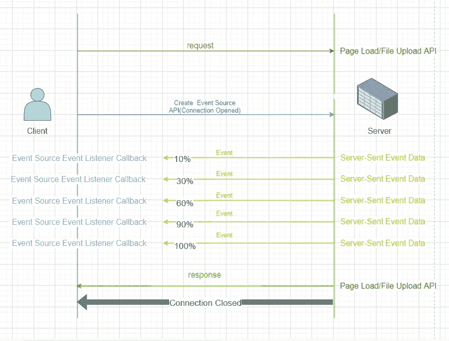
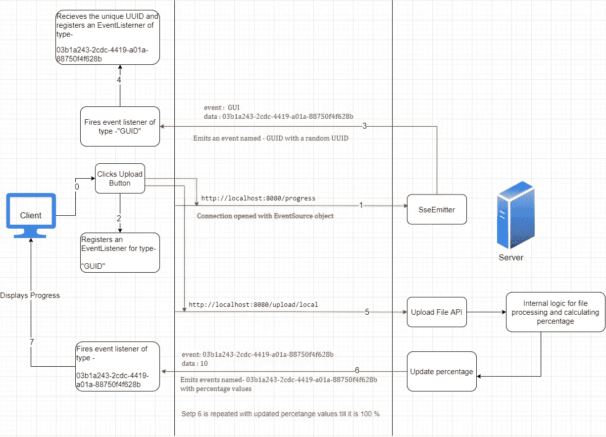
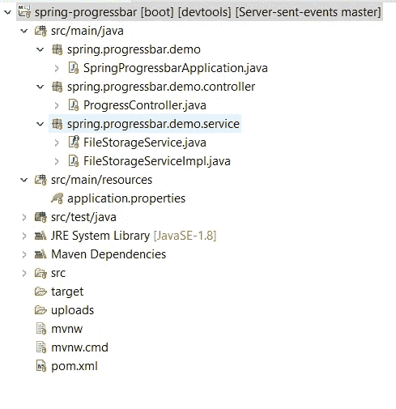
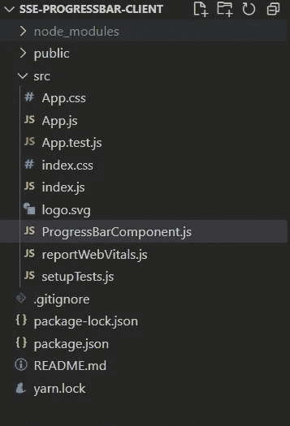
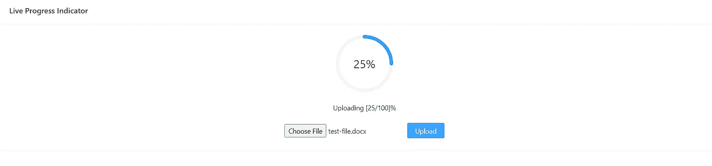
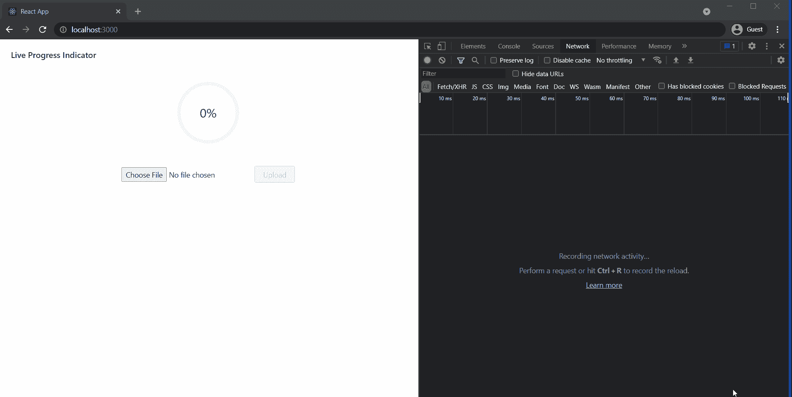

# 使用 React 和 Spring Boot 实现服务器发送的事件和事件源-实时进度指示器

> 原文：<https://medium.com/codex/implementation-of-server-sent-events-and-eventsource-live-progress-indicator-using-react-and-723596f35225?source=collection_archive---------0----------------------->

## 了解 SSE 如何使用现实生活中的用例——使用 Spring Boot 和 React 进行文件上传时的加载百分比指标。


在 [Unsplash](https://unsplash.com?utm_source=medium&utm_medium=referral) 上 [NeONBRAND](https://unsplash.com/@neonbrand?utm_source=medium&utm_medium=referral) 拍摄的照片

如果你心里有这个疑问- ***什么是服务器发送事件？*** 那么我强烈推荐你通读这篇文章——[**服务器发送事件入门**](/codex/getting-started-with-server-sent-events-and-understanding-when-to-use-polling-websockets-and-sse-87465f3bcf63) **。**

> [GitHub 链接到我要在这里解释的演示。](https://github.com/arpan-banerjee7/sse-progressbar)

## 这里是为那些着急的人准备的关于 SSE 的简要信息！

*SSE 是 HHTP 流之上的一个轻量级协议，允许客户端拥有超轻量级的仅订阅功能。与 WebSockets 不同，SSE 不提供双向通信的能力，但是可以被服务器用来实时地将数据推送到客户端。SSE 使客户端能够通过 HTTP 连接从服务器接收自动更新。它旨在使用 JavaScript EventSource API 在任何流行的浏览器中订阅数据流。* *通过这个接口，客户端请求一个特定的 URL 来接收一个事件流。*

当您有一些快速更新的数据要显示，但您不想轮询服务器时，您可以考虑使用服务器发送的事件。示例可能包括显示长期运行的业务流程的状态，跟踪股票价格更新，或显示社交媒体网络上帖子的当前赞数。

现在，你知道什么是 SSE，我将向你解释以下事情-

*   **使用案例是什么？**
*   **我为什么选择使用 SSE？**
*   什么是事件？
*   **实施细节。**

# 用例

系统处理文件，提取某些信息，然后保存。根据网速的不同，有时用户可能要等很长时间。因此，为了使用户体验尽可能愉快，**在文件上传时，显示一个实时进度条，显示服务器到目前为止已经处理了多少，而不是在进度条中重复点击端点。**



服务器发送的事件

# 为什么选择 SSE？

要求是显示一个百分比，指示该文件中处理(解析/读取)了多少数据，然后在处理完成后保存文件时最终显示 100%。因此，我需要一种方法来持续地与客户机通信，向它发送已处理文件的百分比。

服务器发送的事件是实现这个用例的一个很好的解决方案。我不得不*显示快速更新的数据，而不必轮询服务器，因为它是关于同一 HTTP 请求的进度。*

**要理解 SSE 是如何工作的，首先需要知道什么是事件。**

# 什么是事件？

服务器可以在关闭连接之前发送多个事件。服务器发送的消息应该是基于文本的，消息以关键字开头，后跟冒号(:)，然后是字符串消息。“数据”是代表给客户的消息的关键字。

在多条消息的情况下，消息应该用空行分开，否则客户端将把它们作为一个事件处理。浏览器将上述四行连接起来，并发出一个事件。为了将消息彼此分开，服务器需要在每条消息后发送一个空行。当你在 Spring 中发送多条消息时，用于发送消息的 SseEmitter 会处理下一行和关键字格式。

为了在浏览器中处理这些事件，应用程序需要为`message`事件注册一个监听器。事件对象的属性`data`包含消息。浏览器过滤掉关键字`data`和冒号，只将冒号后的字符串赋给`event.data`。

## 命名事件

服务器可以给带有`event:`关键字的消息分配一个事件名称。`event:`行可以在`data:`行之前或之后。在本例中，服务器发送 4 条消息。第一个消息是一个`add`事件，第二个`remove`事件接着又是一个`add`事件，最后一个消息是一个未命名的事件。

客户端以不同的方式处理命名事件。它们不会触发`message`处理程序。命名事件发出一个与事件本身同名的事件。对于这个例子，我们需要 3 个监听器来处理所有的消息。您不能使用`on...`语法向这些事件注册监听器。它们必须在`addEventListener`功能中注册。

在这个演示中，我将使用**命名事件**来解决并发问题。使用命名事件，多个客户端可以同时调用我的“上传文件”服务，而不会出现任何问题。每个客户端的进度百分比将根据他们的文件处理和上传状态。一个客户端的进度百分比不会搞乱另一个。请仔细阅读实现细节，了解我是如何做到这一点的。

# 实施细节

在这个演示中，我将使用 **Spring Boot** 和**反应**。

Spring Boot 提供了一种通过使用 Flux 来实现 SSE 的方法，Flux 是事件流的反应式表示，然而，在本文中，我将使用 Spring 的 [SseEmitter](https://docs.spring.io/spring-framework/docs/current/javadoc-api/org/springframework/web/servlet/mvc/method/annotation/SseEmitter.html) 类来创建一个异步控制器，它将向客户端发出多条消息。

这是应用程序的高层架构图。



高层架构

## SSE 中涉及的一般步骤是-

1.  客户端打开一个 HTTP 连接。
2.  服务器可以向该连接异步发送任意数量的事件(消息)。
3.  服务器可以关闭一个连接，也可以因为一些网络错误或服务器端的任何异常而关闭。
4.  如果由于服务器的任何错误或任何网络错误导致连接关闭，客户端将自动尝试重新连接

# Spring Boot 的服务器端实现

## 项目结构



项目结构

我创建了一个异步`REST`控制器，用两种方法响应 HTTP 请求。一个带`@GetMapping`标注，另一个带`@PostMapping`标注。

ProgressController.java

```
private Map<String, SseEmitter> sseEmitters = new ConcurrentHashMap<>();
```

1.  在类级别声明的这个**映射**跟踪为每个客户端创建的 SseEmitters。我使用了 [ConcurrentHashMap](https://docs.oracle.com/javase/8/docs/api/java/util/concurrent/ConcurrentHashMap.html) 来实现并发性和线程安全。
2.  在第一个带有`@GetMapping("/progress")`注释的方法中，我创建了一个 SseEmitter 对象，并在构造函数中使用了一个可选的超时参数。我将超时设置为一个很大的值，这样它就不会自动超时。**该方法生成随机 UUID，创建 SseEmitter 的对象，存储在 map 中，key 为随机 UUID，value 为 SseEmitter 的对象。**该 UUID 用于唯一识别每个客户。随着阅读的深入，你会明白这是怎么做到的。
3.  带`@PostMapping("upload/local`注释的第二个方法是监听`POST`上传文件的请求。它以多部分请求的形式接收文件，以字符串的形式接收唯一的 UUID。然后，它从 map 中检索 SseEmitter 对象(在步骤 1 中定义)，并将该对象传递给`FileStorageService`。

FileStorageService.java

4.`FileStorageService`逐行读取文件并运行一些内部逻辑来计算百分比。在这里，您必须编写逻辑来计算百分比，并使用传递给它的 SseEmitter 对象来发出它。出于演示目的，我编写了一个简单的逻辑来计算逐行读取文件时的百分比。

应用程序.属性

您可以通过在`application.properties`文件中写入这两个属性来定义可以上传的最大文件大小。

–`spring.servlet.multipart.max-file-size`:每个请求的最大文件大小。
–`spring.servlet.multipart.max-request-size`:多部分/表单数据的最大请求大小。

如果出现错误，可以用完整的错误方法发送一个特殊事件。这将向客户端指示错误。

最后，在发送完所有消息后，您必须通过调用一个 **complete** 方法关闭连接来完成发射器，然后使用 UUID 键将其从地图中移除。

# React.js 中的客户端实现

事件可以在任何 javascript 库或框架中处理，如 react、angular 等。我在这个演示中使用了 **React** 。

## 项目结构



我简单地用`create-react-app`创建了一个 react 项目，并使用`EventSource`接口订阅端点，如下所示:

ProgressBarComponent.js



用户界面

当用户选择一个文件并单击 upload 按钮时，客户机打开一个与带有服务器 API URL 的 EventSource 对象的连接。

```
const eventSource = new EventSource("http://localhost:8080/progress");
```

它还为名为`GUID`的事件注册了一个 EventListener，以处理从服务器返回的事件。同时，服务器发送一个名为`GUID`的事件，其中的数据是唯一的 UUID。这个 UUID 用于唯一地标识客户。客户端捕获这个 UUID，并设置另一个唯一 UUID 类型的 EventListener。

*对于所有来自服务器的成功事件，在注册事件监听器时作为第二个参数传递的回调方法将被调用，其中一个参数作为事件对象。从服务器发送的消息可以使用属性' data '从事件对象中检索，所以****event . data****将保存服务器发送的消息。这个 event.data 可以是一个简单的字符串或 JSON 字符串。如果它是一个 JSON 字符串，你必须解析它:*

现在，在读取文件时，用某种逻辑计算百分比，并将其作为数据发送给唯一 UUID 类型的事件，该事件是在客户端首次打开连接时生成的。

如果在上传过程中另一个客户端调用上传 API，则会生成一个新的唯一 UUID，创建一个新的 SseEmitter 对象并将其放入映射中。现在，百分比值是为这次调用新计算的，不会影响之前正在进行的进度条。

还有另外两个内置事件，一个是' **open** ，一旦从服务器收到 200 status，就会调用这个事件。另一个事件是' **error** '，每当出现网络错误时，以及当服务器通过调用发射器上的' **complete** '或' **completeWithError** '方法关闭连接时，都会调用这个事件。您可以通过调用`**event.target.close**();`在客户端关闭连接，否则，如果您在创建 SseEmitters 时使用了`.reconnectTime(1000)`，客户端将会在出错时继续重试连接。

> 我使用了 [Ant 设计进度组件](https://ant.design/components/progress/#header)作为进度指示器。

这就是使用服务器发送的事件在文件上传中显示实时百分比的方式。

这是应用程序的演示。



现场演示

完整代码可以在我的 [**GitHub**](https://github.com/arpan-banerjee7/sse-progressbar) repo 中找到。

这就是这篇博客的全部内容。请在 [Medium](https://arpan-banerjee7.medium.com/) 、 [Linkedin](https://www.linkedin.com/in/banerjee-arpan7/) 和 [GitHub](https://github.com/arpan-banerjee7) 上关注我，以获得更多类似的博客！