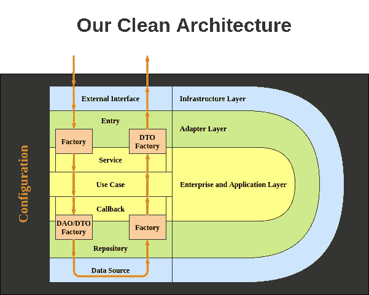
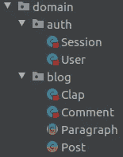
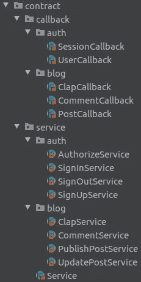

# 在 Scala 中实现一个干净的架构应用——第 1 部分

> 原文：<https://medium.com/codex/implementing-a-clean-architecture-application-in-scala-part-1-1442f0438b03?source=collection_archive---------9----------------------->

Clean Architecture 是由 Robert c . Martin(Bob 大叔)提出的一套指南，我将在本文中使用这些指南实现一个应用程序。虽然 Clean Architecture 只是一套指南，任何项目都可能有它的版本，但重要的原则是在工程师团队中实现一个版本，并在所有项目中坚持它。这个示意图是我们干净的建筑风格。

我们干净的建筑

我已经在我之前的文章“Scala 中干净的架构”中描述了我们的风格这个教程完全基于我以前的帖子，所以请阅读它，并确保您熟悉该项目的结构。

 [## Scala 中干净的架构

### 首先，什么是干净的架构？罗伯特·c·马丁(鲍勃大叔)声称虽然系统架构…

medium.com](/codex/clean-architecture-in-scala-41d1ab05a618) 

我在我的 [GitHub 库](https://github.com/SaeidDadkhah/clean-arch-example)上实现了一个类似 Medium 的小应用程序！这个实现不是一个性能实现，它的唯一用途是描述这里提供的概念。

 [## GitHub-SaeidDadkhah/Clean-arch-example:Scala 中干净架构的实现

### Scala 中干净架构的实现。我们将使用 Clean 架构实现一个简单的博客应用程序…

github.com](https://github.com/SaeidDadkhah/clean-arch-example) 

# 企业层-域

一个实现总是应该从企业层开始。该层的完整实现在`./02_domain`目录下的`02_domain`项目中提供。`com.github.saeiddadkhah.domain`包里面有两个包。`auth`包包含`User`和`Session`类，`blog`包包含`Post`、`Paragraph`、`Clap`和`Comment`类。

`domain`包的结构

这个包的结构的最佳实践之一是将所有的类放在一个特殊的包中；比如`User`类。虽然认证和授权不是`User`类的唯一用法，但是我们将这个类放在`auth`包中。让我们实现实体。最简单的实体只有一些参数，例如`Clap`和`Session`类。实体的参数只能是原语、基本的 Java 或 Scala 类和实体。

仅建模数据的简单类

一些实体可能有一组简单的功能和验证，例如`Post`、`Clap`和`User`类。

一个功能简单的类

带有验证的类

一些实体可能有不同的类型，每个类型有其特殊的数据和功能，例如`Paragraph`类。

不同类型的类

我实现了这三种类型以保持教程的简单性，然而，根据不同的用例，你可以使用其中的每一种类型，甚至将它们结合起来，例如，你可能有一个带有属性、方法、验证的抽象类和几个子类。

# 应用层-合同

构建应用层从设置合同开始。`03_contract`项目是`02_domain`项目和应用层合同的副本。下面是这部分项目的结构。

应用层的合同结构

`callback`和`service`包内的包结构与`domain`内的包结构完全相同，为一个类定义的回调和服务与该类在同一个包内。以下代码片段是发布服务的完整定义。`Request`类在服务的伴随对象中定义，指定服务的输入，`PublishPostService`扩展了`Service`，指定了`Request`和`Response`的类型。根据`Service`的定义，这个*抽象*类的任何实例**只有一个名为`call`的**方法，带有一个`Request`参数和一个隐式`scala.concurrent.ExecutionContext`参数，并将返回一个`Future[Post]`的实例。

服务的定义

与服务不同，回调不扩展任何其他类，并且可能有几个方法。回调中定义的方法通常是简单的 CRUD(创建、读取、更新和删除)操作。回调和服务之间的另一个区别是，我们可以在一个实体上定义几个服务，但是对于一个实体只有一个回调——例如，这里我们有`AuthorizeService`、`SignInService`、`SignOutService`和`SignUpService`，对于`Session`类只有`SessionCallback`。这里是`PostCallback`的定义。

回调的定义

您不应该确切知道回调应该包含哪些方法。您可以在实现用例时添加方法。定义`get`方法的最佳实践之一是将响应包装在`Option`类中，以明确指定没有符合所提供标准的数据的情况。另一种做法是为期望返回元素列表的方法考虑`limit`和`offset`参数。

请继续关注实现应用程序其余部分的下一篇文章。请随意查看[以前的帖子](https://saeiddadkhah.medium.com/clean-architecture-in-scala-41d1ab05a618)和 [GitHub 资源库](https://github.com/SaeidDadkhah/clean-arch-example)以及未解决的问题。我希望你喜欢这个教程。谢谢你。