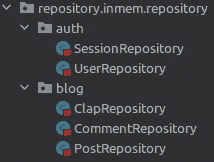

# 在 Scala 中实现一个干净的架构应用——第 2 部分

> 原文：<https://medium.com/codex/implementing-a-clean-architecture-application-in-scala-part-2-4555af428d34?source=collection_archive---------6----------------------->

干净架构是由罗伯特·c·马丁(鲍勃大叔)提出的一套指导方针。在我之前的一篇文章“[在 Scala](https://saeiddadkhah.medium.com/clean-architecture-in-scala-41d1ab05a618) 中清理架构”中，我已经写了关于这个架构的文章，并描述了我们的风格，我建议你在开始这篇文章之前阅读一下。下图是我们干净的建筑风格。


我们干净的建筑

[](/codex/clean-architecture-in-scala-41d1ab05a618) [## Scala 中干净的架构

### 首先，什么是干净的架构？罗伯特·c·马丁(鲍勃大叔)声称虽然系统架构…

medium.com](/codex/clean-architecture-in-scala-41d1ab05a618) 

我在我的 [GitHub 库](https://github.com/SaeidDadkhah/clean-arch-example)上实现了一个类似 Medium 的小型博客应用程序。这个实现不是一个性能实现，它的唯一用途是描述这里提供的概念。

[](https://github.com/SaeidDadkhah/clean-arch-example) [## GitHub-SaeidDadkhah/Clean-arch-example:Scala 中干净架构的实现

### Scala 中干净架构的实现。我们将使用 Clean 架构实现一个简单的博客应用程序…

github.com](https://github.com/SaeidDadkhah/clean-arch-example) 

这篇博客完全基于我之前的文章“[在 Scala 中实现一个干净的架构应用——第 1 部分](https://saeiddadkhah.medium.com/implementing-a-clean-architecture-application-in-scala-part-1-1442f0438b03)”，所以请务必阅读并理解其中描述的概念。

[](/codex/implementing-a-clean-architecture-application-in-scala-part-1-1442f0438b03) [## 在 Scala 中实现一个干净的架构应用——第 1 部分

### 干净的架构是由罗伯特·c·马丁(鲍勃大叔)提出的一套指导方针，我将实现一个…

medium.com](/codex/implementing-a-clean-architecture-application-in-scala-part-1-1442f0438b03) 

# 应用层-用例

应用程序的主要层是用例层，它是应用程序层的一部分。该层的完整实现在`04_application`目录下的`04_application`项目中提供。`com.github.saeiddadkhah.application`包的结构与`com.github.saeiddadkhah.contract.service`包的结构完全相同。对于同名的`service`包中的每个服务，在`application`包中都有一个用例，每个用例都扩展了它对应的服务并实现了它的`call`方法。


应用层用例的结构

任何想要使用该应用程序的人都应该首先注册，所以这是任何人与之交互的第一个用例，也是我们开始检查架构的一个好点。

注册用例的实现

下面是注册用例的实现。注册服务已经被定义为`abstract class SignUpService extends Service[SignUpService.Request, User]`，所以它的`call`方法的签名是`def call(request: SignUpService.Request)(implicit ec: ExecutionContext): Future[User]`，我在`SignUpUseCase`中覆盖了它。

在这里，我散列用户提供的密码，检查用户名的可用性，并创建用户。在实际实现中，在添加用户之前，您可能会检查密码强度、验证用户名和电子邮件，并进行一些其他验证。检查用户名可用性的结果是一个`Future[Unit]`的实例。在用户名不可用的情况下，我们不是抛出任何类型的异常，而是返回一个 failed `Future`的实例，以遵循函数式编程的原则。

这个用例需要访问用户来验证用户名的可用性并添加用户。我们给构造函数添加了`userCallback: UserCallback`参数来显示这个需求。正如依赖倒置原则所陈述的，重要的一点是使用回调 ***(不是存储库)*** 来指定这些需求。如果用例使用其他服务，我们应该将服务 ***(非用例)*** 添加到构造函数中。例如，假设我们应该更改实现，使服务返回一个`Session`类的实例，我们希望使用`SignInService`。我们可以修改上面的代码，使用`SignInService`，在`call`方法实现的最后调用它。

注册用例的实现依赖于注册服务

# 配置

在谈论存储库之前，让我解释一下模块。有三个基本模块`ConfigModule`、`CallbackModule`和`ServiceModule`。每种类型的外部数据源都应该有一个模块，例如数据库和 REST API。

## 配置模块

Config 模块提供了几种方法来读取与应用程序运行环境相关的一些数据。例如，如果我们想在测试和生产环境中使用不同的数据库，我们可以使用不同的配置文件来设置与每个环境相关的连接信息，而无需更改代码。尽管使用一组环境变量似乎是一个好的选择，但是由于构造配置条目的能力，还有更好的选择，例如 JSON 和 XML 文件。我们使用`com.typesafe`的`config`库来加载配置。它利用 [HOCON](https://github.com/lightbend/config/blob/main/HOCON.md) 文件加载配置。下面是我们的`ConfigModule`的实现。

配置模块

有多种方法可以指定我们希望用来运行应用程序的配置文件。正如所料，`config`库提供了`c.t.c.ConfigFactory.parseFile`函数来解析配置文件。您可以设置一个环境变量来指定配置文件的位置，并使用此函数加载它。一种更优雅的方法是使用`-DConfig.file` JVM 选项并使用这个函数`ConfigFactory.load().withFallback(ConfigFactory.defaultApplication()).resolve`。

一个重要的**安全**点是 ***不是*** 提交配置文件。在`.gitignore`文件中放一些忽略配置文件的条目，例如`application.conf`、`application.staging*.conf`和`application.prodcution*.conf`。因为您应该指定所需的配置条目，并为枚举提供样本值和可能的有效值，所以您可以在存储库中包含`application.template.conf`文件，并用样本值填充它。

## 回拨和服务模块

我们使用这些模块将实现绑定到抽象。下面是`ServiceModule`的实现。我们使用从`CallbackModule`导入的回调实例，而不是在这里实例化存储库。在这个实现中，我们只实例化每个用例一次，这使它们成为单例。将值设为`lazy`可能是一个更好的主意。如果您想要使用依赖注入库，您应该将实现绑定到这些文件中的抽象。

服务舱

## 简单的内存模块

在这个模块中，我实现了一个简单的非性能内存数据库。

# 适配器层-存储库

我们应该为这个包中的每种类型的数据源创建一个特定的包。我们目前只使用内存中的数据源，所以在`repository`包中只有一个包。每个存储库包可能包含两个名为`repository`和`adapter`的包。内存中的数据源不包含一个`adapter`包，因为它的实现需要一个类型参数，我们将它用于域类。适配器和存储库的包结构应该分别与域和回调相同。



适配器层的存储库的结构


具有多种数据源类型和适配器包的适配器层的存储库结构

储存库类扩展它们相应的回调和模块，并实现它们的抽象成员。这里是`UserRepository`的定义。

```
class UserRepository extends UserCallback with SimpleInMemoryModule[User] {
   ???
}
```

# 使用应用程序

应用程序现在已经可以使用了。您应该只使用服务模块中提供的服务实例或者从依赖注入框架中获取服务实例，并且只调用`call`方法。例如，如果您正在实现一个 REST 服务器，那么您可以为每个端点使用一个服务，并使用身份验证和授权服务来控制用户对端点的访问并过滤请求。

敬请关注下一篇添加条目的帖子，例如 REST API。请随意检查 [GitHub 库](https://github.com/SaeidDadkhah/clean-arch-example)和开放问题。我希望你喜欢这个教程。谢谢你。